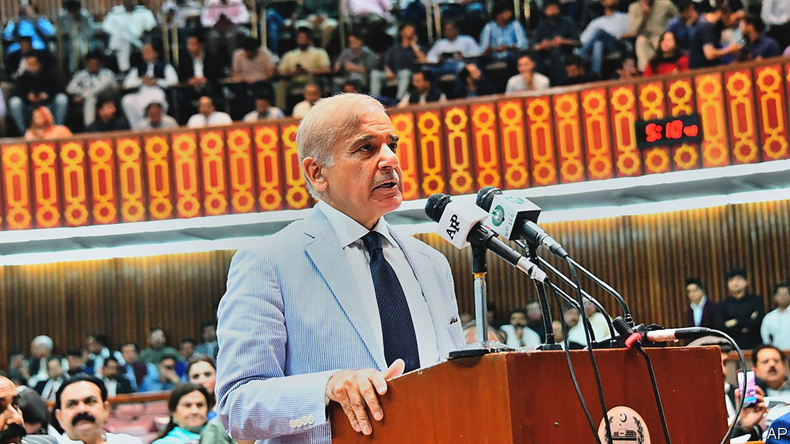

###### A new Sharif in town

# Shehbaz Sharif is Pakistan’s new prime minister 

##### He faces a daunting to-do list, starting with mending a broken economy 

 

> Apr 16th 2022 

IT WAS THE old Pakistan that Imran Khan, now the country’s ex-prime minister, railed against. He promised to banish the self-serving political establishment, usher in an era of clean politics and create a new Islamic welfare state. So it was with visible glee that Bilawal Bhutto Zardari, whose mother, father and grandfather have all served as prime minister, president or both, declared to lawmakers after Mr Khan’s downfall, “Welcome back to purana [old] Pakistan.”

Mr Khan’s last day was a dramatic one. He had already tried various tricks to cling on, dissolving Parliament and calling fresh elections to dodge a no-confidence vote on April 3rd. The Supreme Court ruled his tactics unlawful, and ordered that the vote go ahead on April 9th. Yet on the day, Mr Khan’s colleagues carried on trying to obstruct it. As midnight neared with no sign of a ballot, the Supreme Court prepared to sit and rule the speaker in contempt. With pressure building, the speaker resigned. A former speaker presided over the motion in the early hours of April 10th. When the votes were tallied, Mr Khan’s foes had 174—two more than a simple majority.


The new prime minister is a political dynast of precisely the sort that Mr Khan wanted to drive out of Pakistani politics. Shehbaz Sharif, the younger brother of Mr Khan’s predecessor, Nawaz Sharif, runs the main opposition party, the Pakistan Muslim League-Nawaz. He lacks the charisma of his elder sibling, or indeed the crowd-pulling power of his niece, Maryam Nawaz Sharif. Instead his strength lies in his reputation as a competent administrator.

The son of a wealthy industrialist, Mr Sharif worked in the family business before entering politics. While his brother had three terms as prime minister, Shehbaz, now 70, had three terms as chief minister of the country’s most populous province, Punjab. His first stint was cut short by a military coup in 1999, when the army ousted the elder Sharif as prime minister and both brothers temporarily went into exile. Like Nawaz, he has also been accused of corruption. The Sharifs say the accusations are politically motivated. He is currently on bail in a money-laundering investigation. He denies wrongdoing.

Mr Sharif’s purported competence will now be tested to its limits. At home, he will need to get a grip on Pakistan’s crumbling economy. Inflation is a painful 13%, partly thanks to the war in Ukraine, and the rupee has been on the slide for months. A balance-of-payments crisis is looming. He must also tip-toe around the army. He will have learned from watching his brother that Pakistan’s politicians can get in trouble if they bicker with the armed forces, which have directly ruled the country for about half its existence and played kingmakers the rest of the time.

Nawaz and his daughter have railed against the generals and their meddling, but Shehbaz (pictured) has been more conciliatory. The army appears to have smiled on his premiership. Mr Sharif will need to apply the same approach to fixing Pakistan’s foreign relations. The new government will have to patch up relations with America, which Mr Khan damaged by suggesting, without making any evidence public, that shadowy figures in Washington were trying to push him out.

America is used to being blamed for things in Pakistan, however, and the army has already made soothing noises. Mr Bhutto Zardari’s Pakistan Peoples Party, which has got on better with America when it was in power in the past, will take a prominent role in the new government. The damage Mr Khan did to bilateral ties will probably be short-lived.

Mr Sharif will also have to deal with China. When he and his brother were last in power, they were instrumental in setting up the China-Pakistan Economic Corridor, a package of investment from Pakistan’s “iron brother” in ports, power plants and other infrastructure. The initiative slowed under Mr Khan and several important bits, such as a new railway, have stalled. It is unclear if this stemmed from mismanagement or cold feet about the huge debts Pakistan was running up.

Mr Sharif’s government will have less influence on relations with Pakistan’s closest neighbours. The armed forces have a lock on policy towards India and Afghanistan. General Qamar Javed Bajwa, the chief of the army staff, said on April 2nd that he wants talks with India and is ready to “move forward” over Kashmir, a disputed region. The border between India and Pakistan is quiet after the pair agreed to stop taking potshots at each other in early 2021.

Afghanistan, however, is a dangerous headache. The Taliban remain international pariahs despite Pakistan’s attempts to persuade the West to establish ties with them. And the group’s victory last year has emboldened Pakistan’s own jihadists, who have been carrying out more attacks.

Mr Sharif will not have an easy ride. His coalition may be unified in its moment of triumph, but that will probably prove fleeting. His niece has for years been seen as the family’s most appealing standard-bearer, and she may not want to remain in the back seat for long. Elections, which are anyway due next year, could be brought forward. As for Mr Khan, he will not disappear quietly. Lots of Pakistanis believe his allegations that perfidious foreigners and domestic traitors are to blame for his ousting. That populist gambit may be politically shrewd, but it is also dangerous.

Politics is already polarised and many of Mr Khan’s young supporters are furious. In a poll conducted by Gallup on April 10th and 11th, 43% of Pakistanis said they were angry about Mr Khan’s defenestration. Well over two-thirds, including a majority of Mr Sharif’s supporters, wanted early elections. Mr Khan’s Pakistan Tehreek-e-Insaf party is planning a series of rallies to pile on the pressure for a swift poll. The large crowds that responded to his call for a peaceful protest the day he was voted out show that he remains a force to be reckoned with. Mr Khan may be gone, but he is not forgotten. ■

