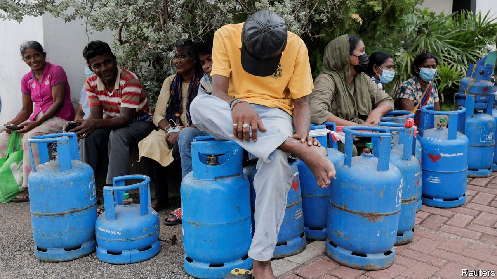

###### Going for broke

# Sri Lanka says it will stop servicing its foreign debt 

##### It may be the first step towards fixing its crisis 

 

> Apr 16th 2022 

SRI LANKA has suffered multiple crises and nearly three decades of civil war since it won independence from Britain in 1948. But it had never failed to pay back its debts. That changed on April 12th, when the South Asian island nation’s finance ministry said in a statement that it would suspend payments on all foreign debt until it had come to an agreement with creditors on how to restructure the loans. The document stressed the country’s unblemished record of meeting its obligations. But continuing to do so, it said, “is no longer a tenable policy”. Recent developments, including the economic fallout from the pandemic and the war in Ukraine, meant paying up had become “impossible”.

Though wrenching, the decision to suspend debt payments may be the first serious step towards fixing the country’s deepening economic crisis. The government’s admission brings it in line with the view of the IMF, which said last month that dwindling foreign reserves had made Sri Lanka’s foreign debt “unsustainable”. P. Nandalal Weerasinghe, who took over as governor of the country’s central bank on April 7th after his predecessor resigned amid protests, said that halting payments would allow Sri Lanka’s remaining foreign exchange to be used on imports of food and fuel while the country negotiates with the IMF and other creditors.


The de facto default is the culmination of a crisis that has been brewing for several years in the country of 22m people. A slew of ill-conceived tax cuts in 2019, combined with a pandemic-induced collapse in tourism, prompted rating agencies to downgrade Sri Lanka’s bonds in early 2020, in effect locking it out of international credit markets. The agencies have since taken an even dimmer view. Yet the government denied that it needed help from the IMF until last month, spending its rapidly diminishing foreign reserves propping up the rupee and making debt payments.

Matters came to a head in recent weeks as power cuts of up to 13 hours a day, long queues for petrol and cooking gas and spiking food prices drove angry Sri Lankans into the streets in ever greater numbers. They demanded the government step down. Gotabaya Rajapaksa, the president, tried to quell the protests, first by imposing a state of emergency, then by quickly lifting it and appointing new ministers.

Mr Rajapaksa’s slumping popularity and the failure of his attempt to intimidate the public have further eroded his authority to deal with the crisis. But at least his recent appointments have given Sri Lanka a new central-bank governor and a finance minister who appear clear-eyed about just how much trouble the country finds itself in. The suspension of payments follows a move by the central bank on April 8th to raise the interest rate by a staggering seven percentage points, to 14.5%, to curb runaway inflation. Both men apparently hope that the self-declared debt holiday will be only a temporary measure to gain breathing space as official talks with the IMF begin on April 18th over the conditions for a bail-out, which may eventually help with regaining access to global bond markets.

Reaching a deal will involve a complex set of negotiations. Sri Lanka owes around half of its $35bn in external debt to private bondholders in international credit markets. China and Japan are the country’s biggest state creditors, accounting for about 10% of its total debt each. Restructuring that will probably involve writing off some of it. The IMF is unlikely to offer a bail-out unless both countries agree to forgive at least some of the debt owed to them, to avoid any fresh assistance flowing straight back into China or Japan’s coffers.

Such agreement may not be forthcoming. China, which has lent large amounts of money to a host of other highly indebted emerging markets, may be particularly reluctant to set a precedent by starting to accept haircuts. It has yet to respond officially to a request for restructuring which Sri Lanka made back in January.

A bail-out from the IMF will also require unpleasant economic reforms. Ali Sabry, who formally started as finance minister on April 8th after being appointed a few days earlier and immediately attempting to resign, said over the weekend that the government would raise taxes and fuel prices, reduce spending and begin to restructure unwieldy state-owned enterprises over the coming months.

These measures are also likely to form part of the IMF’s stipulations. Designed to return the country to a sustainable fiscal state in the long term, they will probably make life even more painful for ordinary Sri Lankans in the short term. The government, which has lacked a parliamentary majority since its coalition partners abandoned it on April 5th, continues to be the subject of angry public protests. It may have a hard time convincing creditors that it has the popular support to see through unpopular reforms. Sri Lanka may at last be heading in the right direction, but it remains deep in the woods. ■

