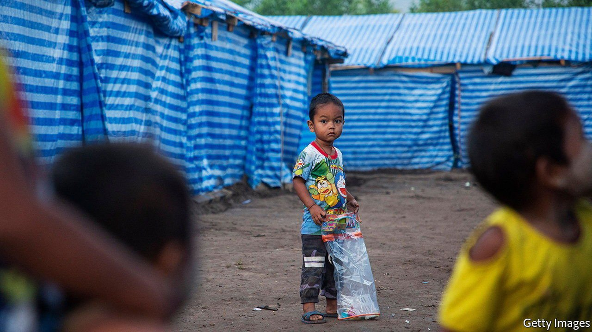

###### Sold down the river

# Thai soldiers are forcing refugees to return to Myanmar 

##### The government does not want them to settle in Thailand 

 

> Apr 13th 2022 

IF YOU DO not leave by tomorrow morning, we will burn your encampment to the ground, the Thai soldiers told Htun May (not her real name) and other Burmese refugees in the makeshift camp on the border with Myanmar. There was not much to feed the flames: tarpaulin tents, some clothes, disposable lunch boxes and whatever meagre possessions the refugees could grab before fleeing their country.

About 100 of them had been camped on this stretch of the Moei river, which marks the border with Thailand, since December. Life there was precarious, but it was a lot better than being mowed down by soldiers at home. And even though they were on the Thai side of the river, local authorities had turned a blind eye.


Their luck ran out in late March. The Thai army began ordering them back to Myanmar, according to two refugees interviewed by The Economist. For four days soldiers arrived at the river bank, threatening to destroy the camps, even though fighting between the Burmese army and a local rebel group had recently resumed.

The refugees are in an impossible position. Returning to Myanmar is not an option. The fighting is so close to the camp that Ms Htun May can hear the artillery fire. Yet the Thai authorities, she says, are preventing them from seeking safety in Thailand, even halting the delivery of food, water and medicine from aid organisations. Since March 25th she has remained on the Burmese side of the river. “Everyone is sad and scared,” she says.

The Thais are used to dealing with refugees from their troubled neighbour. For generations of Karens, an ethnic minority group from eastern Myanmar, Thailand has been a haven from the fighting that has raged between the Tatmadaw, as the Burmese army is known, and local rebels. Many were temporary visitors, stealing into Thailand when clashes flared during the dry season and returning to their villages when the rains came and the shooting subsided. But in the 1990s the Tatmadaw encroached ever further into rebel-held territory, pushing many minorities right up to the border—or over it. Camps in Thailand have cumulatively housed some 250,000 Burmese refugees since they opened in 1984. Many more make it to the cities, where short-staffed employers will overlook their lack of papers.

The Thai government has long regarded refugees as unwanted guests. It does not allow them to resettle in Thailand. It hoped that they would eventually go home. That did begin to happen in 2011 when Myanmar began its decade-long experiment with hybrid democracy. By 2015 new arrivals, at any rate, had dried up.

The coup changed everything. Since the army seized power last year, violence has engulfed much of Myanmar as the junta tries to stamp out persistent opposition. In December the Tatmadaw conducted air strikes and ramped up its attacks in Karen and Kayah states, along the border. Nearly 10,000 Burmese fled to Thailand, according to the UN’s refugee agency. That number shrank to about 2,000 when fighting abated, and grew again to more than twice as many when it resumed in mid-March.

It is the unofficial policy of the Thai government to return Burmese refugees to Myanmar once the war subsides, according to an aid worker based in Bangkok. Sometimes they send them back even as the violence continues. On March 25th, when 1,500 Burmese sought refuge along the river, the army sent them back, says Phoe Thingyan, the secretary of a volunteer group that works with refugees. This, he says, is “very common”. If true, it would be a violation of international laws preventing the repatriation of refugees to a country where they would face harm.

Tanee Sangrat, a spokesman for Thailand’s Ministry of Foreign Affairs, denies the charge. “It is our long-standing policy not to push them back,” he says. According to Somchai Kijcharoenrungroj, the governor of the border province of Tak, “when they cross to our side, we take care of them”, providing them with temporary shelter, food, clothing and medical treatment. Some refugees, he says, actually want to return, because they worry about the security of their homes and farms. In those cases, the Thai government transports them across the river. “We never chase them away.”

Thailand is in a tough spot. The friendship between local Thais and Karens is deep, says a Karen community leader in Mae Sot, a Thai border city. But the central government is reluctant to improve conditions for refugees for fear it will encourage more to come. And the Thai government, itself dominated by its army, “does not want to compromise its relationship with the Burmese military”, says Min Zin of the Institute for Strategy and Policy, a Burmese think-tank. Thousands of refugees camped on the river would look like a humanitarian crisis, not only embarrassing the Tatmadaw but also stiffening the resolve of Myanmar’s rebel groups. That would be a recipe for more violence, and more refugees. Easier, then, to push the likes of Ms Htun May across the river, where they can remain Myanmar’s problem. ■

