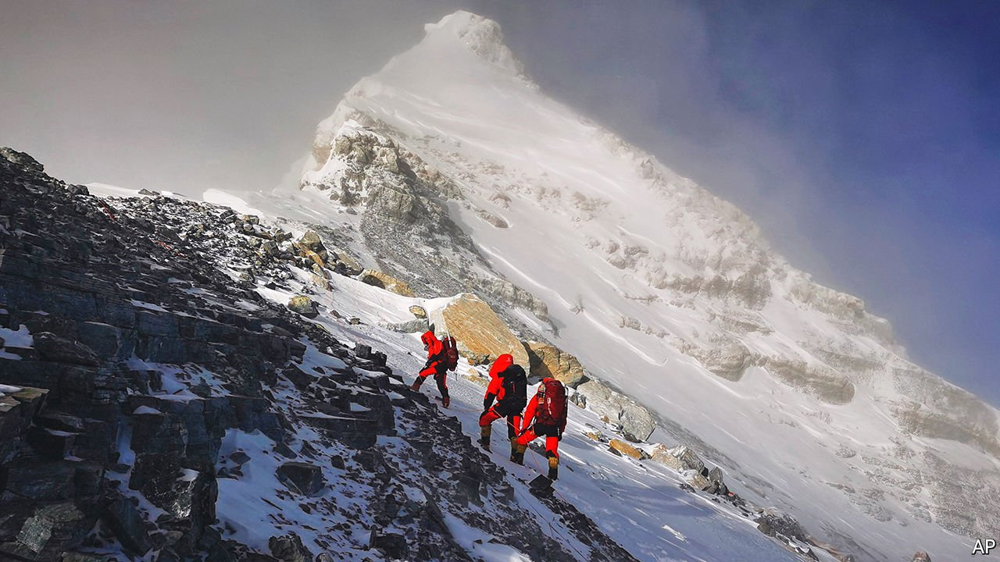

###### No Everest for the wicked

# The fallout from Europe’s war reaches the Himalayas 

##### Ascents have plummeted because Russian and Ukrainian mountaineers are busy with other things 

 

> Apr 16th 2022 

LIFE ON AND around the world’s tallest mountain has been even harsher than usual in the past few years. Avalanches in 2014 and 2015 killed dozens, closing Mount Everest to adventurers. The pandemic pre-empted the climbing season in 2020. This year brings fresh bad news. On April 9th Nepal’s tourism department announced it had issued 204 climbing permits—half of last year’s record figure of 408. Nearly 30% of mountaineers attempting Everest’s summit come from Ukraine, Russia and nearby European countries such as Poland. Most of them have cancelled their plans.

“A lot of Sherpa guides and porters have lost out on their income,” says Dawa Steven Sherpa of Asian Trekking, one of the oldest expedition organisers in Nepal. Mountaineers aiming for the top typically spend $60,000-100,000. They often bring friends who hang around at base camp, spending another $1,500 a head. Most years some 50,000 breathless (literally) tourists visit base camp. This year even those will be fewer in number.


That may be good for the mountain. In recent years Everest has carried more people than it can handle. In 2019 a record 354 climbers queued to reach the summit on a single day. The place got so filthy that authorities cleared 11 tonnes of rubbish from its slopes that year.

But the dearth of climbers is bad for those who make their living from Everest and other tall mountains. Nepal is home to eight of the world’s 14 peaks above 8,000 metres. Its 30m people rely heavily on tourism, which provides 8% of GDP and more than 1m jobs and is the second-biggest source of foreign exchange after remittances. “We may have to dig into our savings to survive,” says Mingma Sherpa, the youngest person to have scaled all 14 peaks, who runs Seven Summit Treks, a local company.

After the setbacks of the past few years mountain workers have learned to survive. They do odd jobs. Many are subsistence farmers, growing potatoes, carrots and radishes. Their wives run lodges in the low-lying Khumbu region. Sherpas also find it easy to borrow money as they are seen as a safe bet: in a good year they earn around $6,000 and sometimes as much as $12,000—Himalayan amounts compared to the average Nepali’s annual income of $1,070. Wealthy foreign climbers, too, chip in during hard times, says Mr Dawa Sherpa.

Little wonder that Nepal has resisted efforts to drag Everest into the war. Last month the Ukrainian embassy in Delhi, India’s capital, sent a diplomatic note to the Nepalese authorities asking for a ban on the handful of Russian climbers coming this year. They politely declined.

Read more of our recent coverage of the 

