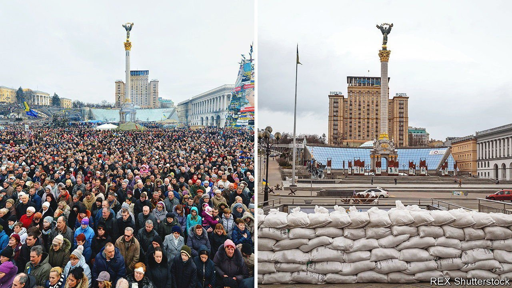
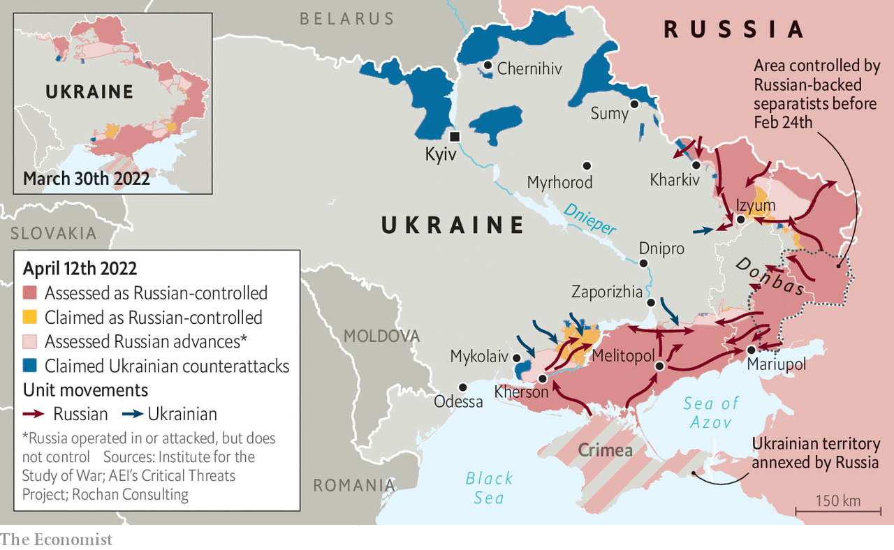
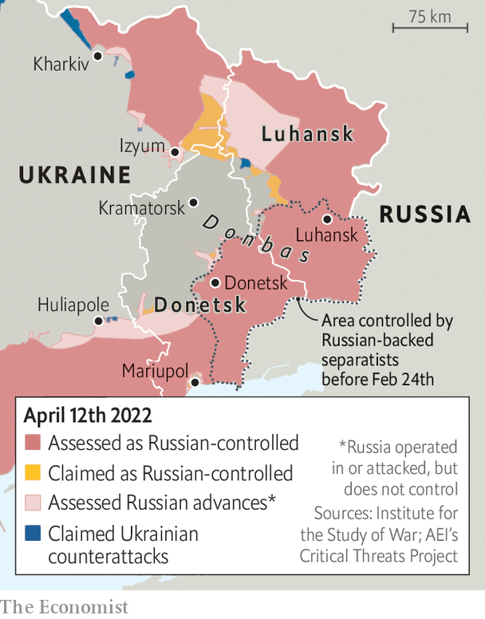
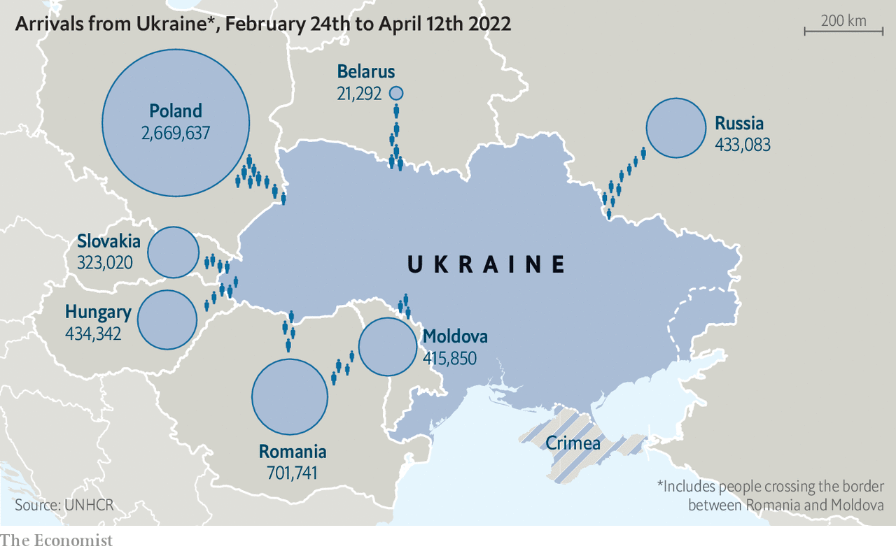

###### It’s a Cossack thing

# Volodymyr Zelensky’s Ukraine is defined by self-organisation 

##### Coming together is what Ukrainians do 

 

> Apr 16th 2022 

ALL MAIN roads in Kyiv lead to Maidan, the open space at the heart of the city—even if, at the moment, some of them are blocked by concrete barriers and tank traps. The central space is, most of the time, a busy urban miscellany. The metro station and a labyrinthine shopping centre wrestle for space below ground; the Stalinist buildings on the perimeter boast franchises like McDonald’s and one-offs like the jellyfish museum. And sometimes it is the heart of the nation.

It has had many names over the years: Dumskaya Ploshchad (Parliament Square), Sovetskaya Ploshchad (Soviet Square), Ploshchad Kalinina (Kalinin Square). When student protests demanding independence were first held there in 1990 it was still Ploshchad Oktyabrskoi Revolutsyi (October Revolution Square). It was only the year after, in the post-Soviet age, that it took its current name. No longer a Russian ploshchad, or a Ukrainian ploscha, it became a maidan—a Persian term introduced by way of the Tatars of Crimea which enriches the architectural notion of a square with the connotations of a communal meeting place. Specifically, it became Maidan Nezalezhnosti: Independence Square.


But nobody in Ukraine bothers with the qualifier. Since becoming the focal site of the Orange revolution, in 2004, and the revolution of dignity, in 2014, Maidan has not needed it. In the winter of 2013-14 it became a city within the city as diverse as the country itself, a place where tens of thousands of people cooked together on open fires, lived in tents, built barricades, pried loose cobblestones and died when fired on from the surrounding buildings. Today the name Maidan stands for independence in and of itself.

 


The identification of independence with a place for coming together gets to the heart of something very Ukrainian. Being Ukrainian is not rooted in a particular territorial claim, or a certain ethnic background, or an allegiance to a particular state and its institutions, or the profession of a given faith. It is instead about an ability to come together when you feel that you need to and to get things done. It is a way of depending on each other, rather than on institutions or hierarchies, whether over cold nights of winter protest or when pelting tanks with Molotov cocktails.

When Roman Romaniuk, a journalist for Ukrainska Pravda, declared that “This war against Putin is our final Maidan,” he was saying that, after two previous Maidans against Mr Putin’s placeman, Viktor Yanukovych, a battle against Mr Putin himself provided a fitting boss-level conclusion to the country’s struggle for sovereignty and democracy. But he was also saying that the self-organising spirit of those revolutions is animating Ukraine’s defence of itself. It goes a long way to explaining why a country which, when invaded, was widely expected to fold like a cheap suit has instead fought the aggressors to a temporary standstill.

Ukraine’s gift for rising to challenges in its own way is not without downsides. On neither of the occasions when the people got rid of Mr Yanukovych did they put in place the sort of reform needed to curb the politically powerful oligarchs and pervasively corrupt bureaucracy that made such rulers possible. Coming together only when needs must means letting a lot of other things slide with the oft repeated phrase to sia zrobyt: “it will have to sort itself out”. A flair for self-organisation may, remarkably, allow Ukraine to survive the Russian invasion in something like its current shape. But without something extra it will never make the country as impressive in peace as it has proved itself in war.

Andrei Zorin, a professor at Oxford University, says that the unifying myth behind today’s resistance, the two Maidans and much more is that of the Cossacks of the Zaporozhskaya Sich. The Cossacks were, as Andrew Wilson, a professor at UCL, in London, writes in his book “The Ukrainians: Unexpected Nation”, “‘Free men’ who took advantage of the ‘wild field’, the no-man’s-land in the open steppe, to establish autonomous farming and raiding communities beyond the reach of the formal authority of the main regional powers—Poland, Muscovy and the Ottomans.”

The Sich was the self-organised military democracy through which some Cossacks asserted their autonomy in the early modern era. Its capacities have been romanticised and lionised ever since. “[The Zaporozhian Cossacks] were not a standing army,” Nikolai Gogol wrote in “Taras Bulba”, a 19th-century novella. “But in case of war and general uprising, it required a week, and no more, for every man to appear on horseback, fully armed, and in two weeks such a force had assembled as no recruiting officers would ever have been able to collect.” In the 1920s Nestor Makhno, an anarchist who found common ground with peasants who hated all kinds of state control, created a similar army to resist all those who sought to claim the wild field between Donbas and Kryvyi Rih where the Zaporozhskaya Sich had once held sway.

 


Such tales resonate because, for most of Ukraine’s history, the state has been something foreign for the people to resist, ignore and get by without. When their country acquired a state of its own in 1991, those who ran it were as unscrupulous and divorced from the people as the foreign rulers had been, providing little reason for a change in attitude. Ukrainians continue to have low expectations of the state and rely instead on informal networks of friends, neighbours and relatives. Political reforms since 2014 have recognised this democratic bottom-upness, allowing local communities to amalgamate into larger ones called hromady as they see fit.

Decentralised does not mean divided

Last year Arena, a project based at Johns Hopkins University and the London School of Economics, reported on what united Ukrainians after 30 years of independence. The researchers concluded that the most important things were not attitudes or values, but “shared, near-unconscious behaviours that have been shaped by the many centuries of Ukraine’s pluralistic history.” In his book “The Gates of Europe”, which has become a standard text in Ukraine since its publication in 2015, Serhii Plokhy describes a nation defined not by its people’s pre-existing identities as by its willingness to negotiate them, crossing and recrossing the “inner and outer frontiers” between regions, faiths and ways of life.

As well as distrusting states imposed on them by others, the Ukrainians have not been very keen on states dominated by any one faction within the country. Mr Plokhy, who teaches history at Harvard, points to the way that, after the fall of the Russian empire in 1917, the primacy some nationalists placed on the Ukrainian language and its associated culture lost them allies among Jewish and Polish minorities worried by such ethno-nationalism. In 1991, on the other hand, Ukrainian sovereignty was supported by all the country’s people. Soviet repression had forged an alliance between Ukrainian nationalists and Jewish dissidents, among others.

Attempts to make capital out of the country’s regional and ethnic differences since then have ultimately proved fruitless, whether encouraged by Russian provocateurs or by factions in Ukraine itself. When Viktor Yushchenko, the president who was brought to power by the Orange revolution, hailed the mid-20th-century nationalist, anti-Semite and sometime Nazi collaborator Stepan Bandera as a Ukrainian hero he alienated not just the Russian-speaking east but also the liberal intelligentsia across the country.

The war is laying all thought of division to rest: as Sergei Rakhmanin, a journalist and politician, wrote recently, it “has stitched us together without any anaesthetic”. Russian-speakers, Jews, Crimean Tatars and Ukrainian-speakers are fighting as one for survival and their right to be who they want to be on their own land. It is Russian speakers in the south and east who, stalwart in resistance, are paying the heaviest price. The war which Mr Putin launched on the basis of a belief that Ukraine does not exist and should not exist is proving the opposite.

Military improvisation has always been part of Ukrainian self defence. The tachankas—machineguns on horse-drawn carriages—fielded by Makhno’s army were the forerunners of the armed Toyota pick-ups, or “technicals”, now seen in low-intensity conflicts around the world. In a Facebook post Anton Kolumbet, a fighter in Ukraine’s territorial defence force, described the self organisation of the defenders in today’s “wild field”:


“We are a very chaotic nation,” says Andriy Khlyvnyuk, “A nation of musicians and warriors.” The lead singer of a group called BoomBox, which is hugely popular in Russia as well as Ukraine, Mr Khlyvnyuk was on tour in America on February 24th. He immediately cancelled the rest of the tour and returned to Kyiv to join the territorial defence force. A viral video of him singing “Oh, the Red Viburnum in the Meadow”, a protest song from 1914, in front of Kyiv’s St Sofia cathedral, rifle slung over his shoulder, has been embellished in mash-ups by Lithuanian opera singers, a South African producer and satirist called The Kiffness and, in their first new song for 28 years, Pink Floyd.

Volodymyr Zelensky, a television comedian before he was elected president in 2018, fits the same “you do what you can” picture. “The first thing that I understood,” he said in a recent interview with The Economist, was “that we the people have agency. People are leaders and political leaders are losers, some of them.” (The Arena research found that politicians were the group Ukrainians like least.) As with everyone else, his wartime role has been to do what he does best—communicate with his people and with the world. He is not trying to run the country so much as letting the country run itself.

Nowhere is this more visible than in the army, where Valery Zaluzhnyi, a charismatic 48-year-old, enjoys free rein as commander-in-chief. Unlike older officers, General Zaluzhnyi never served in the Soviet army; on taking over last year he told his officers to “turn your face to the people, to your subordinates.” He has allowed local commanders to take a lot more initiative than is normal in post-Soviet armies; he listens to the advice of his senior officers.

 


How the self-organising spirit will fare after the war’s end will depend a great deal on what sort of end it is. If Mr Zelensky survives in office he is likely to be the most powerful politician for generations. The machinations of the country’s oligarchs, which have held the country back for 30 years, will matter much less. Giving in to the predilection to just let things sort themselves out once the crisis is over will look more culpable. That all argues for the possibility of reform.

But there will be a risk of backsliding on democracy and liberalism in a country which will be focused on its security as never before. “It is unlikely that Ukraine will have political elections in the next few years,” one observer of Ukrainian politics says. That may make eventual integration into the Europe of the EU harder. “Absolutely liberal, European—it will not be like that,” Mr Zelensky told journalists on April 5th. “It will definitely come from the strength of every house, every building, every person…We will become a ‘big Israel’ with its own face.”

The tank traps that have replaced occasional uprisings and everyday bustle on Maidan will in time be taken away. What the Ukrainian people will put in their place remains to be seen. ■

Read more of our recent coverage of the 

