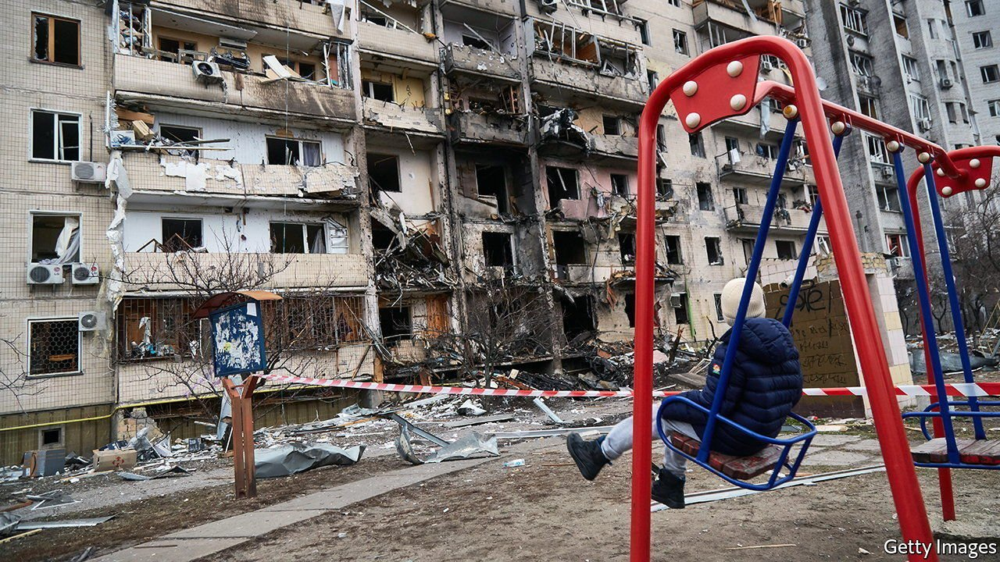
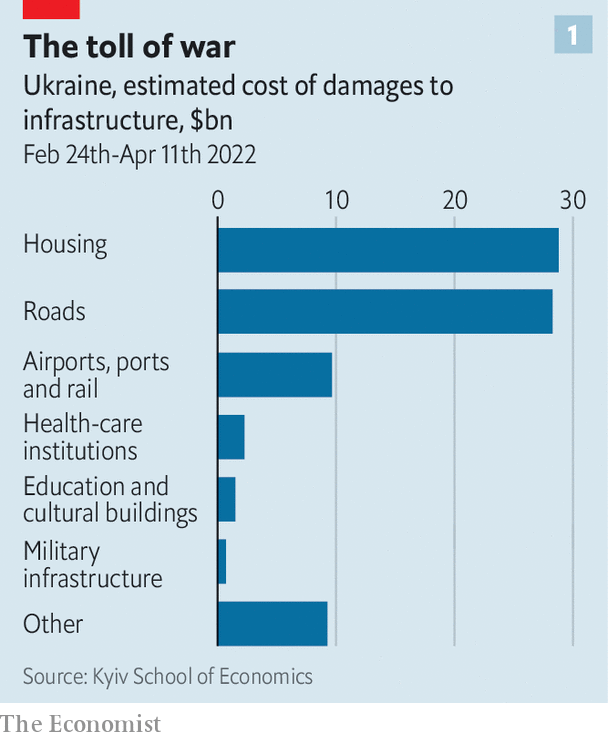
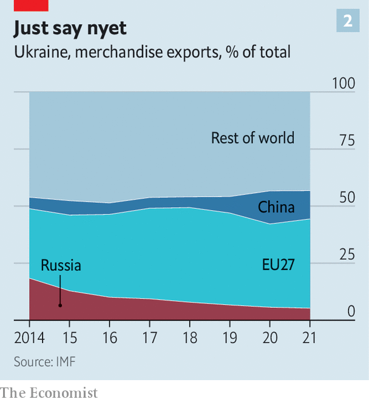

###### Rebuilding back better

# What will it cost to rebuild Ukraine? 

##### And all sorts of infrastructure will need rebuilding 

 

> Apr 16th 2022 

WHEN THE devastating war ended, the country resembled a wasteland. Its industrial infrastructure had been flattened by air raids and its great cities bombed out with terrible loss of life. Russian-led forces occupied the east, with millions fleeing their brutality. But West Germany’s economy recovered strongly after 1945, in what would soon be coined the Wirtschaftswunder (economic miracle).

The parallels are hardly precise. Ukraine was not the instigator of the war currently laying much of it waste. It may end up being the victor, and even if it does not its devastation will not be as total. Nevertheless, rebuilding will be a monumental task. The war waged by Vladimir Putin has not only claimed thousands of lives and displaced millions of people, 7.1m internally, 4.6m abroad. It has laid waste to homes and hospitals, bridges and ports. With no end to the hostilities in sight, more destruction will surely follow.


Researchers from the Centre for Economic Policy Research (CEPR), a network of economists, have used data on property damage, figures on the country’s capital stock and historical analogies to estimate the overall cost of what will have to be done to rehabilitate the country after the war at €200bn-500bn ($220bn-540bn). The upper bound is over three times Ukraine’s pre-war GDP; the lower number is roughly four times the EU’s foreign-aid budget.

As the war continues, the damage will increase and the economic wherewithal to put it right will be eroded as the economy contracts. Electricity consumption, a reasonably reliable proxy for economic activity, is currently down by around a third compared with a year ago. The Vienna Institute for International Economic Studies (WIIW), a think-tank, reckons that the regions directly affected by the war account for about 29% of Ukraine's output, and that in those areas economic activity has more or less ceased. According to a survey by the central bank, 30% of firms around the country have stopped producing entirely and another 45% have reduced their output. The World Bank reckons that GDP will contract by 45% this year.

 


The challenge is vast. Yet the way in which reconstruction happens, and the reforms that accompany it, will be just as important as the money spent. In principle such sums could do more than just restore Ukraine to its status quo—a good thing, since that status quo was . But if rebuilding is to transform the Ukrainian economy into something more open and dynamic a lot will have to change.

At the moment, the government is trying to limit the damage where it can. Around $7bn in loans and financial aid from the West has just about kept the public finances afloat. In an interview with the Financial Times, Ukraine's finance minister put the fiscal deficit at $2.7bn for March alone, and projected monthly losses of $5-7bn in April and May.

Despite this, various sectors of the economy are getting bespoke help. Farmers have been given 20bn hryvnia ($675m) with which to buy inputs and seeds for the planting season now getting under way. Manufacturers can apply for help to relocate within the country. With Russia blockading Ukraine’s main export route through the Black Sea, the government is working with the EU to make trading by land easier.

For all this, the post-war economy will be a lot smaller than the pre-war economy was even as it faces new challenges. One is clearing affected areas of landmines and other explosive debris. Before the invasion of February 24th Ukraine’s defence ministry estimated it would cost €650m to de-mine the Donbas region, which was invaded by Russia in 2014. The figure will obviously be larger now; but the benefits de-mining brings will be substantial.

Rich in its farmland, Ukraine will probably be able to feed those in need. Shelter is another matter. A tracker put together by the Kyiv School of Economics puts the value of destroyed housing at $29bn. Rebuilding damaged infrastructure and industrial facilities will cost even more—as will dealing with the problems caused by lost production, a lack of maintenance and missing investment in the stock that escapes destruction. A study published by the WIIW in 2020 found that, in the five years following the invasion of Donbas in 2014, this sort of depreciation of assets made up 60% of $9.5bn in total war-related infrastructure losses. Apply a similar surcharge to the Kyiv School’s estimate of $50bn in damages due to the destruction of power plants, factories, bridges and roads and the estimate of a $119bn rebuilding bill recently suggested by Ukraine’s prime minister, Denys Shmyhal, may not be far off.

Ukraine’s government has already set up a recovery fund, and its various ministries are putting forward proposals for what needs rebuilding. With the government already heavily indebted and the economy badly damaged much of the money needed will have to come from outside. The idea of using frozen Russian assets has been floated by various people, including the head of Ukraine’s central bank. In its absence money will have to come from Western governments, international organisations and private investors.

The difficulty is that the Ukrainian economy has long been dominated by crooks. The OECD thinks that Ukraine has made its process for tenders more competitive since 2014, but things are still less than completely kosher; the IMF has repeatedly urged the government to strengthen its anti-corruption framework and the rule of law, most recently last year. And this time the contracts will be much larger. The CEPR suggests, in part, the use of framework agreements—standing contracts in which firms undertake to deliver a certain product to the government for a fixed price—to make it easier for both central and local municipalities to procure things reliably and transparently.

Old rope and oligarchs

The problems with the economy that lead to worries about where reconstruction money will end up go deep. In 2019 GDP per person was lower than in any of the 27 countries in the EU: less than half that in Bulgaria, less than a quarter that in Poland. Indeed in real terms it was lower than it had been at the fall of the Soviet Union, a damning testament to the long-standing lack of reform (though the war in Donbas from 2014 on was also a factor). Many of Ukraine’s 1,500 operational state-owned enterprises are loss-making or barely profitable. Political support for difficult reforms will be crucial to make reconstruction a success. It might help that the government seems to see the process as an opportunity to make the economy more modern and competitive, with cheaper, greener energy and more IT.

Past reconstructions, meanwhile, suggest that success could also come from closer integration with Europe, as happened with West Germany decades ago. Poland’s rapid growth is also often attributed to integration: in the 15 years after it joined the EU in 2004, a period during which it received over €160bn in assistance, its GDP per person increased by more than 80%.

 


Ukraine had already been turning westward. The share of its exports going to the EU rose from roughly 30% in 2014 to 36% in 2020, while the share going to Russia fell from 18% to 5.5%. One way to encourage reforms would be to make them a requirement for further integration into European markets and supply chains—say, through a path to EU membership. “The beauty of accession [to the EU] is that it would create consensus within Ukraine about the endpoint of a painful reform process and lock in the direction of the reforms,” argues Beata Javorcik of the European Bank for Reconstruction and Development.

None of this will be easy. Reforming entrenched institutions requires political will. The longer the war continues, the more damage is wrought upon Ukraine, and the harder the task of reconstruction becomes. Nor will any amount of spending ever make up for the horrors of war. But if Ukraine looks like an unlikely candidate for a Wirtschaftswunder, its reconstruction could, if well planned and carried through, ensure a brighter and stronger future. ■

Read more of our recent coverage of the 

