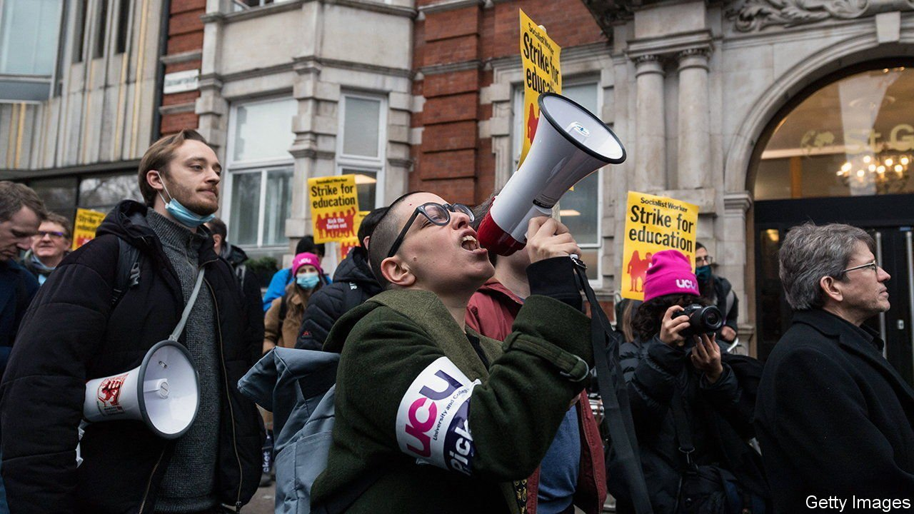

###### Academic pensions

# British academics are seeing their retirement benefits cut 

##### The dispute will drag on 

 

> Apr 13th 2022 

MANY ACADEMIC fights involve hostile questions at conferences and cutting footnotes. But a dispute over pensions has sent scholars to the picket lines. After strikes in February and March, on April 1st cuts to the Universities Superannuation Scheme (USS), the main pension scheme for academics, went into effect. The University and College Union (UCU) is preparing its members for more industrial action, including a marking and assessment boycott. It says that “could stop hundreds of thousands of students from graduating”.

The USS is special in a couple of ways. When ranked by assets under management, it is Britain’s largest private pension scheme, with around £89bn ($116bn) at the end of February. (Its investments include wind farms, Heathrow Airport, motorway service stations and 35 crematoria.) And it is a defined-benefit scheme, which guarantees a pension relative to contributors’ salaries. Educational institutions have clung to an arrangement that is increasingly rare elsewhere in the economy. That has caused headaches.


Over the past few decades pension guarantees have become much more expensive. According to one recent study by economists from Birkbeck University, between 1985 and 2020 the contributions required to fund a USS pension rose more than sixfold. That was partly because members are living longer, but mostly because of falling real investment returns. The USS’s enormous size means that if it runs out of cash, the top-ups required from member institutions could ruin them. That pushes it towards safer, lower-yielding assets.

In March 2020 the USS judged that its financial position needed bolstering. A study by David Miles and James Sefton of Imperial College London estimated a 20% chance that it would run out of cash by 2051, “substantially larger than the chances of losing a game of Russian roulette”. Without any changes to benefits, the USS estimated that contributions as a share of salary from employees and employers would need to rise from around 31% to over 42%.

Demands for higher contributions can be self-defeating if they push current contributors to opt out. The organisation representing university employers said that 15-20% of eligible employees were already rejecting the scheme, often citing unaffordability. So instead of raising the cost of the scheme, they cut benefits. Pensions now accrue more slowly than they did before, and on income up to £40,000 instead of £60,000. Protection against high inflation has been reduced too.

Debate over the issue is still fraught. The UCU complains that the recovery in equity markets since March 2020 makes cuts unnecessary. The economists from Imperial College London updated their study to find that the risk that the USS would run out of cash before fulfilling its past promises had fallen from 20% to just 8%. But the USS said on April 1st that changes in the cost of fulfilling future promises would still have required a big change in the balance of contributions and benefits.

The conflict boils down to a disagreement over how much risk the USS really faces, and how much it should bear. Speaking on April 11th, Woon Wong of Cardiff University, and a UCU negotiator, argued that the strong international reputation of Britain’s universities supported a rosier outlook. But Kate Barker, chair of the USS, replied that she could not be completely sure that the strong international market for students would continue, and had to consider the risk that things would be worse than Mr Wong suggested.

One thing not in dispute is that the current process works badly. A future fix might include an offer for members to withdraw some of their cash from the USS’s defined-benefit scheme, and instead invest it in a higher-risk, higher-reward option. Alternatively, future benefits could fluctuate automatically along with the performance of invested contributions. Both changes would mean weaker promises for contributors—but perhaps less acrimony when trying to keep them. ■

