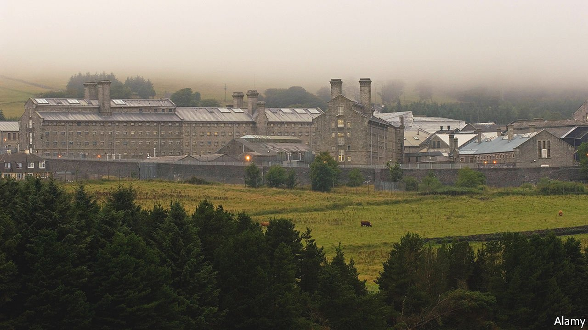

###### Prisons and NIMBYs

# Britons don’t want new prisons. They also don’t want old ones to close 

##### That is bad news for their residents 

 

> Apr 13th 2022 

ON APRIL 7TH Harborough District Council in Leicestershire refused planning permission for a new prison that would have housed 1,700 inmates. Buckinghamshire County Council and Chorley in Lancashire have in the past few months voted down requests from the Ministry of Justice to build new prisons. It would seem as though Britons do not want prisons in their backyards. But things are not quite that simple.

Violent crime in England and Wales peaked in 1995 according to the British Crime Survey, the best guide to the true level of offending. But the adult prison population has risen. Some 80,000 people are inside today—a figure that is expected to rise to 98,500 by 2026 thanks to stiffer sentencing, a rise in the number of police officers and a push to clear the backlog in the courts that was caused partly by covid-19.


Many of the prisons in England and Wales are old and inadequate—the maintenance backlog is estimated to amount to £1bn ($1.3bn). A recent inspection of Wandsworth, a Victorian edifice in London, described it as a “crumbling, overcrowded, vermin-infested prison”, with some areas inhabited by mice, rats and pigeons. The Ministry of Justice wants to build six new ones by the end of 2026, including a prison called Five Wells that opened earlier this year.

The easiest way to do that is to build on land the government already owns. Finding and getting planning consent on new property is expensive and slow, says Julian Le Vay, a former finance director for the Prison Service. Former industrial sites are ideal—in 2017 a prison opened near Wrexham in north Wales on the site of a former tyre factory. The next best thing is property adjacent to existing prisons, since a place that already has a prison might be amenable to another one.

The proposed prisons in Leicestershire, Buckinghamshire and Lancashire are next to smaller existing ones. They were opposed anyway. (The Ministry of Justice will appeal against the Lancashire prison decision. It has not said if it will appeal against the others.) Locals argue that prisons increase car traffic and drain local government resources. In Buckinghamshire, planners cited the threat to butterflies.

But closing prisons is also unpopular, largely because so many local people work in them. A plan to shut the 19th-century Dartmoor Prison (pictured) has been dropped after objections, including from the local MP. In 2012 the government closed Wellingborough Prison, drawing criticism from the local MP, Peter Bone, who called the decision “disgraceful”. Five Wells prison opened on that site.

The tug-of-war over opening and closing prisons often omits a crucial question: what would be best for prisoners and society as a whole? A study published in 2016 in the British Journal of Criminology found that visits from parents made incarcerated men less likely to reoffend upon release. The Ministry of Justice itself found that prisoners who did not receive family visits were 39% more likely to reoffend. That suggests prisons ought to be built in or near large population centres. A prison might provide jobs for a struggling town; it may or may not disturb local butterflies. But if prisoners’ families cannot reach them easily, the prison population could well continue growing as people cycle in and out. ■

