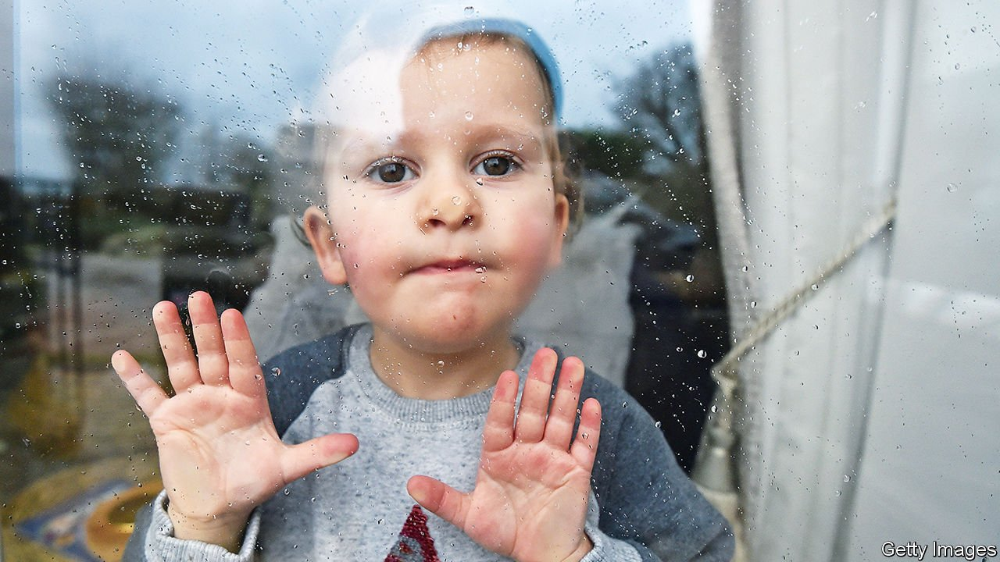

###### No small problem

# England’s littlest learners need help to catch up 

##### Underfunded preschools will struggle to play their part 

 

> Apr 13th 2022 

HAPPY TODDLERS munch macaroni at Puddleducks nursery in north London. Upstairs, children study at miniature desks. The airy pre-school, with its mud-pie kitchen and subdued “sensory room”, is running much as it did in early 2020, before England’s first lockdown forced it to shut for two and a half months. But Balal Arshad, the manager, says some of the children are not speaking as fluently as expected for their age. Some are finding it harder to get along with others. The number of children his staff think would benefit from extra attention has doubled since covid-19 reached Britain two years ago.

A report published in early April by Ofsted, the schools inspector, revealed similar concerns in many nurseries and pre-schools. Staff told inspectors that babies are failing to respond to “basic facial expressions” and were a bit less mobile than usual. Children seem to need more help with sharing and turn-taking, and their behaviour is worse in general. That affects how much they learn.


Ofsted’s findings echo experimental data collected by the Department for Health, which suggest that slightly fewer two-year-olds than usual are meeting expected standards in walking, problem-solving and similar feats. Similarly, researchers at Brown University in America report that children aged between three months and three years are scoring lower than expected on tests of early learning. LENA, an American non-profit, has found that babies born nine months into the pandemic babbled less in the first months of life than children before them.

Parents of small children suffered more distress than most other British adults at the start of the pandemic, according to a study by academics drawn from eight universities, hospital trusts and research groups. Their anxiety may have affected how they interacted with their offspring. Babies and toddlers have spent much less time outside their homes, because of government restrictions and their parents’ desire to keep them safe. In particular, they have spent less time in pre-schools.

At the end of 2021 attendance was still only about 80% of what it had been before the pandemic. Poorer families are making less use of state-funded pre-school places. Last year about two-fifths of eligible families did not use the 15 hours a week that is available at no cost to disadvantaged two-year-olds, up from about one-third in 2019.

Some parents might be keeping children out of nurseries because they worry about the coronavirus. Others may have discovered that remote working means they can manage with less formal child care—a useful saving when prices are rising overall. In some parts of the country, supply seems to be a problem. The number of local authorities saying that their area offers enough pre-school places is falling, according to a survey published in March by Coram, a children’s charity. Only 63% think local providers have “sufficient” capacity to meet demand from parents of two-year-olds, down from 72% in 2021.

For many years nurseries have struggled to recruit staff who are willing to work for salaries that hover around the minimum wage. And workers must now face being “bitten and kicked” by children who are less prepared than usual for pre-school, reckons Neil Leitch of the Early Years Alliance, an industry group. Four-fifths of nurseries surveyed by his organisation in October reported that hiring was a struggle; about half said they had limited or reduced the number of places they offer as a consequence. Mr Arshad at the Puddleducks nursery says it has become common for job advertisements to attract not a single suitable candidate.

Nurseries, preschools and child-minders are seeing little of the cash that has been set aside to help children of all ages recover from the pandemic. A £153m ($199m) pot announced last year—much of it to be used for training nursery staff—amounts to only about 3% of all the public money earmarked for educational recovery. The government appears to be gambling that the catch-up programmes it is running in the first few years of primary school will be enough to fill in learning that has been lost before it. For some children that could prove a costly wait. ■

