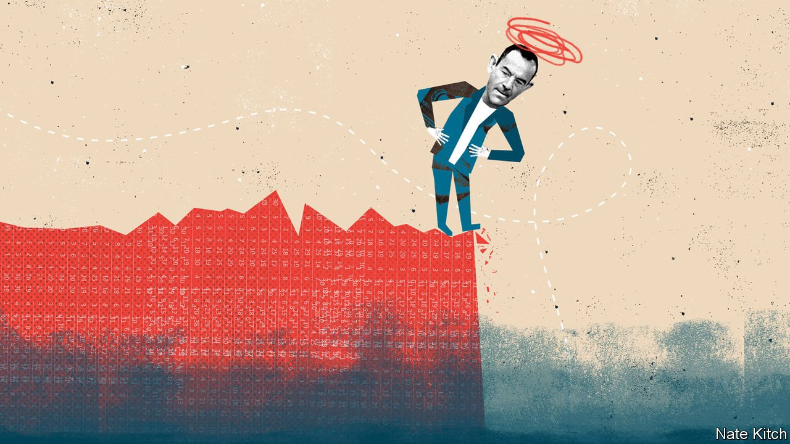

###### Bagehot

# Martin Lewis faces up to a world he can no longer fix 

##### As inflation soars, Britain’s money-saving guru calls for government intervention 

 

> Apr 16th 2022 

THE WEEKLY email from Money Saving Expert is a superb guide to Britain’s collective mood. Usually, the missive from the consumer-finance website brings an incoherent mix of bargains into the inbox of its 7.5m subscribers. “£12 broadband, free wills...£4.50 dresses”, ran one perky subject line.

But in recent weeks the messages have become darker. “Heat the human, not the home” was the headline above one section of advice on how to avoid freezing as energy prices soar. Martin Lewis, who has become one of Britain’s most recognisable figures since starting the site in 2003, is now calling for government intervention to cope with annual energy bills that could soon hit £3,000 ($3,900) per household. Without help, warns Mr Lewis, civil unrest is likely.


As the cost-of-living crisis intensifies, the usually apolitical Mr Lewis has a good claim to be the most influential man in British politics. The readership of Money Saving Expert rivals the collective reach of Britain’s newspapers. “The Martin Lewis Money Show” on ITV is watched by up to 4m people per week. Mr Lewis estimates he is stopped on the street 30 or 40 times per day. Polls put him among the country’s most popular figures. He is part national treasure, part firm parent: think David Attenborough, but with mortgage advice rather than gorillas.

Mr Lewis’s fame might seem odd to people outside Britain. But then, British capitalism is odd. The country has gone further than others in opening services to the market. Elsewhere, state suppliers dominate the energy market. By contrast, Britons could until recently choose between dozens of firms. Switching mortgage providers every year or two would strike people in France or Belgium on 20-year fixed deals as insane. In Britain it is normal; those too lazy to do it end up paying higher prices.

It is a hassle, though. As the saying goes, the trouble with socialism was that it took too many evenings. The trouble with neoliberalism is that it involves too many evenings comparing prices. Mr Lewis emerged as a fair guide through the maze. It is a valuable service: he sold the business to Money Supermarket, a price-comparison website, for £87m in 2012 although he is still involved. Arms folded, his picture glares from the top of the homepage.

Money Saving Expert has played a subtle but significant role in British politics. While austerity immiserated poorer Britons after the financial crisis, those in the middle were able to dodge the worst with a bit of financial wiliness. Mr Lewis’s company helped Britons claim back £38bn in mis-sold payment protection insurance, keeping their bank balances positive. At the peak in 2012, compensation payments amounted to 0.3% of GDP. For years, Labour called on voters to be angrier than they were. But for most of them, things were all right. Why smash the system when one can work it instead?

That world is quickly vanishing. Many of the energy firms that Mr Lewis encouraged people to jump between have gone bust, taken down by a sharp rise in wholesale gas prices. With inflation forecast to hit double digits, changing broadband suppliers will not touch the sides. Bluntly, there is little Mr Lewis can do to help, as he admits. There are no more micro solutions to what is ultimately a macro problem.

Mr Lewis finds himself in an increasingly political position. He built his fame via a technocratic approach to the British economy—a kind of policy without politics. (Despite his popularity, Mr Lewis has ruled out an entry into politics proper, but he is keen on becoming a crossbench peer in the House of Lords.) It is easy to tell people which car insurance is cheapest. It is harder to say exactly how much the government should spend on ensuring people can heat their homes. But, now, Mr Lewis is clear: more.

Usually, celebrity interventions in politics can be dismissed as the wailing of well-paid luvvies. But they work well when the celebrity in question has experience of what they are talking about, says Luke Tryl from More In Common, a think-tank. Marcus Rashford, a Manchester United footballer, had success campaigning for wider access to free school meals because he grew up in poverty. Having spent two decades berating people for failing to pay off their credit-card balances, Mr Lewis has earned his chops.

His chivvying puts the Conservative government in an awkward spot. It has cut fuel duty and tried to help in other ways, but its measures are poorly targeted. A cap on household energy bills delayed rather than avoided pain for consumers. It acts more like a price beret—a little hat to put on top of a huge price rise, rather than an upper limit. Consumers face an extra £38bn in energy bills. Covering a significant chunk of that cost, as Mr Lewis suggests, would be an intervention to rival the furlough scheme during the pandemic.

Penny wise, pound foolish

How the government responds to Mr Lewis’s call will determine its fate at the next election. Living costs are the main problem facing Britain’s politicians, although they do not always recognise it. Westminster suffers from collective attention-deficit disorder: there is always a non-dom wife or a sex-pest MP to snatch attention from long-term but more important crises. But Britons are anxious, and the full horror of rising prices is yet to be felt. Most of the old homeowners who so reliably vote Conservative are yet to receive a giant heating bill.

Mr Lewis personified a particular era of British capitalism. It featured a fight between consumers and capital, with the state playing little role. Homo economicus had to fend for himself, with Mr Lewis whispering tactics in his ear. Now things look so grim, only the government is big enough to help. Mr Lewis has changed his tune accordingly. Rather than chide the British public as usual, he is shouting at the British government. The Conservatives would do well to listen. ■

Read more from Bagehot, our columnist on British politics: (Apr  (Mar 26th)

 (Mar 19th)

