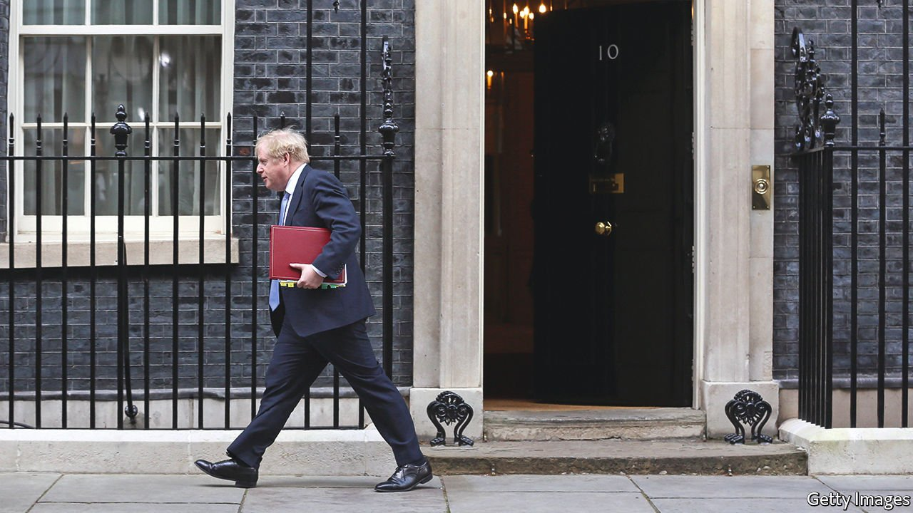
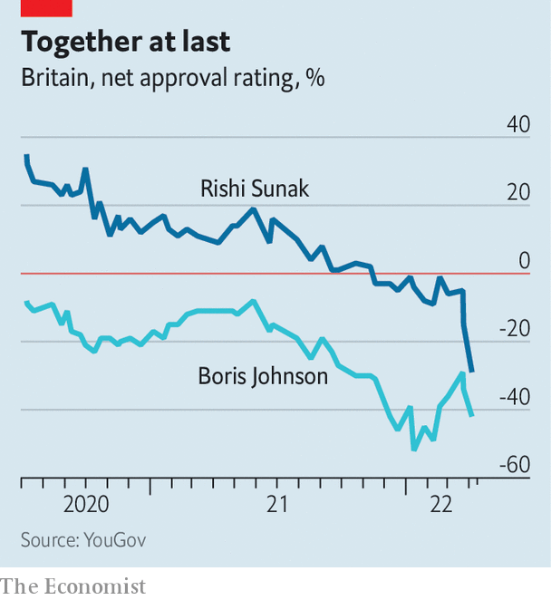

###### Partygate

# The Conservative Party keeps waiting for Boris Johnson to improve 

##### It will be waiting for a long time 

 

> Apr 16th 2022 

“NOTHING HAPPENS, nobody comes, nobody goes, it’s awful!” Estragon, a character in Samuel Beckett’s play “Waiting for Godot”, is not a Conservative MP. But he has the same view of the world.

On April 12th Boris Johnson was fined for attending an illegal birthday party in the summer of 2020, at a time when Britons were banned from seeing loved ones indoors. He thereby became the first prime minister to be found to have broken a law in office—a law introduced shortly before by his own government. Snap polls showed a majority of voters want him to step down. But, with the Conservative Party, excuses can always be found for inaction. The MPs who decide Mr Johnson’s fate increasingly resemble characters in Beckett’s play, in which action is frequently promised but usually delayed.


Some of their justifications for inaction are bureaucratic. At the start of the year, MPs promised to act against Mr Johnson, but only once an internal government report had been published. When the report by Sue Gray, a senior civil servant and ethics chief, appeared in an abridged form, the trigger changed. MPs would move against their leader only if the police took action against him. Now that the police have played their part, the excuses have become procedural: Parliament is in recess and the corridors of power are empty. Conservative WhatsApp chats are alive but indecisive.

Voters may jolt them. Local elections are due at the start of May. But even if voters deliver a slap to the Conservative government, more excuses could be forthcoming. Few people vote in local elections, runs one ready-made line of defence for Mr Johnson. Those who do tend to be politically engaged, unlike the disgruntled working-class voters whom Mr Johnson managed to drag over to the Conservatives for the first time in 2019. Better to wait for a general election for a true test.

The war in Ukraine provides yet another excuse. The prime minister has handled the invasion with uncharacteristic skill. Moving against him now would seem simultaneously unserious and churlish. It may give succour to Vladimir Putin, MPs argue. That the same happened in the second world war, when Tory MPs forced Neville Chamberlain to resign, makes no odds to Conservative lawmakers who seem to prefer their Beckettian hell.

Hardly any MPs are happy. But Mr Johnson is all they have. To move against him is to move against a man who, in just a few months in 2019, took them from the worst result in their history in the European elections (9% of the vote) to their largest majority in Parliament since Margaret Thatcher (and 44% of the vote). MPs cling to Mr Johnson like shipwreck survivors who continue to wear life jackets even after they are safe on land. Mr Johnson does not have a decent political operation, counsels one former cabinet minister. But nor do any of the alternatives. The likely option is more waiting.

 


Rishi Sunak, the chancellor of the exchequer, was supposed to be the alternative. He is diligent, thoughtful and serious, especially compared with the prime minister—a family man next to a man of many families. When revelations of parties in Downing Street first emerged, Mr Sunak was slow to support the prime minister and quick to chide him. Mr Johnson “was right to apologise”, he said, primly. But now Mr Sunak too has been fined. His popularity was fading anyway as living standards fall (see chart). It may vanish entirely as Britons digest the fine and recent revelations that his wife, Akshata Murty, is a “non-dom” for tax purposes.

Other potential successors have blundered to a lesser degree. Liz Truss proved to be an efficient and energetic trade secretary. As foreign secretary, she has been a Thatcher-like hawk, mixing photo-ops in tanks with an aggressive, now vindicated, position on Russia. Jeremy Hunt, the former foreign secretary, is highly regarded within the party. But both have doubters. Ms Truss splits opinion among those who have worked with her. Ten years ago Mr Hunt had a reputation as a slightly peculiar, if pleasant, cabinet minister. The fact that he has become the party’s wise elder suggests in part how few untarnished MPs it now contains.

Don’t just do something, sit there

While no one moves against Mr Johnson, little moves in government. In the 1980s the party launched an economic revolution that changed Britain for good. Those who wait for similarly sweeping legislation will do so for a long time. Trivial measures such as privatising Channel 4, a broadcaster, are advanced; bold ones such as changing planning laws are ditched.

Mr Johnson is accused of misleading Parliament. Such an offence is supposed to be a resigning matter. Little holds back the executive other than Parliament and a prime minister’s own sense of restraint. For all that successive governments have attempted to codify the constitution, the country still runs on the “good chap” theory. But the prime minister has never pretended to be a good chap. That the Conservative Party saw fit to place him in the job is an indictment of the party rather than him.

Those expecting Mr Johnson to resign will be disappointed. If he were the type of person to resign over attending an illegal party in a pandemic, he would not have attended an illegal party in a pandemic. If Conservative MPs want Mr Johnson gone, they will have to move against him. But if they wanted him gone, they had reason enough to move months ago. Instead, they appear doomed to copy Estragon and Vladimir at the end of Beckett’s play. “Well,” says Estragon. “Shall we go?” Vladimir replies: “Yes, let’s go.” The final words are a stage direction: They do not move. ■

