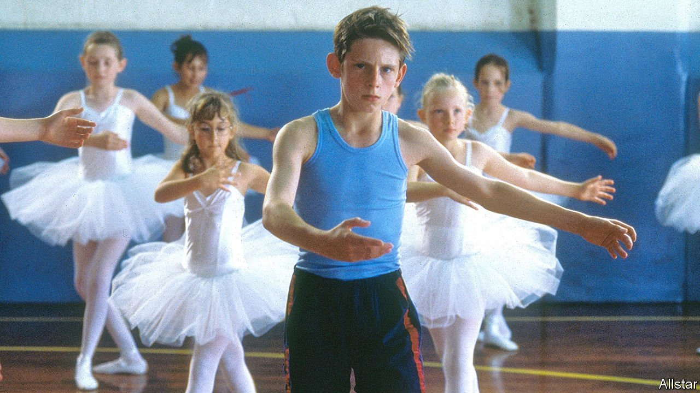

###### Censors and sensibility

# The classification of films is changing 

##### What the British find offensive has shifted, again 

 

> Apr 13th 2022 

“FUCKING” IS NOT what it used to be. Where once the mere presence of a “fuck” would be enough to merit a “15” rating in a film, and an “18” if said often enough, today the guidelines of the British Board of Film Classification (BBFC) have softened. Today a friendly “fuck”, as it were, will merit merely a “12” rating. Similarly, an affable “cunt” might slip past as a “15”. But a hostile use of the word—perhaps “by a strong man against a vulnerable child or a woman”, suggests David Austin, the head of the BBFC—is likely to merit an “18”. Context, he says, is everything.

Words have power. And in a small drab office in central London, Mr Austin and his fellow BBFC officers carefully monitor precisely how much power. Every day they watch the films that are to be released in Britain, and award them a rating, from U to 18; every year they reflect on how the limits of acceptable language are changing. The result is a Richter scale of rudeness that calibrates the emotional shock conveyed by each word, from low impact (words such as “damn”), to a distinct tremor (“fuck”—or as the discreet BBFC code has it, “strong language”) to rather more powerful disturbances.


What causes jolts is changing. Every four years the BBFC runs consultations with the public: 10,000 people are consulted; numerous films are watched. At the end of last year, after the Black Lives Matter protests, the BBFC ran an unscheduled consultation on discrimination in film. It found that attitudes had altered. Material once “considered anodyne may now raise issues of harm and offence”. The most striking change is towards what the BBFC politely calls “the n-word”. Once, with the right educational context, it might have been classified as “PG” (parental guidance), but now “It is highly unlikely to be permitted in any content rated lower than 12 A/12.”

There are two ways to look at the BBFC. One is as an organisation that does what it says, and classifies things. It does far more of this than is often realised. The BBFC is known for the circular and triangular age ratings that appear before a film begins, with Mr Austin’s signature beneath. But its work is not limited to cinemas. Netflix and other streaming services classify content under its aegis, while fine threads of BBFC judgment lie over the entirety of the web itself. Activate “parental controls” on a mobile device and you are activating its guidelines, for those things deserving of a BBFC “18” will be automatically filtered out.

The other way of looking at the BBFC is as an unintentional but unsurpassed chronicle of British mores. Founded just over a century ago as the British Board of Film Censors, its early annual reports offer an almanac of old anxieties and moral panics. Between 1917 and 1933, for example, it was variously distressed by bull fights, blasphemy, “men leering at exposure of women’s undergarments”, “Bolshevist propaganda” and the opaque but unarguable “revolting monstrosities”.

Chaos dark and rude

The annual reports also show that anxieties over race are long-standing—though the tone has changed somewhat. Thus 1917’s annual report deplored “subjects dealing with India in which British officers are seen in an odious light”; while a later ruling disliked “liaisons between coloured men and white women”. The area once known as “abroad” was a constant cause of anxiety. As a report in 1936 noted, there had been a “marked increase” in a new and alarming kind of film, namely, “European films”. Many, it warned dourly, will “require drastic cutting”. Each era raised new issues: “A Clockwork Orange” caused conniptions in the 1970s; in 2000, “Billy Elliot”, a heart-warming but foul-mouthed film, had to be awarded a “15”.

Censorship, as the place where the censorious and the salacious meet and embrace, is often unintentionally amusing. Matthew Parris, a former politician and British journalist, served for five years on the Broadcasting Standards Council (BSC), a knuckle-rapping quango that reviewed public complaints about TV and radio. Each summer he had to take home “bags full of cassette tapes of pornographic material” that had caused objection. On one occasion, “we had to work out whether intercourse had been anal or vaginal” which, Mr Parris recalls, required “a little expertise” and hours of freeze-framing.

Mr Parris thinks the humour comes less from the smut than because “you never know what’s going to upset people.” One correspondent wrote to the BSC to complain that a party-political broadcast featuring William Whitelaw, a Conservative politician, had been shown before the nine o’clock watershed. It was, she wrote, distressing for her children: “They start crying whenever they see his face.”

To read the BBFC reports now is to be overwhelmed by a feeling of quaintness and futility: of Cnuts before the incoming tide. That is a mistake: few attitudes date so swiftly as seeing past eras as stuffily uptight and your own as uniquely liberal. Public opinion is tidal—and it flows as well as ebbs. Blasphemy and sex no longer shock as they once did, but the BBFC has not universally lowered age-ratings for all words. Some have risen.

George Orwell once observed: “At any given moment there is an orthodoxy, a body of ideas which it is assumed that all right-thinking people will accept without question. It is not exactly forbidden to say this, that or the other, but it is ‘not done’ to say it.” As with ideas, so too with words. What the precise ideas, or words, are will change—but they will always be there. And in a small office in London, the officers of the BBFC—semantic seismologists—will be monitoring their power. ■

