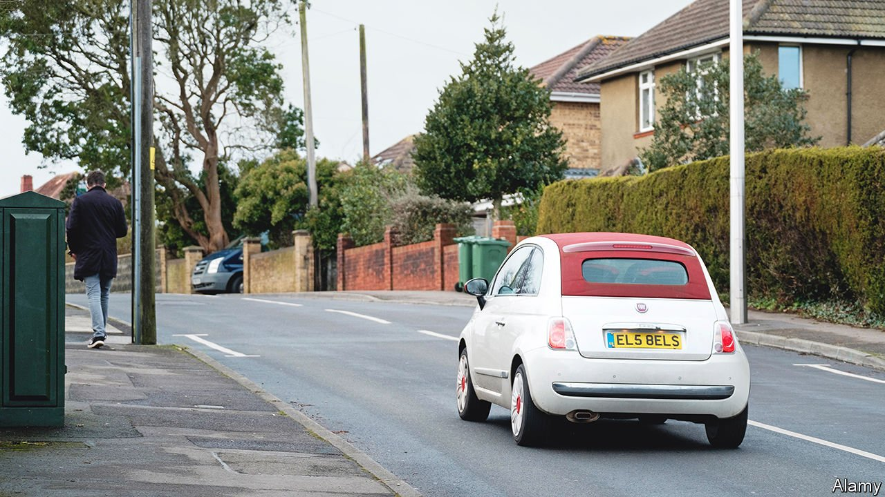

###### Baby you can drive M1 car

# The cost of personalised number plates is rising in Britain 

##### Registrations are growing more popular, and sillier 

 

> Apr 13th 2022 

VANITY DOES not come cheap. 53NGH, which looks like the name “Singh”, sold for £61,010 ($79,780) at a government auction of personalised number plates earlier this month. 8TOY was the second most expensive plate, at £43,010; Chinese buyers associate the number eight with wealth and luck. BOT 7OX sold for £10,010, although LDY 8O5S went for a mere £3,160.

Britons owned £3bn-worth of personalised number plates in 2020, according to the Office for National Statistics. They are attached to vehicles both costly and humble. Farm Plates, a specialist dealer, sells registrations to rural customers for jeeps and trailers. “If you could put them on tractors I’d sell thousands,” says Olly Hares, the owner.


Britain’s first number plate was DY 1, issued in Hastings in November 1903. Memorable registrations were popular from the beginning: the following month, Earl Russell secured London’s first licence plate, A1, after queuing overnight at the county-council office. By the 1960s a market for personalised plates had emerged. Dealers scoured scrap yards and left notes on the windscreens of cars with desirable registrations.

The Driver and Vehicle Licensing Agency (DVLA) issues new plates with the latest date code twice a year. The most valuable are sold at auction, along with older-style plates the DVLA has not yet released. The agency tries to avoid obscenities and politically sensitive plates. AN71 VAX, EU21 BAD and TA71 BAN were ruled out last year. A plate bearing a resemblance to Crimea was pulled from auction earlier this month in light of Russia’s invasion of Ukraine.

Dealers say that prices are rising. Plates that allude to cryptocurrencies are the latest fad. NFT3, which refers to non-fungible tokens, sold for £10,000 in the most recent DVLA auction; CR11 PTO went for £27,490 in March. Buyers might well be hoping to sell such plates on for more money. “I think it’s the same risk you’ve got buying cryptocurrencies themselves,” says Brian Heaton, of the Institute of Registration Agents &amp; Dealers, a trade association, sagely. “There’s nothing behind it all.”

