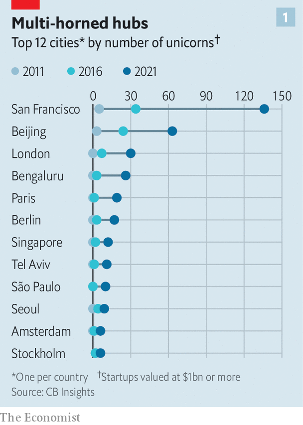

###### The new atlas

# Can Silicon Valley still dominate global innovation? 

##### Why nearly 300 cities now host more than 1,000 unicorns 

 

> Apr 16th 2022 

TAKE AN EVENING walk on 17th Cross Road in Bengaluru’s HSR Layout district, and you bump into tech types stepping out of their startup’s office and into one of the local microbreweries. They might work for Udaan (e-commerce), Vedantu (education technology) or another of the growing herd of private startups valued at $1bn, whose proliferation in the area has prompted locals to dub it “Unicorn Street”. That name might be outdated, says Mohit Yadav, co-founder Bolt.Earth, a unicorn wannabe housed in the MyGate building. “Unicorn neighbourhood” would be more apt, he chuckles.

HSR Layout was not always the startup hub of Bengaluru, itself the startup capital of India. Five years ago Koramangala, a few kilometres to the north, was the place to be—until rising office prices pushed out new startups. The fact that young firms are beginning to eye an ever-wider region to set up shop hints that Bengaluru is maturing as a venue for ambitious technologists. The city is home to 26 unicorns, and last year attracted $13bn in venture capital (VC).


For decades Silicon Valley’s position as the birthplace of high-growth technology companies was unassailable. The small patch of land has given the world, among others, Hewlett-Packard (founded in Palo Alto in 1939), Intel (Mountain View, 1968), Apple (Los Altos, 1976), Google (Menlo Park, 1998) and Uber (San Francisco, 2009). Mark Zuckerberg moved in only four months after founding Facebook in Cambridge, Massachusetts, in 2004. As recently as 1999 the valley attracted a third of global VC investment. In 2011, 20 of the world’s 27 unicorns had their headquarters in America, according to CB Insights, a data provider. Only four other countries boasted even one.

 


San Francisco is home to 136 unicorns, with 220 in the Valley as a whole, more than any other place in the world. But as Bengaluru shows, such clustering is no longer confined to a strip of land in California. Unicorns can be found in 45 countries. Over 1,000 trot the globe; nearly half are outside America. The share of all VC flowing into American startups has declined from 84% two decades ago to less than half.

 


The diffusion of capital reflects huge growth in tech in recent years that lifted many boats. But it will endure beyond the ups and downs of the investment cycle. Even as tech valuations slid during the fourth quarter of 2021 and first quarter of 2022, the share of funds flowing to firms outside Silicon Valley and America has remained high at 82% and 51%, respectively.

Of the places that have burst onto the startup scene, some are mature, such as Beijing, London or Tel Aviv, and often global in their ambition. Others, including Bengaluru, Singapore or São Paulo, are in earlier stages of hub-dom. All enjoy a broad pool of technical talent, deep links to other parts of the world and local risk capital. Together, they are redrawing the map of global innovation—creating one that is more dispersed, diverse and competitive.

Many of the new clusters look different from Silicon Valley—although some share its pleasant climate. They also differ from each other. The more mature hubs tend to spawn more “deep tech” firms working in complex areas like artificial intelligence and other sophisticated software aimed chiefly at corporate customers rather than consumers. But whereas Israeli and British startups often look across their borders, Beijing’s are focused almost entirely on the domestic market.

 


Younger innovation hubs, including Bengaluru, São Paulo and Singapore, look a bit more alike in that their focus is regional rather than global. Instead of breaking new ground they often adapt existing business models to local market conditions. As disposable incomes rise in new regions, consumers become willing to pay for similar “technification of services”, says Peng Ong of Monk’s Hill Ventures, a Singaporean VC firm. Anand Daniel of Accel, a Silicon Valley VC firm, calls this the “X of Y” playbook. And so Flipkart (e-commerce) is the Amazon of India; Nubank (fintech) is the Revolut of Brazil; Grab (ride-hailing) is the Uber of South-East Asia. This helps explain why 70% of South-East Asian unicorns and 80% of Latin American ones are either in fintech or consumer internet (see chart). Still, hyper-localisation means each hub is distinct.

The boom in tech clusters has been fuelled by several structural developments. The worldwide spread of high-speed internet and smartphones has allowed startups to serve customers just about everywhere from just about anywhere. “Rapid technology adoption has made the market so much deeper,” says Abheek Anand of Sequoia India, the Indian arm of a Silicon Valley VC stalwart. Cloud computing and freely available developer tools have made starting a firm much easier. At the same time, as growth rates in mature markets have slowed and competition for investments has risen, venture capitalists are looking elsewhere for their next big bet.

The pandemic appetite for all things digital has fuelled these trends. Some 60m South-East Asians, nearly a tenth of the region’s population, became new netizens in the past two years alone, according to Bain, a consultancy. The number of companies in India and South-East Asia generating $100m of annual revenue has jumped by an order of magnitude in recent years, observes Mr Anand.

If the democratisation of technology and global VC were the whole story, however, startups would be springing up everywhere. They aren’t. The Economist has looked at startup funding and valuation data for the ten countries with the most billion-dollar startups. We have found that nearly 40% of these unicorns herded in the country’s top startup city. Between 2011 and 2021 the top city’s share of national VC funding rose from less than 50% to nearly 70% for London, from 24% to 60% for Berlin and from 15% to 34% for Bengaluru.

Where to startup?

That suggests that clustering remains no less powerful a force than when Alfred Marshall coined the notion of “agglomeration economies” in the late 19th century. Once a city gains a foothold, additional activity is pulled in because of increasing returns to scale. It is easier to do business and recruit when suppliers and talent pools are nearby. Ideas flow more easily when employees from rival firms frequent the same pubs (or microbreweries). Even wide adoption of hybrid work is unlikely to change that; people will still want to meet in person and it is easier to do this when the persons are nearby.

A deep talent pool is the most obvious ingredient of a successful cluster. Famously, Silicon Valley benefits from proximity to brain trusts such as Stanford or the University of California, Berkeley. Tel Aviv has both universities and recruiters from the Israeli Intelligence Corps, which like elite universities enlists the best and brightest. Participation in such elite units is an immediate signal for a venture capitalist looking for a startup founder to back, or a startup seeking to hire young technologists. Bengaluru has nearly 70 engineering colleges. More than 55% of Indians on LinkedIn, a professional social network, boast technical skills, such as those needed for programming. Only Germans are technically savvier; for Americans and Britons the share is around 42%. “Where else can you quickly hire a few thousand engineers?” marvels Shailesh Lakhani, a colleague of Mr Anand’s at Sequoia India.

Talent alone is not enough, however. Tokyo had the brains to produce global tech giants such as Sony (in electronics) and, more recently, Rakuten (in e-commerce). Yet the Japanese capital has struggled to nurture a vibrant startup scene. One possible reason is the continued dominance of Japan Inc by keiretsu (conglomerates). Another is the country’s insularity. In one survey from 2019 the country ranked 53rd in the world in English proficiency; less than 8% of Japanese speak it fluently. Foreigners tend to have a hard time gaining status in Tokyo’s business circles. Outside venture capitalists have been shunned.

That hints at the second critical factor: openness to people and ideas. Migrants are a disproportionately enterprising bunch. Around 60% of America’s most valuable tech companies were started by immigrants or their children. European hubs such as Berlin, London and Paris, each of which is home to ten or more unicorns, have large immigrant populations. China lacks foreign founders but its startup hubs like Shanghai and Shenzhen draw plenty of “sea turtles”, returnees who have studied or worked abroad.

It is hard to determine to what extent connectedness spurs startup activity, as opposed to the other way around. But the two go hand in hand, and almost certainly feed off each other. René Belderbos of Maastricht University has examined how often inventors in a city co-author patents with inventors abroad, and how this changes over time. Unicorn-rich Bengaluru, San Francisco, Singapore and Tel Aviv all feature in the top ten of Mr Belderbos’s ranking of cities based on the growth in such linkages. Unicorn-poor Tokyo has seen a decline in connections.

Bengaluru illustrates how talent and openness combine to create startup magic. The city’s fondness for newfangled technology dates back to at least 1905, when the local maharajah diverted a nearby supply of hydropower to make it the first city in Asia with electric streetlamps. Four years later it built the Indian Institute of Science, a prestigious university that remains a magnet for clever Indians. Migrants make up more than half its population—a statistic India’s tech grandees invariably cite when explaining the city’s success.

It has also long been connected to the world. Texas Instruments, an American electronics-maker, chose Bengaluru for its first regional office in 1985. Infosys and Wipro, Indian information-technology (IT) giants based in Bengaluru since the 1980s, have served global software customers, making the city “the world’s back office”. When India’s closed economy opened up in 1991, the city was the natural place for foreign companies and capital eyeing the country’s vast market, says Nandan Nilekani, co-founder of Infosys. That in turn drew ambitious domestic upstarts seeking connections and cash.

Yet Bengaluru might not be where it is were it not for a third ingredient: the presence of local risk capital. For an enterprise to thrive, it needs backers who understand the ecosystem and are willing to feed it. This can be founders and employees of earlier startups, who become angel investors for the next generation, notes Rana Yared of Balderton Capital, a VC firm. Former employees of Flipkart, which Walmart bought in 2018, have gone on to found 225 startups, including five unicorns, according to Tracxn, a data provider. Those from Grab, Lazada and Sea Group, a trio of Singaporean tech darlings, have founded or run more than 1,000 firms.

A local capital base also encourages another important type of risk-taking. Employees must be able to leave existing firms and join or start competitors. AnnaLee Saxenian of Berkeley has argued that Boston’s Route 128, also near to top-notch universities, was outcompeted by Silicon Valley in the 1980s because it lacked this free flow of people between firms, perhaps in part because of stricter enforcement of non-compete agreements than in California.

In some cases, the state can provide early backing. Besides having a long bench of angels that stretches back at least to Bill Hewlett and David Packard, Silicon Valley enjoyed its share of government contracts in its formative post-war years, particularly from the Defence Department. Fairchild Semiconductor, whose employees included the future founders of Intel, Sequoia Capital and Kleiner Perkins, depended on government procurement for much of its early growth. Bengaluru, home to military-research outfits, and Tel Aviv also have strong links to their countries’ armed forces, which can act as buyers of first resort.

Some governments support startups with capital rather than contracts. Take Singapore, which has more unicorns per person than anywhere bar Israel. Edwin Chow of Enterprise Singapore, a government agency in charge of the city-state’s startup policy, puts this down to schemes aimed at attracting investors and founders. For instance, a big programme from 2009, modelled after a similar one in Israel, matched every $1 from investors with nearly $6 from the public purse. At least 15 funds qualified for the scheme, which allowed the investors to buy out the government’s stake at its original face value, adds Mr Ong of Monk’s Hill.

 


How much credit such top-down policies deserve is hotly debated. Attempts to will clusters into existence have mostly foundered. In 1999 Germany poured €1.5bn ($1.6bn) into a Bavarian cluster initiative. France funnelled a similar amount to its pôles de compétitivité in 2005. Malaysia’s BioValley complex, launched the same year at a cost of $150m, was soon derided as “Valley of the BioGhosts”. A Canadian experiment in supporting startups failed because it was so well-funded that private investors stayed on the sidelines. In 2009 Josh Lerner of Harvard Business School concluded that “for each effective government intervention, there have been dozens, even hundreds, of failures, where substantial public expenditures bore no fruit”.

There be unicorns

Most investors and even some policymakers agree that Singapore’s success has more to do with its entrepot status, pro-business laws and political stability. That said, Justin Hall of Golden Gate Ventures, a Singaporean VC firm, reckons that the leg-up from the state may have accelerated Singapore’s ascent by a few years.

The importance of talent, openness and risk capital will persist. But the clusters that thrive thanks to a combination of the three will continue to evolve. As the younger clusters mature, the “ X of Y” playbook will gradually give way to more advanced tech, as is happening in China. They will also become more globally minded. Already about 30% of India’s current herd of 60-odd unicorns primarily target international markets, says Dev Khare of Lightspeed India Partners, one more VC firm.

And new cities may join the ranks of tech hubs. Lagos, Nigeria’s commercial capital, already looks poised to become the dominant player in the African fintech scene. In March Nigerian startups were better represented than those of any other country except two at Y Combinator, a famed Silicon Valley startup accelerator. Hot technologies such as the decentralised world of cryptocurrencies and so-called Web3 may seek out places with favourable regulations (or lack thereof). FTX, a cryptocurrency exchange valued at $32bn, has just moved to Nassau, in the Bahamas. The weather is nice there, too. ■


