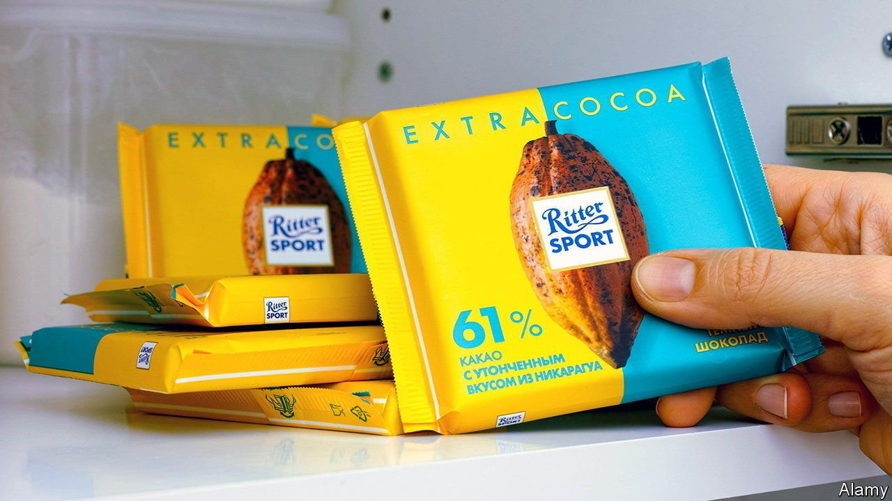

###### The Russia remainers

# Companies fear consumer boycotts 

##### But activists’ interest has little immediate impact on sales 

 

> Apr 16th 2022 

ANDRIJ MELNYK, the Ukrainian ambassador in Berlin, did not hold back. Mocking Ritter Sport’s advertising slogan, he tweeted on March 29th “Quadratisch, Praktisch, Blut” (square, practical, blood), replacing gut (good) in the firm’s slogan. A couple of days later Dmytro Kuleba, Ukraine’s foreign minister, called for a boycott of the maker of chocolate snacks tweeting: “Ritter Sport refuses to pull out of Russia citing possible ‘serious effects’ for the company. However, remaining in Russia brings worse effects, such as a fatal damage to reputation.”

Companies often comply with at least some of these type of demands for reasons unrelated to the immediate impact on the bottom line. “Calls for boycotts usually have very little impact on sales, but the media spotlight can do much harm to the brand equity,” says Brayden King at Northwestern University in Illinois. The more media coverage a company gets the bigger the potential future damage.


Ritter Sport, a family-owned firm that is over 100 years old, is taking the risk. It tried to explain its decision to continue doing business in Russia, its second-biggest market after Germany, accounting for around 10% of sales. If it stopped deliveries in the country, many of its suppliers, cocoa farmers in west Africa and Latin America, would lose out. “We are not an international conglomerate that can simply stop some business activity here to shift to another over there,” says the firm. But it promised to cease advertising and investing in Russia and donate all profits from sales there to charity.

This is not enough for activists, who continue to call for a boycott, spreading the word through social media. They tend to go after firms with a good reputation such as Ritter Sport because their criticisms are likely to be more damaging and hence more effective. Recent efforts to burnish its image include promises to become carbon neutral by 2025, and using only sustainably-grown cocoa from decently paid farmers. “Ritter Sport is a high-involvement product,” says Colin Fernando of BrandTrust, a marketing consultancy, which means that it is supposed to represent its customers’ self-image. Continued involvement in Russia may leave a nasty taste in the mouth.

Campaigners will take heart that they have forced Nestlé, a Swiss giant, to change its ways both in the past and recently over doing business in Russia. The world’s largest foodmaker stopped pushy marketing of its baby formula in poor countries several decades ago after a campaign by American activists, who argued Nestlé discouraged breastfeeding, spread around the world. And after initially refusing to pull out of Russia Nestlé relented at the end of March, joining over 450 firms that have left or suspended operations there, depriving Russians of KitKat chocolate bars and Nesquik, a chocolate-drink powder. Nestlé will still provide essentials, such as food for babies and hospitals, but donate the profits to humanitarian organisations.

The success of a boycott depends on how you measure it, says Eric Wohlgemuth, chief executive of Future 500, a consultancy. It can alert bosses to their mis-steps, such as with Nestlé. Nike also fell foul of activists over its alleged use of child labour to make its sportswear, encouraging it to take more care over the farther reaches of it supply chain. And sometimes it can have a meaningful financial impact. Shell, an Anglo-Dutch oil giant, which has previously been the target of protests over drilling in the Arctic, faced calls in February for a boycott over its purchases of cheap Russian crude oil. On March 8th Shell announced its intention to make a gradual retreat from Russia at a cost of up to $5bn in write-downs and other losses.

There is a chance that this will blow over for Ritter Sport, with only a minor dent to its do-gooding reputation. But it is on probation, warns Mr Fernando. Another public upset could cost it more dearly. The former darling of Germany’s Mittelstand will monitor Ukrainian foreign-office Twitter accounts closely. ■

For more expert analysis of the biggest stories in economics, business and markets, , our weekly newsletter. And for more of our recent coverage of the Ukraine crisis, visit our dedicated .

