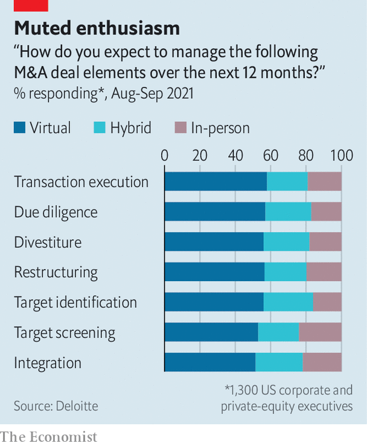

###### Mergers and acquisitions

# How dealmaking has been reinvented 

##### This M&A boom isn’t like the last one 

 

> Apr 16th 2022 

IT WAS ONCE thought that investment bankers, like sharks, needed to keep on the move to survive. Then pandemic lockdowns put paid to their perpetual motion between headquarters, airports and meetings. Greasing the wheels of mergers and acquisitions (M&amp;A) took a backseat to corporate concerns about survival. Deals were scrapped or put on hold and bankers focused on clients that they knew already. Virtual dealmaking became the norm. As in-person interaction returns, will the new ways of working persist?

Video conferencing has led to unexpected benefits for companies and their investment bankers. When travel restrictions grounded Wall Street’s jet-setters, negotiating multi-billion-dollar deals on Zoom made firms more productive and cheaper to run. Bankers swapped business-class lounges for virtual calls from their designer kitchens. Suddenly, with more free time, they could contact twice as many potential bidders for their clients, increasing the odds of a suitable match.

 


The hyper-efficiency has been welcomed. In an earnings call in 2020, executives at Citigroup remarked on the ease with which client visits that once required months of careful planning could be scheduled in days in the virtual environment. Moelis, a boutique firm, slashed its spending on travel from $10m each quarter to a fraction of that amount. As restrictions are lifting, some in-person meetings have returned but the punishing travel schedules have not. A recent poll by Deloitte, a consultancy, shows that more than half of companies and private-equity investors now expect to manage M&amp;A in a predominantly virtual environment (see chart).


The pandemic also turbocharged the adoption of technology. Increased use of big data and analytics hastened the automation of grunt work normally delegated to junior bankers. Acquirers also got creative with due diligence. Virtual tours became commonplace for inspecting far-flung sites including mines, factories, ports and warehouses. Goldman Sachs among others flew drones over the facilities of companies to capture high-quality photos or to produce slick videos. Lawyers and others used artificial intelligence to sift through thousands of company documents, spotting red flags in a fraction of the time it would take humans.

Cultural shifts borne out of the pandemic prompted even deeper soul-searching. As the corporate world embraced flexible working arrangements, many banks ushered in hybrid schedules—somewhat reluctantly—for their staff. Firms raised salaries, paid out bumper bonuses and more in an attempt to stop young, disgruntled staff from leaving the industry. Jefferies bought them Peloton exercise bikes and Citi offered them jobs in Málaga, a Spanish coastal city, while JPMorgan Chase obliged them to take at least three weeks off a year. For those accustomed to the industry’s hard-nosed culture, it was perplexing.

A frenzy in 2021 put this kinder, gentler model of dealmaking to the test. Private-equity buyouts and special-purpose acquisition companies drove the value of global M&amp;A to a record $5.9trn. Annual fees earned by dealmakers surged by nearly 50% to more than $48bn in 2021, accounting for nearly a third of investment-banking income, up from a quarter in 2020, according to Refinitiv, a data firm.

The boom exposed the limits of virtual schmoozing. Even with drones carrying out critical due diligence, polling by Deloitte suggests that the inability to travel or meet management teams in person was more likely to trigger cancellations. Most respondents (78%) abandoned at least one deal in 2020 while nearly half (46%) quashed three or more. For young recruits, automation of arduous tasks did little to cure burnout. A survey of 13 analysts in 2021 at Goldman Sachs laid bare their gruelling working conditions: 95-hour weeks and an average of five hours of sleep a night meant mental health suffered.

Digitisation has raised thornier questions about dealmaking. A growing reliance on technology suggests that huge swathes of the M&amp;A value chain can be automated. Meanwhile the availability of big data erodes the information advantage that banks once had. Can executives run the process without retaining expensive bankers? Apple acquired Beats in 2014 without the help of banks, as did Facebook when it bought WhatsApp the same year. Spotify and Slack both went public, in 2018 and 2019 respectively, without involving underwriters.

Few firms have the resources to manage the process internally and much of the investment-banking workload, at least in the senior ranks, is contingent on old-school relationship-building. But even as face-to-face meetings resume the digital transformation means the old days of M&amp;A are not coming back. ■

For more expert analysis of the biggest stories in economics, business and markets, , our weekly newsletter.

