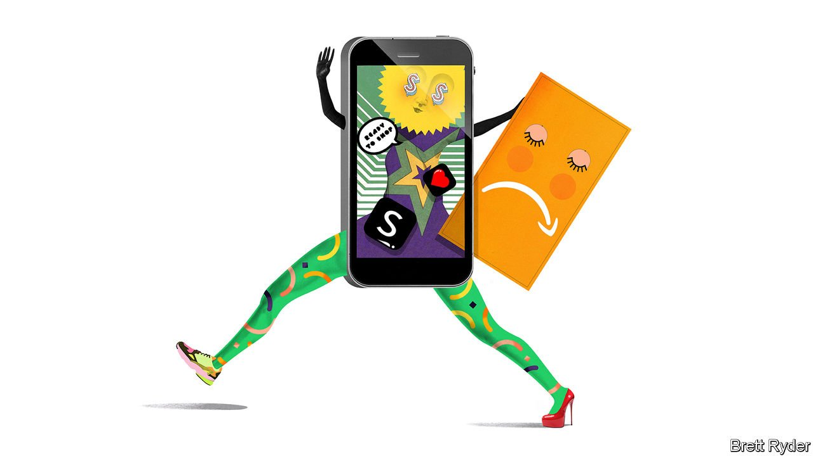

###### Schumpeter

# How much of a risk is opacity for China's Shein? 

##### The TikTok of frocks is the world’s hottest fashion retailer 

 

> Apr 16th 2022 

IF YOU FANCY a look into the razzmatazz-filled future of e-commerce, type #Sheinhaul into TikTok, suspend your ethical scruples, and watch young influencers tear open boxes of garments, yell things like “My Shein order is here…holy shit!”, and then pour hundreds of dollars-worth of cheap garments over their heads. It’s hype, for sure, but not entirely frivolous. Shein, a Chinese online retailer, is the TikTok of the $1.5trn apparel industry. It is one of two Chinese firms (ByteDance, TikTok’s owner, is the other) to be privately valued at $100bn or more. Like TikTok, it is an obsession of Gen Z-ers in their teens to late 20s. And yet it is so opaque that even the American investment funds that back it, such as Tiger Global and General Atlantic, won’t divulge a thing about it. Could it be that it wants to keep its Chinese heritage under wraps?

In America, where it faces an incumbent that is almost impregnable, Amazon, its success is extraordinary. In the first three months of 2022, it accounted for almost a third of fast-fashion sales in the country, more than stalwarts Hennes &amp; Mauritz (17%) and Inditex’s Zara (10%) combined, according to Earnest Research, a consultancy (Amazon does not break out its own apparel sales). Although Shein’s sales growth slowed from triple digits to 35% year-on-year in the quarter, it still bucked the trend: fast-fashion sales excluding Shein (and Amazon) fell by 12%. Morgan Stanley, a bank, forecast in October that Shein could become the world’s largest apparel retailer this year, with annual sales of $20bn. Not bad for a company that came out of nowhere a decade ago. It publishes no financial data, so profitability is a secret. But a recent report said it is closing in on Amazon as America’s second-most-popular shopping app, leapfrogging Shopify, a platform for individual brands, and Walmart, a retailing behemoth. For all the air of mystery, the company is worth examining not just as a harbinger of the future of fast fashion, but of online shopping in general.


What distinguishes it? In a nutshell, Shein (pronounced Shee-in) looks like a hybrid of two of the most successful forces in online retail—customer-obsessed Amazon and data-obsessed China. Like Amazon, it uses low prices to lure customers, and seeks to keep them constantly engaged—even compulsively so—while operating with ruthless efficiency. Yet it is China that provides the alchemy. Though it is not a big seller there, it has introduced the speed and effervescence of Chinese e-commerce to the outside world in three ways: via an integrated supply chain; data-driven design; and a grasp of the social-media hype cycle. These are what mainly sets it apart from its Western competitors. Even Amazon, which looks dowdy by comparison, could learn a thing or two.

Start with the supply chain. Based in Guangzhou, Shein taps into thousands of suppliers that stitch and sew garments. Standard stuff in the world’s factory. What makes it different is that it pays them on time, which foments trust, enabling it to commission small orders at low prices, bolstering the frequency with which it can launch new styles. Sheng Lu, of the University of Delaware, calculates that last year Shein offered 1.3m new styles in America, versus 35,000 at Zara and 25,000 at H&amp;M. He says typically Shein’s prices were 40-60% cheaper. That combination of limitless variety and skimpy prices is at the heart of its business model.

Second, the suppliers are harnessed together by Shein’s own software, which provides them with constant updates, measured by algorithm, of what is hot or not. That enables them to adjust output constantly to suit the latest tastes, without amassing unwanted inventory. Shein’s international data-gathering, from scouring social-media sites, is crucial. It doesn’t obsess over what season it is or what’s on the catwalk. Instead, writes Packy McCornick, a business blogger, “it’s a mirror that reflects each country’s current style back to it.” Like TikTok, it doesn’t seek to impose a cultural stereotype (least of all a Chinese one) on the markets where it sets foot. Surveys suggest few of its shoppers know—or even care—where it comes from.

Third, it is a master of what Allison Malmsten of Daxue Consulting, a China-focused market-research firm, calls “gamification”—another feature of e-commerce in China. She describes browsing Shein’s app as like walking through a shop, not scrolling down an Amazon page. Discounts crop up at random, giving a sense of excitement. Micro-influencers, supported by small inducements, promote discounted products. She likens it to the way that Zara pioneered fast fashion on Western high streets in the 1990s, with short supply chains, high turnover and new designs. “Shein is the online version of that—on crack,” she says.

For all its strengths, Shein generates a wide variety of questions—mostly because of its lack of transparency at a time when fast-fashion firms are under intense pressure to open up, particularly about their supply chains in China. There have been on-again, off-again rumours about an initial public offering. While Shein remains private, its commitment to sustainability, working conditions in its factories and sourcing of raw materials is relatively unknown. As a Chinese firm, its gathering of data, especially those of young shoppers, may arouse concern in the West. Its success itself poses a conundrum. Surveys suggest Gen Z-ers are motivated to reduce their environmental footprint. And yet Shein’s performance is an indication that bargain-basement prices exert as much pull as ever.

Rags to riches

As for the future, much depends on how robust its growth-first, profits-later financial model is. One message from its jet-propelled ascent is that barriers to entry, even in countries dominated by Amazon, are not prohibitively high, provided you get the technologies right. That works both ways; Shein itself is not impervious to competition. But while people are paying fortunes just to dump its stuff on the floor, it can afford itself a smile of satisfaction—even if an overly shy one. ■

Read more from Schumpeter, our columnist on global business: (Apr 9th) (Apr 2nd)

 (Mar 26th)

For more expert analysis of the biggest stories in economics, business and markets, , our weekly newsletter.

