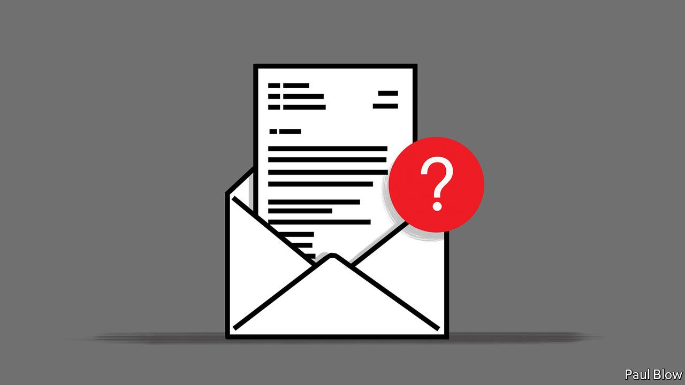

###### Bartleby

# How to sign off an email 

##### Epistolary etiquette for the 21st century 

 

> Apr 16th 2022 

“REGARDS”. “BEST WISHES”. “Warmly”. “Cheers”. “Take care”. The words at the end of a professional email may seem banal. Still, the sign-off matters. Even the ubiquitous “Sent from my iPhone” can act as a justification for brevity and typos or as a virtue-signal that the sender has taken the time to reply although clearly not at their desk. It is therefore worth considering how your missive’s ending will be perceived on the other end, not least because it is likely to be archived away in perpetuity.

The appropriate sign-off depends on your position in the corporate pecking order, your relation to the recipient and the nature of exchange. Your columnist, a guest Bartleby, has a few general tips.


First, go easy on informality. Use proper grammar and spelling. It is hard to imagine that you could do a lot with the seconds saved with a “see ya” or “thx” instead of writing the words out in full. Bartleby herself often hides in the intersection of the busyness of life and artificial intelligence. “Got it!” Gmail’s predictive algorithm suggests, and your columnist often clicks on the box. This is maybe lazy but also efficient. It removes the need for a greeting (part of whose job is done instead by the affectionate exclamation mark). Resort to this tactic if truly in a hurry or too melancholic to engage with the world.

Spelling things out also helps avoid confusion. A senior editor at The Economist signs as “X”—because his first name starts with that letter, not because he is overly fond of osculation (he uses “XX” for his close friends; his surname does not start with X). Especially when emailing someone for the first time, it is essential not only to include your full name and last name but to avoid folksy terms such as “Ciao” and “Be well”.

Bartleby’s heart sinks every time she sees a sign-off trying to exude a chilled vibe. They ooze neediness. Affectionate terms such as “toodles” or “lots of love” do not enhance proximity to the recipient unless the closeness is already there. “Smiles” is unspeakable. “High five from down low”, which one publicist used in an email exchange, is worse.

Avoid being prescriptive. “Have a nice day”, “Happy Monday” or “Take it easy” emphatically do not promote relaxation. “Stay safe”, popular amid lockdowns, evokes sex-education manuals. “Eagerly waiting for a response” will invariably delay the response’s dispatch. “Check out my latest book”, especially with Amazon links, is uncouth. “Follow me on Twitter” lacks graciousness.

Next, be consistent. “Yours truly” was a common way to conclude a business letter in the 19th century. But in that era correspondence was layered with nuance. “Yours faithfully” could be preceded only by “Dear Sir” (or, on rare occasions in commerce, “Dear Madam”). If the recipient was named (“Dear Mr So and So”) then the book-end was “Yours sincerely”. Today writers fasten the formal to the informal. If your subject line is “Now in paperback” don’t overcompensate by personalising your sign-off. If you send out a press release on emissions cuts, do not end your note with “Hugs”.

Do not cry out for attention. Latin began to die out in the sixth century and was later abandoned for the vernacular. So resist including dictums in a dead language (“nil posse creari de nilo” as a default salutation is a bit outré). One of Bartleby’s venture-capitalist correspondents signs off with Bertrand Russell’s observation that “The trouble with the world is that the stupid are cocksure and the intelligent full of doubt”—which sounds, well, cocksure.

Lengthy automatic salutations can be tiresome (“I’m using Inbox When Ready to protect my focus” is simply too much information). If you want to cut a thread short, consider “Thank you in advance”. Yes, it may strike some as presumptuous. But it has the virtue of saving you from a follow-up email.

Some elements of the corporate sign-off are beyond your control. It may include the company’s logo or disclaimers mandated by company policy (“Please consider the environment before printing this email”). But the function of sign-offs is to sign off. Technology may have disrupted the epistolary form, but as with all last words, much still depends on the echo they leave in your mind.

Thank you for your consideration. Talk soon.

This column may contain confidential material. If you are not an intended recipient, please notify the sender and delete all copies. It may also contain personal views which are not the views of The Economist Group.

Read more from Bartleby, our columnist on management and work:

 (Apr 9th) (Apr 2nd)

 (Mar 26th)

