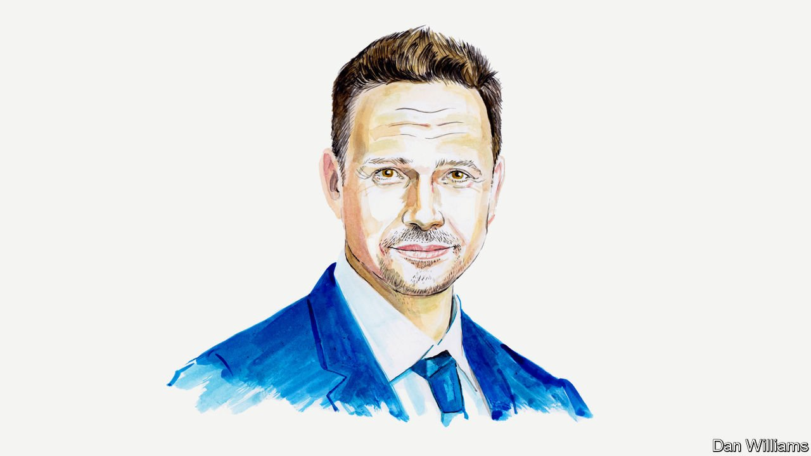

###### Russia and Ukraine

# Warsaw’s mayor explains how his city is coping with a 17% increase in its population 

##### Rafal Trzaskowski asks for more assistance to be sent directly to cities and charities helping Ukrainian refugees 

 

> Apr 16th 2022 

WE KNEW THE war was coming. But we did not expect it to become a full-scale conflict, displacing millions of people, in just a month. We did not anticipate so much tragedy and destruction. In our worst nightmares we did not expect to witness atrocities not seen in this part of Europe since the second world war.

Millions of people have fled Ukraine and 2.5m have arrived in Poland alone. We estimate that more than half a million refugees have passed through Warsaw, Poland’s capital. Another 300,000 have chosen to stay in the city and its suburbs. In just a month the population of Warsaw has increased by 17%. Poland has suddenly become the country with the second-largest refugee population in the world.


Our neighbours from Ukraine were welcomed with open hearts. The whole country has helped in the effort. Volunteers and charities streamed to the border to help people in need and the government opened reception centres. It announced that it would welcome every Ukrainian citizen in distress. After years of anti-refugee sentiment fuelled by the populist ruling party, Law and Justice–which I have countered as a member of the opposition coalition Civic Platform–we have all proved that we do indeed have solidarity in our national DNA even so.

The city of Warsaw opened information points and reception centres on the first day of the Russian invasion on February 24th. The central government has also opened its own reception centres in the city. We decided to organise the initial assistance at railway stations, providing our guests with information, food and medical help. Initially the vast majority of Ukrainian arrivals were taken care of by their families and friends. But ordinary people also opened their apartments to complete strangers. That is one reason why there are no visible groups of refugees on our streets, no pitched tents in the parks and no people living like nomads in camps.

The city also provides accommodation in our reception centres, municipal buildings, hotels and sport and youth centres. With the help of private companies we have retrofitted numerous office buildings so that they can serve as refugee centres. The Norwegian Refugee Council and WOSP, which collects money for medical equipment for kids and is one of the biggest charities in Poland, have built a state-of-the-art temporary transit shelter at the Warsaw East Railway Station.

As the war continues ever larger numbers of people are fleeing its bombs. They are increasingly traumatised, and need immediate psychological and medical assistance. They also need accommodation. Through the EU the Ukrainians have been granted temporary status akin to that of citizens in Poland and so enjoy free access to health care and education. Our hospitals and clinics are caring for thousands of patients. And there is a little hope amid the tragedy: 40 Ukrainian children have already been born in them.

Most of the administrative burdens associated with this care are being dealt with by local authorities. We are responsible for registering refugees, which includes assigning them identity and social security numbers, and for distributing government stipends to those hosting them. Warsaw is slowly becoming overwhelmed. Most of my social workers now focus on refugees, and most of my psychologists, who normally work with Polish kids, are helping traumatised youths coming from Ukraine. And of course I, as a mayor, have a duty to make sure that the city functions normally. No one wants the generosity of the people to be sapped by the inadequate quality of the city’s services.

It has to be clearly stated that most of what you see in Poland is improvisation. It is a bottom-up process driven mostly by a dense network of co-operation between volunteers, charities and local governments who shoulder most of the relief effort. We cannot go on in this way. Two weeks ago, at the peak of the crisis to date, 30,000 people a day were coming to Warsaw. I had to call mayors of other Polish and European cities to beg for assistance. My friends sent buses in the middle of the night to relocate people.

It’s high time we phased out improvisation and instead created a strategy for coping and appropriate systems for helping refugees. The latter will allow us not only to continue delivering assistance, but also will allow us to prepare for the coming months. To give you one example: in Warsaw we have already accepted more than 15,000 Ukrainian kids into our kindergartens and schools. But we know that there are 80,000 more of them waiting to enrol in the Polish education system. If they do so we will have to hire several thousand new teachers and build numerous kindergartens and schools. These are enormous costs that cities cannot bear alone. That is why it is best to create a two-tier system, whereby only certain kids, who understand a bit of Polish, immediately enter our system. The rest should start with remote learning on an Ukrainian educational platform. In addition they should be taught Polish after hours, so that they can be gradually introduced into our school system more successfully if they so choose.

What we need most is for the European and international relief agencies to create a permanent system of co-ordination for the refugee crisis. The Polish central government should make a prompt decision to sign a memorandum of understanding with the relevant UN agencies and it should ask the EU to show its solidarity through a voluntary refugee relocation scheme.

Finally, we need financial assistance that does not only go to the central government. The fact that Poland and Germany have just asked for a new system to be created through which the EU can grant €1,000 per refugee is a positive thing. But we also need funds to go directly to refugees, charities and local governments as they are at the forefront of the crisis. I have been fighting in the EU for such direct financial support for cities for years. We confront the greatest challenges of our time every day: fighting climate change, battling the pandemic or tackling the consequences of the most vicious military aggression in Europe in decades. The international community and the EU need to step up and help us out.

The Ukrainians are fighting not only for their freedom. They are fighting for our freedom, our values and the stability of transatlantic institutions as well. That is why we need to do our bit to help refugees. During the second world war, Hitler tried to wipe Warsaw from the European map. It was turned to rubble by the Nazis. Yet it rose to glory like a phoenix from the ashes. Kharkiv, Mariupol, Kherson and other Ukrainian cities have been sentenced to death by Vladimir Putin. Not many people in the world understand what that means better than us, what it means to fight, persevere and rebuild for the future. We need to help the Ukrainians fight and then rebuild their future. They cannot do it alone.

_______________

Rafal Trzaskowski is the mayor of Warsaw and a member of the opposition coalition, Civic Platform.


