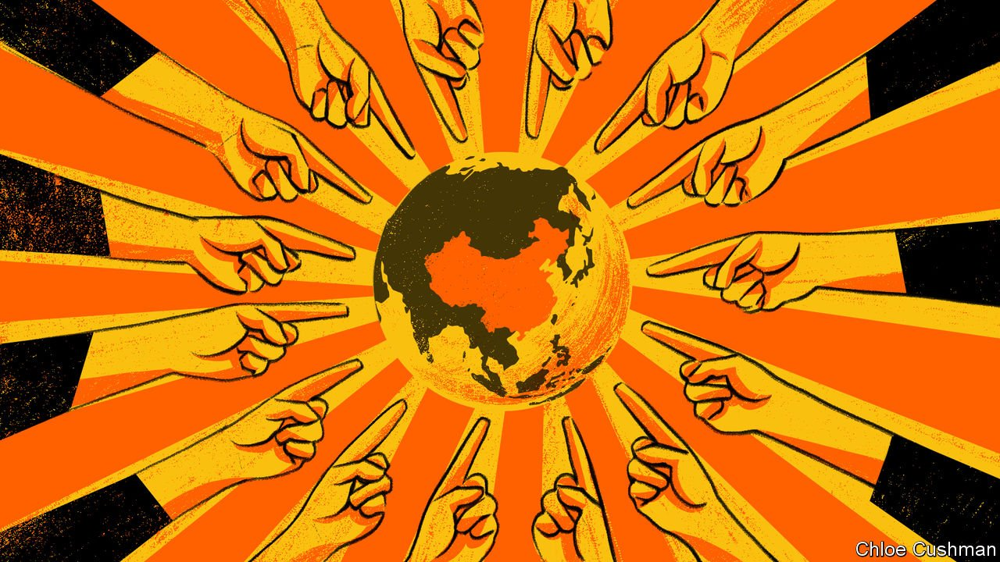

###### Chaguan

# China goes on the offensive over human rights 

##### Xi Jinping tells European critics that former colonisers may not judge China 

 

> Apr 13th 2022 

THERE IS NOTHING magic about the year 1945 to China’s Communist Party. President Xi Jinping offered this history lesson at an online summit with the heads of European Union institutions on April 1st. It was prompted by efforts by EU leaders to explain why Europe’s dark past obliges them to raise rights abuses with China, and to urge Chinese rulers to use their influence to curb Russian crimes of aggression in Ukraine. In particular, Mr Xi challenged comments by the president of the European Council, Charles Michel, that Europeans care greatly about human rights because of the extent of suffering on their soil, notably during the second world war and the Holocaust.

The Chinese have even stronger memories of suffering at the hands of colonial powers, Mr Xi retorted. He listed hostile Western acts, starting with the unequal treaties, as Chinese historians call them. Signed in the 19th and early 20th century, these forced China to open its markets and cede territory (at cannon-point). He spoke of colonisers hanging signs on gates reading, “No Dogs and Chinese Allowed”. Though there is no solid evidence that such blunt signs existed, more verbose (and disgracefully racist) bylaws did. These banned Chinese people as well as animals from French- and British-run parks in central Shanghai and other foreign enclaves.


After this lecture about Europe’s poor moral standing, Mr Xi recalled the massacre of civilians at Nanjing by Japanese invaders in 1937. Such aggressions, he said, had left Chinese with strong feelings about human rights, and about foreigners who employ double standards to criticise other countries. China stands by its record in Xinjiang, Hong Kong and Tibet, Mr Xi concluded. The EU must undo an impasse, caused by tit-for-tat sanctions relating to China’s rule in Xinjiang, if it wants better relations, he said.

Diplomats in Beijing describe Mr Xi’s combative performance as dismaying but clarifying. To be sure, it is not new for China to denounce former colonial powers. At a conference in Bandung in 1955, China’s prime minister, Zhou Enlai, described his country’s experiences of “colonial plunder and oppression” as he sought to make common cause with African and Arab countries, most of them newly independent. But the People’s Republic of China was then a poor and isolated outsider. Until 1971 it was not even a member of the United Nations, a body founded in 1945 to defend a rules-based order largely written by the winners of the second world war. (China’s UN seat was held by the Nationalist regime that lost the Chinese civil war to Mao Zedong’s Red Army in 1949, heading into exile on Taiwan.) The UN’s rules were explicitly designed to prevent a repeat of the second world war’s horrors, from genocidal nationalism to might-makes-right acts of aggression. To Mao and his heirs, though, other fights, from the Opium Wars to Korea, have as many moral lessons to offer.

In its first decades of UN membership, China was cautious and defensive, arguing that economic development takes precedence over abstract political freedoms. Its interpretation of the UN charter emphasises state sovereignty over individual rights. Under Mr Xi, China has gone on the offensive, using its economic heft and ever-deepening ties to countries in the global south to blunt criticisms of its autocratic system in such forums as the UN Human Rights Council. It seeks to redefine such terms as “democracy”, calling China’s one-party system more responsive to public needs than dysfunctional Western democracy. In 2018 Mr Xi declared that China must never take the “Western path” of constitutional governance, the separation of powers and judicial independence.

In February this year Mr Xi signed a joint statement with Russia’s leader, Vladimir Putin, that reads like a manifesto for a new order. It held up the two authoritarian powers as leading advocates for “genuine democracy”. That pugnacious joint approach has survived Russia’s invasion of Ukraine, for all that Mr Putin’s war tramples the territorial integrity of another nation—a supposedly sacred Chinese principle since Zhou’s speech in 1955.

Unabashed, Chinese diplomats have cast Western angst about Ukraine as racist hypocrisy, when much non-European suffering is ignored. On March 28th a Chinese foreign-ministry spokesman asserted, “It is an unacceptable double standard to sympathise with refugees in Ukraine while turning a blind eye to refugees from countries in the Middle East, Africa and Latin America.” Such Chinese assertiveness is prompting debate among rich-world governments. Some diplomats ask whether it is wise to lecture China about repression in Xinjiang at such a moment. Contemplating the challenge from China and Russia and the need to recruit allies to counter it, others question conditions attached to Western development projects in the global south, demanding transparency or high environmental or labour standards, when China offers loans with few questions asked. In the words of one diplomat: “These two superpowers want to change the world. We are capable of stopping it, but it depends on how many friends we have on our side. That will require flexibility and compromises.”

A matter of principle

In the face of such doubts, Gyude Moore, a former Liberian public-works minister now at the Centre for Global Development, an American think-tank, calls it insulting to assume that Africans are not interested in transparency or independent judges. He cites lawsuits in Kenya and elsewhere that seek to make public the terms of Chinese infrastructure loans, or that have successfully prevented stolen elections. An international official argues that the real problem is a lack of investment, as shrinking Western aid budgets undermine reformers who cannot offer rewards for good governance. But there is a simpler reason to defend universal values consistently. A selective approach would confirm China’s suspicion that, deep down, all countries are guided by interests alone, and use principles as a weapon. China’s challenge to the post-1945 order is in the open now. More cynicism is a weak defence. ■

Read more from Chaguan, our columnist on China: (Apr 9th) (Apr 2nd)

 (Mar 26th)

