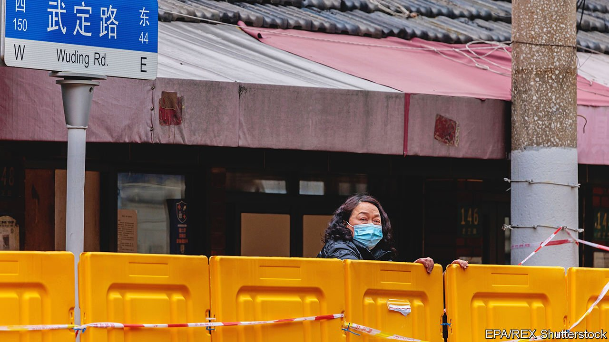
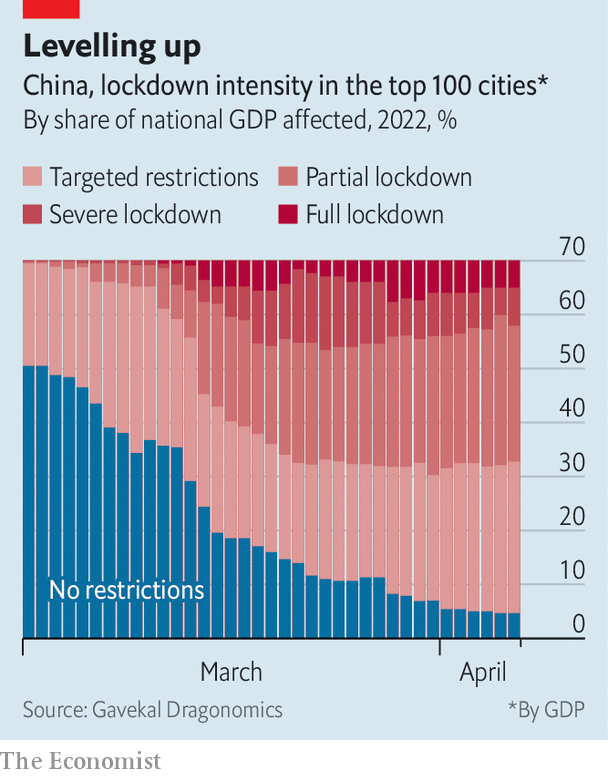
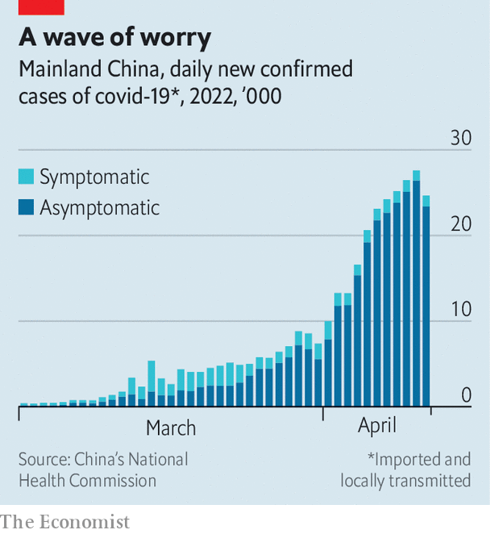
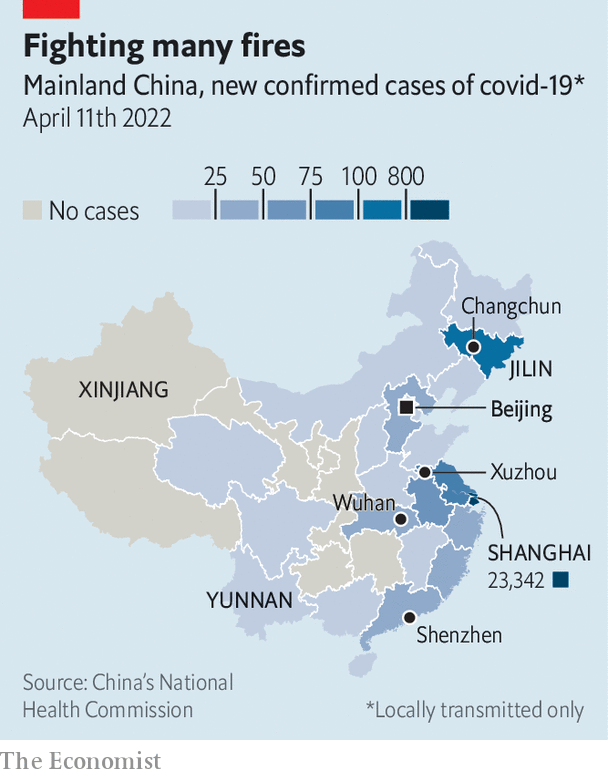

###### Locked down, fed up

# The way Chinese think about covid-19 is changing 

##### But the government shows little sign of changing its zero-covid policy 

 

> Apr 16th 2022 

READING THE news backwards has long been a useful skill in China, where officials often obfuscate. Recently it has seemed like a matter of survival for some. Take the residents of Beijing, the capital, who are girding themselves for a covid-19 lockdown and all the hardship that might entail. When the city’s officials announced on April 11th that there was more than enough  for everyone, people assumed the opposite. “Understood, hurry and go shopping now,” a cynic wrote online.

Beijing has fewer than 100 cases of the virus. There are no clear indications of a growing outbreak or of an impending lockdown. But residents recall the experience of , where local officials insisted there would not be a citywide lockdown right up to the moment they imposed one. First they tried to lock down half of the city at a time. Then they closed the whole place. Residents who had trusted the authorities quickly ran out of food. Now people in other Chinese cities are stockpiling supplies, determined not to make the same mistake.

 


China shows no signs of loosening its zero-covid approach, which uses mass testing and strict lockdowns to crush outbreaks. If anything, the government is tightening its controls. A report by Gavekal Dragonomics, a research firm, found that all but 13 of China’s top 100 cities (by GDP) were implementing covid restrictions (see chart). Ten cities are in “severe lockdown”, meaning more than half of residents are confined to their homes. Changchun, Xuzhou and Shanghai were recently in full lockdown. Shanghai has announced that areas with no cases for two weeks will see restrictions lifted.


For much of the pandemic the Chinese public has joined officials in hailing the zero-covid strategy as a success. Over the past two years China has had a lower mortality rate from the virus and stronger economic growth than any other big country. During a recent speech celebrating China’s hosting of the Winter Olympics in February, President Xi Jinping claimed that some foreign athletes said China deserved “a gold medal for responding to the pandemic”. Earlier Mr Xi said the country’s anti-covid efforts “demonstrate the advantages” of the Communist Party’s leadership.

 


But the current wave is changing the way people think about the virus—and about the government’s strategy. No one wants mainland China to end up like Hong Kong, which was overwhelmed by the highly transmissible Omicron variant, leading to a spike in deaths among . The mainland’s elderly population is similarly vulnerable, so a complete lifting of controls is out of the question. At the moment, though, anecdotal evidence suggests that more people are dying because of the Chinese government’s restrictions than from the virus. The state needs to adapt, say critics.

The 98-year-old mother of Lang Xianping is one such victim. In a post on Weibo, China’s version of Twitter, Mr Lang wrote that she died of kidney failure after waiting for hours at the entrance of an emergency room, unable to enter without a negative covid test. Mr Lang, meanwhile, argued with local officials until they let him out of his sealed compound. When he was finally released, there were no cars on the street to take him to the hospital. “I did not get to see my mother one last time,” he wrote. “This tragedy could have been avoided.”

These types of stories—tragic, troubling and widely shared—are growing more common. And they are causing some people to fear covid restrictions as much as they do the virus. As provincial governments roll out pre-emptive measures to combat covid, citizens are sharing guides on how to freeze vegetables, as well as old film clips in which party officials are criticised for caring more about political correctness than starving commoners.

 


People are frustrated with the government’s failure to adjust its covid policy by, for example, letting patients with mild symptoms quarantine at home, instead of at isolation centres where they use scarce resources. Experts believe covid rules are causing avoidable deaths. They point to a study published last year by a team affiliated with China’s Centre for Disease Control and Prevention. It found that during an early lockdown in the city of Wuhan, deaths from chronic illnesses exceeded expected rates by 21%. Deaths from diabetes exceeded expected rates by 85% and suicides by 66%. Two years later, some ask, has the government learned anything?

Trust issues

Other countries that have moved away from strict covid policies now allow people with infections to self-isolate. That requires governments to trust that people will act responsibly. But the Chinese government, obsessed with control, does not. Instead, it tells citizens to trust the party. A recent editorial in the People’s Daily, an official newspaper, called for Shanghai’s residents to “grit their teeth” and hold tight to the party’s leadership. “In fighting the pandemic, trust is more important than gold,” it said. Residents of Shanghai are unmoved. “All the policies this month have been incomprehensible,” says one. “They say one thing but implement another. We don’t trust these policies any more.”

Instead the people of Shanghai are relying on each other. They use the term zijiu (self-salvation), as they fill the gaps left by an overwhelmed party apparatus. Kelly Wang, a volunteer in the district of Xuhui, describes how younger residents care for their elderly neighbours and organise bulk orders of food. The state, meanwhile, has censored the hashtag “buying groceries in Shanghai” on Weibo. “We know that we can’t count on the government any more,” says Ms Wang. But, she adds, “The people here are capable and brilliant.”

Shanghai, home to the rich and powerful, gets a lot of attention. But other parts of China, such as Yunnan and Xinjiang, have gone through longer, more restrictive lockdowns. The city of Jilin has been closed for over a month. Residents there have shared videos of police publicly shaming residents for criticising covid restrictions in a private online chat group. In Shenzhen a shop owner filmed state-media reporters who refused to interview him because he complained about not receiving lockdown subsidies. “We’re only here to report on the people being helped,” says one reporter. But as China’s strict covid controls ensnare more people, it is becoming harder to convince them that all is well. ■

Dig deeperAll our stories relating to the pandemic can be found on our .

