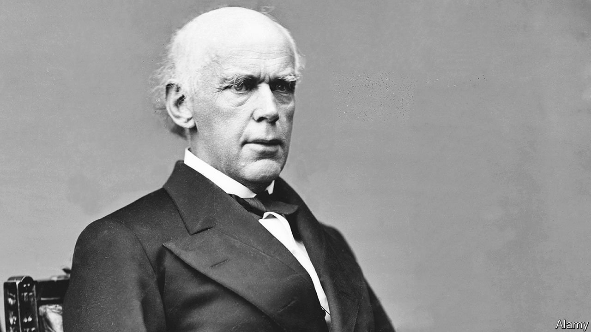

###### Bonds and bullets

# How Abraham Lincoln financed the civil war 

##### The conflict shaped the economy as well as vice versa 

 

> Apr 16th 2022 

Ways and Means. By Roger Lowenstein. Penguin Press; 448 pages; $30

WAR CAN expose a society’s weaknesses, or give expression to its latent potential. This lesson, apt today, applied in spades to the American civil war, as a new financial history of the conflict explains. Though Roger Lowenstein, a journalist, surely had no idea that when “Ways and Means” was published, Russia would invade Ukraine, his engaging history nonetheless makes for timely reading.


In hindsight, it is hard to imagine that the triumph of Union forces could ever have been in doubt, given the North’s advantages in population and industry. But the Confederacy did not need to win the war outright; it had only to struggle on until the people of the North grew tired enough of fighting to seek a peace. President Abraham Lincoln, whose victory in the election of 1860 precipitated secession, was determined to preserve the Union. But the patience of his people in the face of hardship could not be taken for granted, and the tools available to him were limited.

At the outset of the struggle, the federal government was still a bare-bones affair, which in most respects deferred to the authority of “these United States”. It lacked a central bank to help manage the government’s credit. Neither did the federal government control its own currency; in the antebellum economy, the role of money was played by private notes, issued by banks. And the main source of federal revenue—tariffs on traded goods—was hard hit by the crisis. A third of the ports at which customs duties were collected were in the Confederacy.

Chief responsibility for addressing these problems fell to Salmon Chase (pictured), a prickly figure and aspirant to the presidency who served as Lincoln’s Treasury secretary. At first neither North nor South expected a long war, and Chase’s initial financial requests were a mere drop in the bucket of money that would be needed to subdue the rebellion. After he secured a loan of $50m from a bank syndicate (around $1.5bn today), a banker said he hoped the sum would be sufficient to win the war. The government would ultimately spend some 60 times that amount. Both sides sought to borrow from Europeans, with minimal success. This newspaper declared it “utterly out of the question” that the Americans could obtain “anything like the extravagant sums they are asking”.

Yet while the Union’s finances seemed in danger of collapsing early in the war, Lincoln’s administration soon began constructing the machinery to effectively tap the strength of the American economy. From 1862 the federal government started issuing a fiat currency—called “greenbacks”, for the colour of the ink used in printing on the reverse side. In 1863 Congress enacted Chase’s plan for a national banking system, in which federally chartered and supervised banks issued Treasury notes and held federal bonds. The inflationary potential of such measures was kept in check by a big expansion of federal taxation—including the central government’s first-ever income tax.

The government’s measures did not just make the financing of the war possible; they also knitted together an ever more powerful national economy. The new currency facilitated commerce, spurring economic growth in the North which benefited the war effort. As the fighting broke down the age-old bias against government intervention in the economy, a wave of transformational legislation was passed—boosting investment in continent-spanning railways, providing free land to Americans willing to move to the country’s Western fringes, and laying the groundwork for a network of public universities that would provide practical higher education to the masses.

None of this was possible in the South, where slaveholders’ deep suspicion of government, and indeed of the trappings of modernity, was essential to the rebellion. Unable to produce its own goods—or to sell its cotton, thanks to the Union blockade—the Confederate economy ground to a halt. Without the capacity to tax, the South struggled to borrow and relied heavily on money-printing, which fuelled runaway inflation. Illusions of a glorious victory gave way to ruin and humiliating defeat.

The rebels seethed at the economic power wielded by their enemy. “The Yankees did not whip us in the field,” noted one Confederate soldier. “We were whipped in the Treasury Department.” But the fight was a clash of values and outlooks as much as a contest of arms or bond issues. Through it, a more cohesive and capable United States was forged. ■

