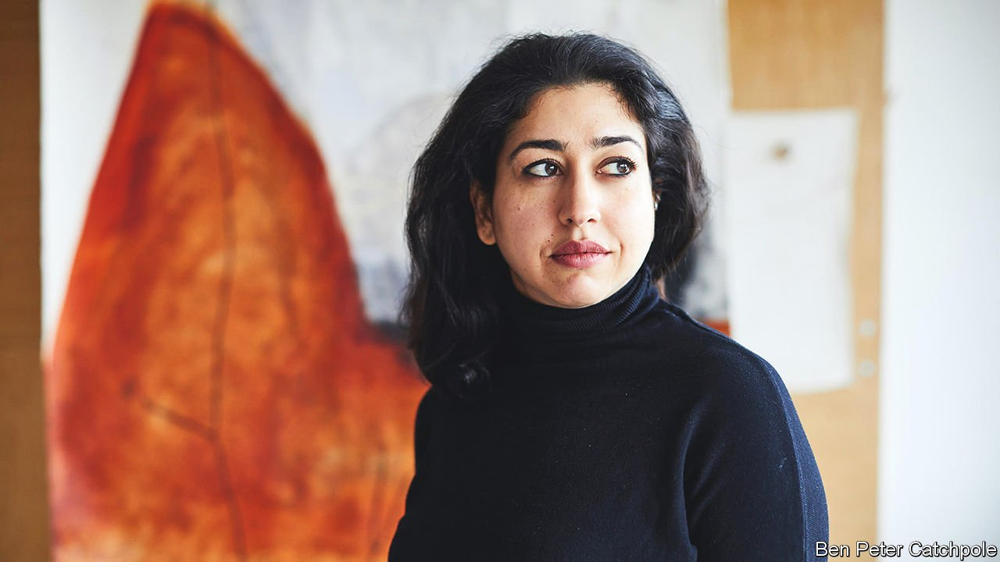

###### Contemporary art

# Radhika Khimji and the art of freedom 

##### She is a star of Oman’s first pavilion at the Venice Biennale 

 

> Apr 16th 2022 

A SKINNY LITTLE fish of indeterminate colour, the Garra barreimiae lives in the freshwater lakes of the Al-Hajar mountain range in Oman. When it is young it can see, but as it ages a layer of skin grows over its eyes and it gradually becomes blind. Every year the blind fish of Oman draw thousands of tourists to the Al Hoota cave, a five-kilometre cavern of rocky grottoes and watery depths. Under strings of electric lights, men in white robes and women with covered heads inch along walkways and peer into the dark water. For Radhika Khimji, a 42-year-old Omani artist now living between London and Muscat, the challenge in the cave was less to spot the Garra than to imagine its world.

The result will feature in Oman’s first pavilion at the Venice Biennale, which opens on April 23rd, alongside work by four other artists. For “Under inner under”, Ms Khimji took impressionistic black-and-white photographs of the cavernous rock face, blowing them up and printing them on thick fabric to make a wall curtain. The visual effect is crepuscular, volcanic and reminiscent of Dante’s underworld. On that backdrop she painted strings of pale-pink oval lozenges: globules of light in a gloomy world (the most a half-blind fish could see), or perhaps a new dawn spied through a dark window. The piece defies easy interpretation, but urges the viewer to keep looking. “In scale and imagination, I think this represents a big leap forward for Radhika,” says Aisha Stoby, curator of the Omani pavilion in Venice.


Oman has taken to contemporary art more slowly than its Gulf neighbours. Over the past two decades, Abu Dhabi, Dubai and Qatar have projected themselves as art hubs, midway between Europe and Asia. Even Sharjah has held a contemporary-art biennale since 1993. Art in Oman, however, has mostly meant tourist souvenirs—views of long beaches, rocky landscapes and ancient forts hidden in the hills.

Ms Khimji’s work is different. A member of a Gujarati family that moved to Oman many generations ago, she is not trying to picture or even describe the world around her. Instead she reimagines it using an ever-shifting array of styles, materials, techniques and dimensions.

At school she found writing hard, she says, but drawing was a respite. As a young child she spent her holidays sketching for an aunt, a fashion designer—often images of buxom figures with heavy breasts and large thighs. A teacher from England suggested she apply to Slade School of Fine Art in London. At 20 she returned to Oman and entered an arranged marriage. Within six months she had fled, determined to make a life alone as an artist.

Admitted to a postgraduate course at the Royal Academy of Art, she steered away from ideas about decolonisation and diasporas—themes that are now almost automatically associated with up-and-coming artists from Africa, Asia and the Middle East. She took up voice-movement therapy, yoga and weightlifting. These helped her get over her failed marriage, she explains, and also to engage in a far more emotional way with making art. She experimented with sculpture, cut-outs and collages. In a return to the large-thighed subjects of her childhood, she painted a huge triptych of prancing figures which were decorated with the same lozenge shapes that she would use in her work on the blind fish.

The triptych was eventually bought by the Guggenheim Abu Dhabi, the only Omani work in its collection. “I’m not really a very good painter,” Ms Khimji says now. But painting dancing figures in acrylic, on paper backed by MDF, led to a breakthrough when she began cutting the figures out and arranging them in conceptual pieces. Placed upright, they might be running or climbing; laid flat on the ground, they seem sunk in post-coital oblivion. At times they look bent or disfigured, at others, whimsical and lithe. On one occasion she tied a group of them to a collapsed parachute at the Barka Fort in Oman. As so often with her work, the effect was ambivalent: it was hard to tell if they had crashed or landed safely, whether they were tethered or free to walk away.

Her figures have been shown in Austria, India and America. Since 2015, meanwhile, she has filled seven volumes of notebooks with ink portraits and drawings, sketches and dreams. Some of the colours are inked so thickly as to bleed through the pages. The notebooks are private and not for sale, but they chart the journey of an artist who refuses to be tied down.

For the Marrakech Biennale of 2016, where Ms Khimji’s installations first reached a big international audience, she omitted the figures and arranged the parachute on a crumbling wall. “I think of her most of all”, says Reem Fadda, that exhibition’s curator, “as an artist of freedom.” ■

