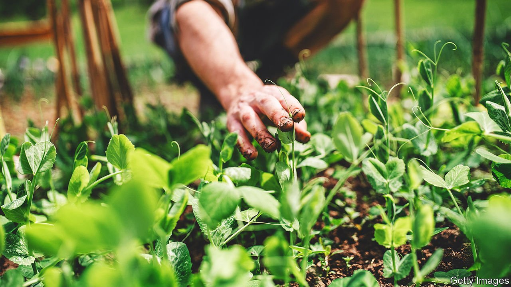

###### World in a dish

# The joy of gardening 

##### The crops can be delicious. But that is not the real point 

 

> Apr 16th 2022 

IMAGINE A PLATE holding two strawberries, identical in appearance. One came out of a clamshell supermarket box, meaning it was probably harvested when it was still unripe, immediately placed in a forced-air cooling unit, loaded onto a refrigerated truck and driven hundreds of miles. By the time it reached the plate it may have been off the vine for two weeks. The other strawberry was picked from a garden minutes before being eaten.

The first one will probably taste like a slightly mushy cucumber, with a vague hint of berry tang and strong sour undertones. The second is likely to be sweet and floral; the flavour will linger in the mouth, as the scent will on the hands. Supermarket strawberries are not entirely without advantages: they are convenient and available in the northern hemisphere in February. But the two berries differ from each other in the same way that hearing Bach’s Mass in B Minor in a concert hall differs from listening to it on a threadbare cassette. The home-grown fruit is an edible case for cultivating a home garden.


Your columnist, who long deemed gardening a twee waste of time, advances this argument with a convert’s zeal. Planting cool-weather greens, as gardeners across the north-east of America are now doing, can seem nonsensical. Convenient, perpetually well-stocked supermarket shelves are available all week, in many places supplemented on weekends by farmers’ markets, which offer a jolt of virtuous seasonality. But the same could be said of cooking: cheap and decent restaurants abound, so why bother to make your own meals?

That attitude misconstrues the ultimate appeal of gardening: it mistakes the product for the purpose. It is true that a garden can yield peas that taste like the vibrant, green essence of spring; tomatoes and carrots of incomparable sweetness; lettuces and herbs that taste like themselves rather than the plastic they are usually packaged in; and potatoes with the biscuity richness of earth itself. Finding, say, fenugreek leaves or celtuce in the shops can take some time, effort and expense; growing your own vegetables, exotic or routine, ensures a reliable supply.

On the other hand a garden, especially in the early years, can also yield little but frustration. Novice gardeners may plant the wrong crops for their soil. Squirrels have an infuriating habit of taking single bites of cucumbers, beans and tomatoes, then leaving the rest on the vine to rot. And even expert gardeners can lose a season’s harvest to unco-operative weather.

No matter. The real joy of gardening is the time spent doing it. The deepest pleasure—as with cooking, writing, bringing up children or almost anything worthwhile—is in the work itself. A gardener’s memories revolve not around the food produced, but around long summer afternoons with hands in the dirt, surrounded by family, if the garden is at home, or deepening acquaintances with friends and neighbours in an allotment or community garden. To garden is to patiently, lovingly and diligently help life flourish, in the ground and above it. ■

