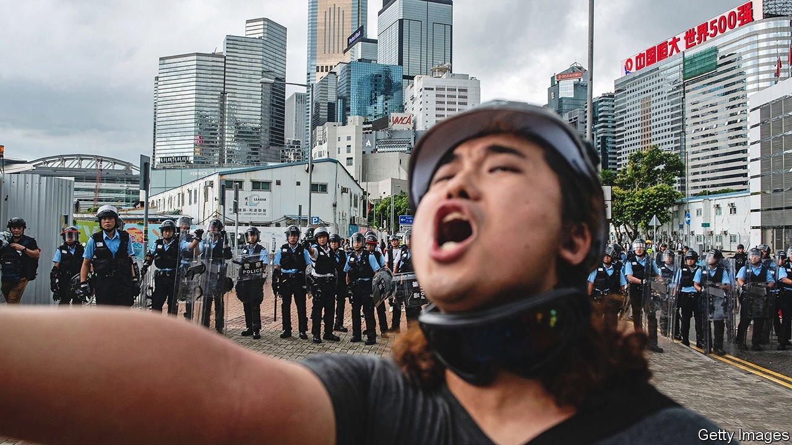

###### Indelible or invisible?

# Two powerful accounts of Hong Kong’s protest movements 

##### In both books, the author is a leading character as well as the narrator 

 

> Apr 16th 2022 

The Impossible City. By Karen Cheung. Random House; 319 pages; $28 and £23

Indelible City. By Louisa Lim. Riverhead Books; 293 pages; $28


IN RETROSPECT, SOME calamities quickly assume the inevitability of tragedy. Of course Vladimir Putin could never accept an independent, Western-aligned Ukraine. Of course the Taliban would triumph in Afghanistan; just glance at the history of foreign involvement there. And, more certain still, of course China’s Communist rulers would never tolerate a free, open, democratising city in a southern corner of their country. “One country, two systems”—the simple Sino-British formula under which Hong Kong would remain politically distinct from the rest of China for 50 years from 1997, when Beijing resumed the exercise of sovereignty—was always doomed.

But nobody told Hong Kong. After all, it was supposed not to care. Many outsiders swallowed China’s habitual line that Hong Kong was an “economic” city, a place of business that was not concerned with politics. Yet the generation that has grown up since 1997 has always posed and faced an awkward question that Karen Cheung formulates at the beginning of “The Impossible City”, her fine new book: “Why are we not the ambivalent, apolitical generation that our leaders want us to be?” Every few years since 2003, the territory has seen huge protests, building up to the occupation of parts of the city centre in the “umbrella” movement of 2014, and what amounted to an abortive insurrection in 2019. Whether to take part was a decision that Hong Kong’s people could not dodge.

Ms Cheung and Louisa Lim, author of the equally good (and similarly titled) “Indelible City”, both grew up in Hong Kong. Both occupy what Ms Cheung calls the “liminal space of being local enough to write stories that white writers can’t and ‘international’ enough to write about Hong Kong for overseas readers”. And both offer illuminating accounts of how the city descended into the mass street unrest of 2019, as demonstrators agitated for a more representative political system, and of the pandemic-abetted repression that has crushed protest since. Tear-gas, water cannons and police batons eventually cleared the streets. Covid-19 kept them empty.

Their perspectives are very different. Ms Lim is a journalist-turned-academic, who long covered China and Hong Kong for the BBC and National Public Radio; her previous book told of the Chinese Communist Party’s efforts to erase the memory of the protest movement that roiled China in 1989 and its bloody suppression. She writes mostly as a coolly objective observer, but opens with an account of crossing the line into activism, on September 30th 2019, the eve of a big protest to mark China’s National Day. On the roof of a skyscraper, she finds herself “painting expletive-laden Chinese characters onto a protest banner eight storeys high, and wondering if I had just killed my career in journalism”.

Though dominated by events since 1997, “Indelible City” also attempts a revisionist telling of Hong Kong’s history. This challenges both the traditional Western view that it was nothing but a “barren rock” until British opium traders found a use for it, and the Chinese version: that it has been an integral part of the Chinese polity since time immemorial. Rather, in the past Hong Kong was “a sanctuary for rebels and fugitives from central power” and a haven for free-thinking.

The mermen’s song

Ms Lim describes Hong Kong people’s efforts to rebuild a link with this past, including through the resurrection of an indigenous creation myth about the Lo Ting, fish-headed mermen who had come to Hong Kong’s Lantau island in the fifth century, after a failed rebellion against the imperial dynasty. The character who gives her book its name is Tsang Tsou Choi, who died in 2007 and left behind a vast body of graffiti over public spaces in Hong Kong—much of it supporting his eccentric claim to be the king of Kowloon, the peninsula opposite Hong Kong island.

For those brought up in Hong Kong, questions of identity were unavoidable and virtually impossible to answer. Almost uniquely among colonised peoples, they were never offered independence. In 1972, shortly after it joined the United Nations, China asked the decolonisation committee to remove Hong Kong from its list of colonial territories, and Britain, as became customary in its treatment of its colony, connived in this implicit condemnation of Hong Kong to eventual Chinese rule. Ms Lim quotes an early British governor, from 1858, who pithily summed up the ethos of British sovereignty: “We rule them in ignorance, and they submit in blindness.”

So Hong Kongers, a term that, for her part, Ms Cheung says she has never heard anyone apply to themselves, “defined themselves in negatives—not Communist, no longer colonial subjects”. Her book, like Ms Lim’s, shows how they did acquire a sense of identity. Sadly, it was still couched in the negative: in the thwarted struggle against the gradual erosion of their civil liberties under Chinese sovereignty—and the repeated frustration of their demands for a representative political system.

Like Ms Lim, Ms Cheung is a leading character in her book as well as its narrator. Hers is more personal, building up a sense of a unique Hong Kong identity through an account of her own life and interests and immersion in the local indie-music scene. A journalist for various outlets, still in her 20s, she complains of some foreign editors: “It’s best if our family stories are somehow representative of the rest of the Hong Kong population…They want your life stories, not your opinions.”

Indeed. But her story is also Hong Kong’s. The painful struggle with depression that she recounts becomes emblematic of a stunted generation living on the edge of desperation. She notes that between 2012 and 2016 the suicide rate among students jumped by 76%.

Both these books were largely written before the pandemic further cut off Hong Kong from the rest of the world—a shared isolation that has seemed more acute this year, as first Hong Kong and then parts of the mainland suffered widespread outbreaks of the Omicron variant. The joint pursuit with China of a zero-covid policy has been among the most powerful symbols of where Hong Kong’s future lies. That future may indeed have been inevitable, but it has rarely looked so grim. ■

