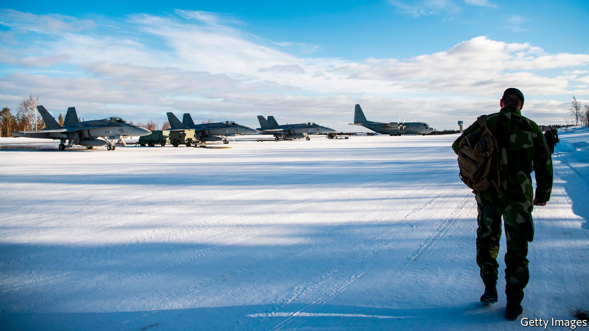
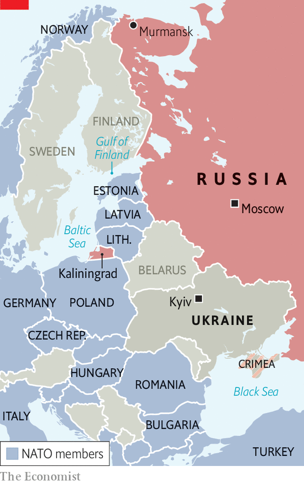

###### Bloc party

# Finland is hurtling towards NATO membership 

##### The NATO-Russia border would double at a stroke 

 

> Apr 16th 2022 

EVEN AS RUSSIAN troops were massing on Ukraine’s borders in January, Sanna Marin, Finland’s prime minister, insisted that it was “very unlikely” her country would join NATO during her time in office. Less than three months and one invasion later, Finland is hurtling towards membership. On April 2nd Ms Marin told Finns that the country would have to reach a decision “this spring”. As she explained, “Russia is not the neighbour we thought it was.”

Finland, after two grinding wars with the Soviet Union, and unlike most of eastern Europe, kept its independence and democracy through the cold war. The price of doing so was neutrality. Finland bought arms from both East and West, but stayed out of alliances. That arrangement, and the way in which Soviet pressure distorted Finland’s domestic politics, became known by the pejorative term . When the USSR was dissolved, Finland, along with Sweden, took the leap of joining the European Union, binding it closer to other European countries. And after Russia’s first invasion of Ukraine in 2014, both countries intensified joint exercises and other forms of co-operation with NATO.


Russia’s attack on Ukraine has now tipped the scales. When your correspondent visited Helsinki in February, a week before the invasion, official after official emphasised the conservatism of Finnish policy. “We’re still far from a national consensus,” said one, adding that it was unclear whether support for a NATO bid would gather steam. “Do we just have a national awakening?” he mused. In fact, that is largely what has happened.

In 2019 just over half of Finns were opposed to NATO membership. On February 28th, four days after the invasion, the polls showed majority support for the first time. The latest, on March 30th, revealed 61% in favour, 16% against and 23% undecided. That includes majorities among supporters of all parties, except the Left Alliance. And it is widely accepted that if Sauli Niinisto, Finland’s popular president, were to give his formal endorsement, support would grow further. 

Both Ms Marin and Niinisto are keeping silent for now, to allow a political process to play out. “April, May and June are important—and in many ways historic—months in Finland,” says Henri Vanhanen, a foreign-policy expert and adviser to the centre-right Kokoomus party. A government report setting out the changes in Finland’s security position since the Russian invasion is due to be published on April 14th.

Parliament will then debate the issue. After that, a second government report could make a formal recommendation on NATO membership. A special parliamentary monitoring group, made up of party leaders and committee chairs, will play a key role in signalling the political consensus. A committee of government ministers and Mr Niinisto will take their cue from that. The final call remains with parliament, though whether it will need a two-thirds majority depends on its constitutional committee.

A decision is widely expected to come before a NATO summit in Madrid on June 29th, and perhaps as soon as early May. The two main governing parties, Ms Marin’s Social Democrats and the Centre party, have previously been split on NATO. But a consensus is forming rapidly: of 200 lawmakers, 96 are now in favour of membership and just 14 against, according to Helsingin Sanomat, a newspaper. “It's been the Finnish people in the lead,” says Elina Valtonen, an MP and vice-chair of Kokoomus, whose pro-NATO position has driven it to unprecedented popularity in the polls (elections are due by next April). “I'm pretty confident that we will be filing the membership agreement…in a few weeks’ time,” adds Ms Valtonen. 

For Finland, which shuns dramatic change, that is lightning-fast. One reason for that is concern about the country’s vulnerability during a membership bid. On March 12th Russia’s foreign ministry said that Finnish membership would have “serious military and political consequences”, including “retaliatory measures”. Hints of those may already be appearing. On April 8th a Russian plane reportedly violated Finnish airspace, and the websites of the country’s foreign and defence ministries were hit by crude cyber-attacks (which may have been related to a speech by Volodymyr Zelensky, Ukraine’s president, to Finland’s parliament on the same day). To limit opportunities for Russian meddling, Mr Niinisto has said that a national referendum on NATO will not be necessary.

Once a bid goes in, Finland would be especially vulnerable: subject to Russia’s ire, but not yet covered by NATO’s Article Five mutual-defence clause. One answer to that is to move fast. On April 3rd Jens Stoltenberg, NATO’s secretary-general, said that Finnish or Swedish accession could be done “in a relatively quick way”. No one, not even Viktor Orban’s pro-Putin government in Hungary, is expected to veto it. Mr Stoltenberg has also hinted at interim security guarantees. He was “certain”, he said on April 6th, that “we will find ways to address concerns…regarding the period between the potential application, and the final ratification.” 

In practice integrating either country would not be hard. Both are as close to NATO as it is possible for a non-member to be. Mr Vanhanen says that NATO officials have told him that Finland is in fact more “NATO interoperable”—capable of conducting joint operations alongside other allies—than some actual members. A special procedure designed in 2014 and activated for the first time after Russia’s invasion means that Finnish and Swedish envoys now sit at the North Atlantic Council, the alliance’s decision-making body, for every meeting relating to the crisis. Anders Fogh Rasmussen, Mr Stoltenberg’s predecessor, has said that an application “could be approved more or less overnight”, though some officials say that is a slight exaggeration.

Yet in Sweden, the debate is moving more slowly. Sweden’s main governing party, the Social Democrats, is opposed to NATO membership. As recently as March 8th Magdalena Andersson, the prime minister, said that a membership bid would “destabilise the current security situation in Europe”. However, the country has had a parliamentary majority in favour of NATO since December 2020. The latest poll, on April 1st, also showed a majority of the public (51%) in favour for the first time, up from 42% in January; opposition fell from 37% to 27%. General elections are due in September. 

In the past, Swedes worried that a solo NATO bid would leave Finland dangerously exposed. Now it is Finns who wonder whether Sweden will keep pace. The two countries’ armed forces have become intertwined in recent years. They sent a joint brigade to a NATO exercise in March (an earlier joint Finnish-Swedish air exercise is pictured above). It is natural that Finland is ahead, says Carl Bildt, a former Swedish prime minister, given its tangles with Russia: “They have a tradition of thinking more deeply about security issues than we do, for fairly obvious reasons.” But Mr Bildt is confident that, just as Finland caught up with Sweden when both countries joined the EU in parallel in 1995, Sweden will make up the ground. “For me, it is inconceivable that we would end up in a situation where the two countries come to different conclusions.”

 


For most of its history, NATO shared only 196km of border with Russia, in the uppermost fringes of Norway. When Poland joined NATO in 1999 that rose to 428km, thanks to its border with the Russian exclave of Kaliningrad. And after the accession of the three Baltic states in 2004, the shared frontier leapt to 1,233km. If Finland takes the plunge in the coming weeks, as it is likely to, the common border will more than double at a stroke (see map).

That has implications for both sides. A country that has prized stable relations with Russia for 74 years would face a new and sustained level of threat, as Mr Niinisto warned recently. But Russia, too, would have to reconsider the security of the Gulf of Finland and the strategic ports around Murmansk. The irony is that a war launched by Vladimir Putin ostensibly to keep NATO at bay, in Ukraine, looks set to bring the alliance closer than ever before.

Read more of our recent coverage of the .

