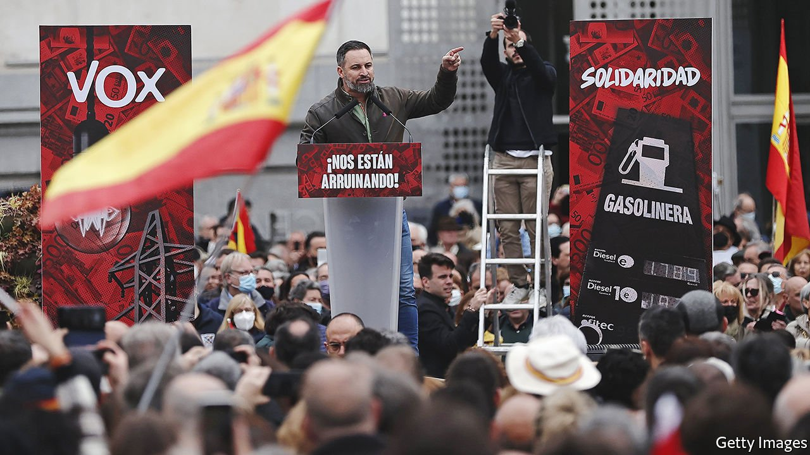

###### Vox populi

# Spain’s hard-right Vox party joins a regional government 

##### A taboo has been broken 

 

> Apr 16th 2022 

A DAY AFTER Marine Le Pen reached the second round in France’s presidential election, the regional parliament in Spain’s Castilla y León approved a new government, the country’s first to include Vox, a hard-right party. Visiting the region for the investiture vote, Santiago Abascal, Vox’s leader, took time to tweet congratulations to Ms Le Pen on a “great result”, saying France, like the rest of Europe, faced a choice between “sovereignty and reindustralisation or progressivist globalisation that is ruining us”.

It is easy to see Vox as the renaissance of a far right that never disappeared even after Francisco Franco, Spain’s dictator for nearly 40 years, died in 1975. Mr Abascal calls the current government the worst in 80 years—that is, worse than Franco’s. Vox wants to replace a law on gender-based violence with one on “intra-family violence”, turning the focus away from male perpetrators. It wants to recentralise Spain, eliminating the 17 powerful regional governments (like the one it has just joined in Castilla y León). This makes Vox radioactive to regional nationalists in places like Catalonia and the Basque Country.


Vox sometimes shows a more acceptable face. Unlike Ms Le Pen, its leaders have not been photographed with Vladimir Putin. It has criticised his war in Ukraine and welcomed Ukrainian refugees. Its parliamentary spokesman, Iván Espinosa de los Monteros, says in perfect American English (acquired as a student in Illinois) that the party is not against all immigrants. Many integrate well, and Spain needs them, he concedes. But Vox still wants to encourage native Spanish women to have more babies, a point reiterated at the investiture.

The party is a big headache for Alberto Núñez Feijóo, the new leader of the conservative People’s Party (PP). He is known for pragmatism, a welcome change to Spain’s vicious polarisation. He has kept his attacks on the Socialists in government to matters of policy, saying he wants to defeat them, not insult them. But the PP-Vox alliance in Castilla y León means that he will be asked endlessly about Vox. A Vox deputy recently compared Pedro Sánchez, the Socialist prime minister, to Hitler. Mr Feijóo says he has not yet spoken to Mr Abascal, but he says he has talked to Catalan separatists and his Socialist opponents and he would talk to Vox.

Spain faces elections next year, with no party likely to win a majority. It now has a three-party-plus system, with the PP, Socialists and Vox trailed by assorted minnows, and no tradition of grand coalitions. Mr Sánchez broke a taboo and governed with the radical left. Mr Feijóo may face competing taboos: deal with the hard right, or the Socialists.

