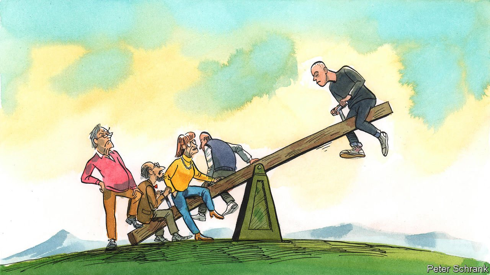

###### Charlemagne

# Thank the elderly for keeping Europe’s extremists out of power 

##### Emmanuel Macron depends on grey-haired voters for support 

 

> Apr 16th 2022 

IF EMMANUEL MACRON, the youngest-ever president of France’s Fifth Republic, gets to keep his job he will have its oldest voters to thank. Had only the ballots of those under 60 been counted in the first round on April 10th, Mr Macron would have come third—leaving France to pick between extremists of the left and right in the run-off a fortnight later. Across Europe, many mainstream leaders owe their jobs to a grey-haired (and no-haired-at-all) electoral bulwark loyally trudging to the polls. They will not be around for ever. Either today’s youngsters will have to mellow into the middle ground as they age, or Europe will drift away from the predictable centrism it has comfortably espoused for decades.

In Europe as elsewhere, voters’ preferences were supposed to follow a predictable pattern as they aged. Brimming with idealism and compassion their parents apparently lacked, younger citizens tended to lean left. As they got older, took out a mortgage and discovered the pleasures of income taxation, the right’s appeal became more obvious. But this ideological drift often took place within the same political party. “Big tent” affairs like Germany’s centre-right CDU, or PSOE on Spain’s centre-left, contained factions that could accommodate just about everyone from bleeding hearts to the fiscally righteous. (Americans and Brits will also be familiar with, in essence, two-party systems spiced up by the occasional and usually marginal interloper.)


Many European countries today consist of two superimposed polities. Voters in their 70s are hanging on to the big tents, American-style. German pensioners are turning out for the CDU and its rival SPD, parties their own parents might have recognised. Doddering Irish stick with Fine Gael or Fianna Fail, near-centenarian political stalwarts. Their Italian counterparts are more likely to cast a ballot for the Democratic Party or Silvio Berlusconi’s Forza Italia; the Spanish for their rough equivalents and so on.

For the young, in contrast, centrist big tents are merely one option among many. Ties that might have bound their parents to a party—belonging to a church, say, or to a trade union—often no longer apply. Their resulting political adventurism has helped launch new movements across Europe: a slew of Green parties, the odd (sometimes very odd) nationalist one, a few liberal splinter groups. Some outfits that have emerged as a result are quirky, like the Five Star Movement in Italy, a shape-shifting party that got a higher share of votes from younger voters than older ones in Italy’s most recent elections. A few have nasty histories, like Sinn Fein in Ireland: once a terrorist-adjacent group, among the young it is now polling at well over the combined tally of the erstwhile Fine/Fianna duopoly. In Spain both liberal parties and demagogues have sprung up on the far right and left. Outright xenophobes like Jobbik in Hungary and the Sweden Democrats, now both somewhat reformed, got their breakthroughs from young voters before establishing wider bases. In Germany AfD, another migrant-bashing party, has been held back by voters over 70, who are only half as likely as the wider electorate to support it.

The most successful of these political insurgencies can morph into their own big tents. The En Marche! movement that propelled Mr Macron to power in 2017 did so with roughly as many young as old voters. Five years later, having become part of l’establishment (and having pillaged the most recognisable talents from the Socialists and Republicans, France’s old mainstream parties), Mr Macron has baby-boomers to thank for his success. Around 36% of French voters aged 60 or above backed him, nearly twice the rate of the under-25s. Given that turnout increases with age, it was this ballot bonanza which won him a clear first-round victory.

Why the generational divide? Young and old people think of politics differently. Pensioners are loth to ditch parties that helped secure the peace after a war they might remember, or decades of subsequent economic growth. But all that millennials and those in generation Z, from first-time voters to 30-somethings, have lived through are two economic crises since 2008, with covid-19 curfews to boot. The extreme left doesn’t seem so threatening to those who do not remember the cold war. To older French voters Jean-Luc Mélenchon, a lefty firebrand, is alarmingly reminiscent of crusty French communists who showed fealty to all things Soviet. Younger ones merely like his plan to soak the rich.

Plenty of youngsters rightly feel that mainstream politicians mollycoddle senior citizens, who bought their homes before prices boomed, enjoy inflation-proof pensions and leave behind high public debts and an environmental mess. The class warfare of old has been replaced by a generational divide. The boomers have their political parties; later generations have theirs now too—radical new ones, increasingly. Conventional wisdom once held that youngsters, having sown their electoral seeds, would mature into big-tent voters as they aged. That seems ever more doubtful. The slide of the centrist electoral mastodons has continued for well over two decades now.

Oldies but goodies

Sticking to a dominant duo of entrenched parties is no guarantee of moderation: look at America’s Republicans. Nor is fragmentation a sure path to extremism. France ditched its two big tents in favour of more centrism, not less. In Belgium and the Netherlands, a dozen or so parties now sit in parliament. Elections are a mere starting gun for the building of arcane coalitions that can take months or even years. Parties on the fringes sometimes shore up governing coalitions, but thus far have not controlled them.

The fragmentation of politics prompted by the young has injected competition into the public sphere. Good. But the old parties that dominated European politics at least did a decent job of forcing extremists to fit their centrist mould or struggle for relevance. A new model is gaining ground. It will include a place for those whom older voters are currently keeping on the sidelines. ■

Read more from Charlemagne, our columnist on European politics: (Apr 9th) (Apr 2nd)

 (Mar 26th) 

