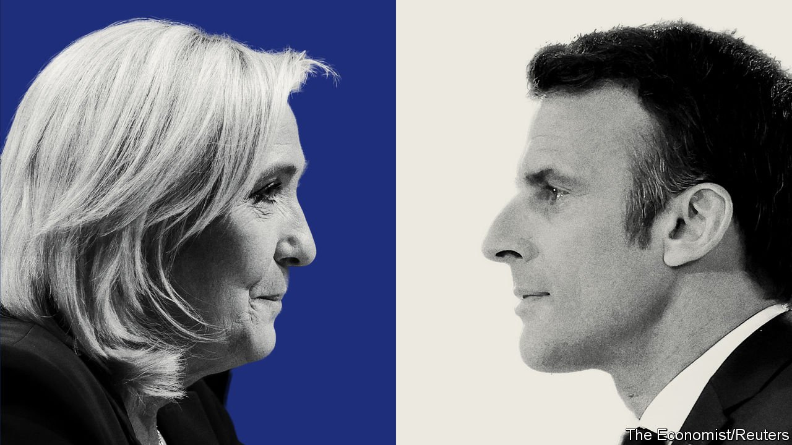
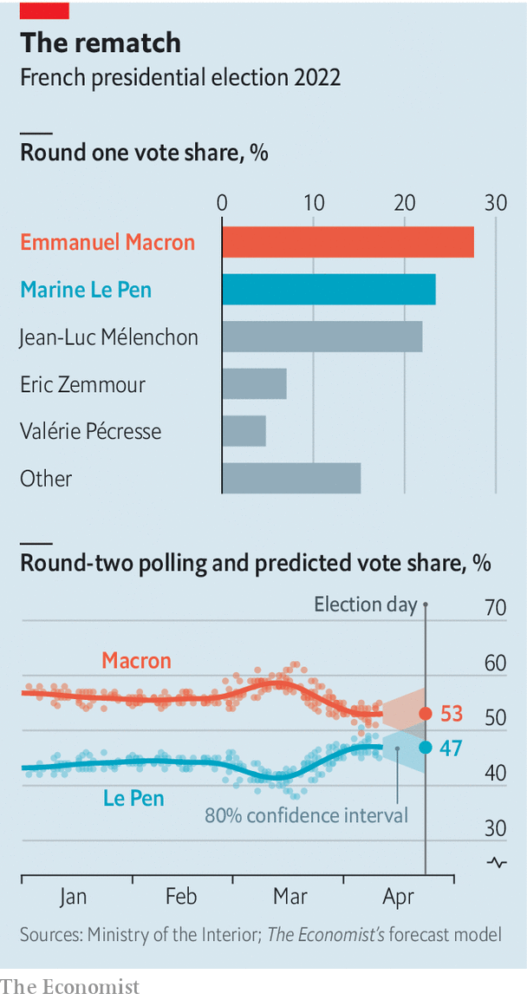

###### Macron v Le Pen, again

# The race to be the next president of France enters the final stretch 

##### The two finalists go head-to-head in the closing phase of the campaign 

 

> Apr 16th 2022 

THERE WERE 12 candidates to pick from, but in the end the French chose the same presidential finalists as in 2017. In the first round of voting on April 10th, , the centrist president, came top, with almost 28%. , a populist nationalist, came second with 23%. In the run-off in 2017 Mr Macron beat Ms Le Pen by a resounding 66% to 34%. When voters return to the polls on April 24th to choose the next president, the result is likely to be far closer.

Three features of the vote stand out. First, Mr Macron drew 1m more votes than in 2017, pushing his score four points higher to the best first-round result for an incumbent president since François Mitterrand in 1988. Mr Macron may be unloved, but, partly thanks to his competent management of the economy, the pandemic and European affairs, his approval rating is over 40%—higher at the end of his term than his two predecessors, François Hollande and Nicolas Sarkozy (though neither of those got a second term).


Second, the result confirmed the total collapse in presidential politics of the mainstream parties on both the left and the right. In 2017 the Socialists’ and Republicans’ candidates between them secured 26% of the vote. This time, they could not even muster 7%. Neither scored even the 5% minimum to qualify for maximum reimbursement of campaign expenses. , the Republicans’ nominee, pleaded for donations, saying she is now personally €5m ($5.4m) in debt. Even Yannick Jadot of the Greens, a movement in tune with the times, failed to reach 5%.

 


The flipside of Mr Macron’s remarkable success at building a broad centrist church, however, is the third and more sinister element of this vote. The combined score for all populist, radical and extremist candidates was nearly 58%, sharply up from just below 50% in 2017. Tactical voting may have inflated this total. The radical-left Jean-Luc Mélenchon supplied the biggest surprise, coming in third with 22%. Half of this haul, according to one poll, came from Socialists, Greens and others on the left who hoped to keep Ms Le Pen out of the run-off. But much of the populist total is truly extreme. Among those eliminated was , a toxic far-right former television pundit, who scored 7%.

The force of the populist vote reflects deep discontent. Many voters reject outright the pro-European, broadly liberal centrism on offer from Mr Macron, with his sharp suits, diplomas and abstract nouns. Both Ms Le Pen and Mr Mélenchon, who jointly secured 45%, speak to this anger in former industrial cities, rundown tower blocks and rural France. In the northern former mining village of Auchy-les-Mines, Ms Le Pen scored a massive 48% in the first round. In Seine-Saint-Denis, a depressed banlieue north of Paris, Mr Mélenchon bagged 49%.

The two finalists are now back on the campaign trail. Ms Le Pen can expect 82% of the far-right vote that went to Mr Zemmour, says a Harris Interactive poll. Mr Macron can hope for 54% of the Greens’ vote, 52% of the Socialists’, and 46% of Mrs Pécresse’s. She, Mr Jadot and the Socialists’ Anne Hidalgo, as well as the Communists’ Fabien Roussel, all urged voters to back Mr Macron to keep out Ms Le Pen. Yet none of these eliminated candidates has many voters to offer, and a lot of them will abstain.

Instead the key to the second round is in the hands of those who backed Mr Mélenchon in the first. On election night, the sharp-tongued, 70-year-old radical urged his supporters not to give “a single vote” to Ms Le Pen. But some of his vote is primarily anti-establishment and anti-liberal. This makes it less compatible with the pro-European Mr Macron, who wants to raise the retirement age from 62 years to 65, than with Ms Le Pen, who promises to lower fuel prices and the pension age. She, like Mr Mélenchon, is anti-NATO, Eurosceptic and pro-Russia. Around a third of Mr Mélenchon’s voters say they will now back Mr Macron; 20% will support Ms Le Pen. The rest are undecided, or likely not to vote.

On April 11th Mr Macron took his campaign to hostile territory in northern France’s former mining basin. He stopped in Carvin, a village that put Ms Le Pen top, followed by Mr Mélenchon. Sitting in Le Bellevue café, Mr Macron declared himself “the candidate who speaks to everyone” and said that he would fight Ms Le Pen’s ideas “until the last second”. His pension-age hike, he said, could be phased in more gradually. Firms that pay high dividends could be compelled to give employees tax-free bonuses. She, meanwhile, is posing as the “candidate of unity”, who would bring calm after the chaos.

As French minds turn to the hard choice ahead, the candidates will come under greater scrutiny. One concern will be Ms Le Pen’s past sympathy for Russia’s Vladimir Putin. Another will be her plans for “national preference” for French citizens, in jobs and benefits, a direct clash with EU law. “A Le Pen presidency would turn France away from the Franco-German axis towards Hungary and Poland,” says Tara Varma, of the European Council on Foreign Relations. “They are trying to transform the EU from the inside.”

With little time left, a crucial moment will be a televised debate on April 20th. In 2017 Ms Le Pen was woefully unprepared. This time, she will be better briefed. Her task will be to come across as a competent leader-in-waiting; Mr Macron’s will be not to appear condescending. On April 12th The Economist’s election model gave Mr Macron an 81% probability of winning, against 19% for Ms Le Pen. He remains the clear favourite, but it is not over yet. ■

For more coverage of the French election, visit our dedicated 

