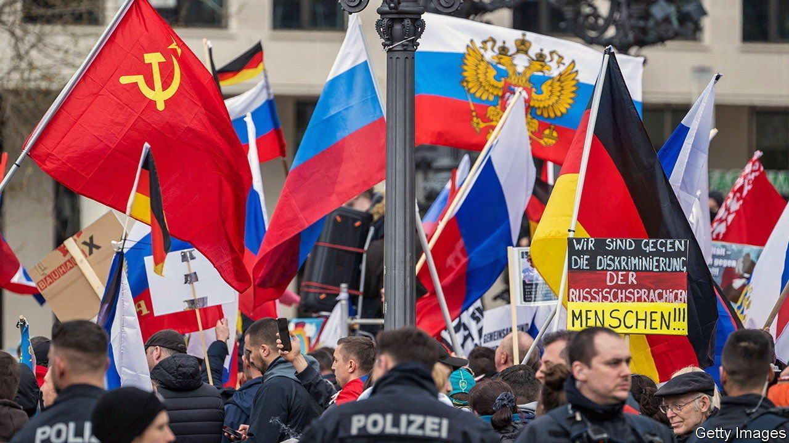

###### Truth and lies

# There are many reports of hostility towards Russians in Germany 

##### But not all are true 

 

> Apr 16th 2022 

IN THE EARLY hours of a night in mid-March, a man in a hoodie threw a Molotov cocktail at the International Lomonosov School, a Russian-German establishment in Marzahn, a working-class district in eastern Berlin that is home to around 30,000 Russian-Germans. It was the second arson attack on the school that month.

The incident was one of a series of episodes of harassment and hostility against the Russian diaspora in Germany and other European countries. Such attacks are rare in France, Italy and Spain, where Russian communities are relatively small, but Germany’s 3.5m migrants from the former Soviet Union say that conditions have deteriorated rapidly since the war in Ukraine started on February 24th.


The fact that many Russians in Germany are supporting the war has not helped. Vladimir Putin’s atrocities have prompted some Germans with Russian roots to believe stories about Ukrainian outrages that would help to justify it. Russian-speakers in Germany are mostly ethnic Germans whose families lived for centuries in Russia and who emigrated after the fall of the Berlin Wall. Many are critical of the Russian president’s policies, but a sizeable minority remains adamant in its support for him. On April 10th pro-Russian demonstrators marched in the streets of Frankfurt and Hanover waving Russian flags. A day earlier pro-Russian motorcades had crossed Stuttgart and other smaller cities.

It is hard to determine precisely the extent of the backing among Russian-Germans for Mr Putin’s war. Most Putin supporters tend hide their views, doubtless fearful of reprisals. These fears are fanned by accounts on the website of the Russian embassy in Berlin. Russian restaurants, for example, have allegedly received anonymous, threatening calls and abuse on social media (“Your food tastes like blood”). Russian-speakers are said to have been harassed on public transport. In Cologne a boy from Kazakhstan whose parents are Russian-German was beaten up by his classmates, says Roman Friedrich, a social worker in Cologne. Since the war started the German authorities have registered several hundred anti-Russian incidents.

“The annexation of Crimea brought out cleavages that are deepening,” says Jannis Panagiotidis of the University of Vienna. In many families attitudes are split along generational lines: the older folk support Mr Putin, whereas the youngsters say their parents have been brainwashed.

Lies and propaganda also play their part. In late March a sobbing woman lamented in a video clip widely shared on social media that Ukrainian refugees had beaten to death a Russian volunteer called Daniel at a home for asylum-seekers in the state of North Rhine-Westphalia.

But the murder of “Daniel” never happened. “I helped to uncover the fake news,” says Mr Friedrich. The case reminded the 46-year-old Mr Friedrich, who grew up in Russia and moved to Germany in 1996, of Lisa, a Russian-German teenager also from Marzahn, who in 2016 concocted a story that she had been abducted and raped by a group of migrants.

The arm of Kremlin propaganda is long. Some suspect that even the arson attacks on the Lomonosov school were orchestrated in Moscow. There is no proof; but the woman outraged by the murder of “Daniel” later realised that she was the dupe of a propagandist who had told her the story. In another video on the same platform she said she had been entrapped, and apologised. But the damage has been done. ■

Read more of our recent coverage of the 

