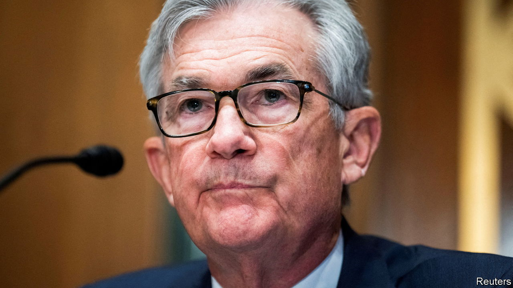
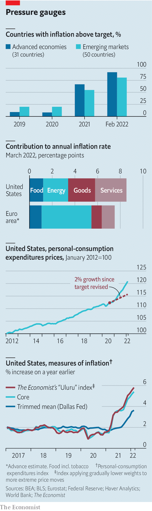

###### Pervasive problems

# Consumer prices in America rise at their fastest pace since 1981 

##### How inflation is becoming more broad-based 

 

> Apr 16th 2022 

UNHAPPY ECONOMIES are often unhappy in their own ways. Today most, however, are battling a common foe: a surge in consumer-price inflation. According to figures released on April 12th, consumer prices rose by 8.5% in March in America, compared with a year earlier—the fastest pace since 1981. In Britain and the euro area consumer prices rose by 7% and 7.5%, respectively, in the year to March. Across most rich and emerging economies, inflation is now well above central banks’ targets.

In summer 2020, after a period of too-low inflation, America’s Federal Reserve said that it would tolerate inflation that was a little above its 2% target for a time, in the hope of making up for undershoots. In the subsequent 20 months, consumer prices have blown past where they would have been had the Fed achieved its 2% target on average, putting pressure on the central bank to raise interest rates fast.

In many places a big chunk of current headline inflation reflects rises in energy prices, which soared after Russia’s invasion of Ukraine jolted commodity markets. In March these explained about half of the euro area’s annual inflation rate. In America, however, the pressure is broad-based. “Core” consumer prices, which strip out food and energy prices, rose at an annual rate of 6.5% in March.

 


Core inflation is one way to assess the breadth of price surges. Another is to exclude the items for which prices have swung the most, typically owing to idiosyncratic factors. The Dallas Fed, for instance, constructs a “trimmed mean” measure, which sorts the components of the personal-consumption expenditures index (the Fed’s preferred gauge of prices) by their inflation rates, and drops the bottom 24% and the top 31%. On that measure inflation has risen by 3.6%—still above the central bank’s target, but by much less.

The problem with trimmed means, however, is that they involve abrupt cliffs, lopping off the top and bottom of the index while giving adjacent percentiles their full weight. In November The Economist devised an alternative index, which applies smooth weights. Components with inflation near the median get the most emphasis, and those with the most dramatic price changes get the least. Our measure suggests an inflation rate of close to 6%—hot enough to keep Jerome Powell, the Fed’s chairman, sweating at night.

For more expert analysis of the biggest stories in economics, business and markets, , our weekly newsletter.

