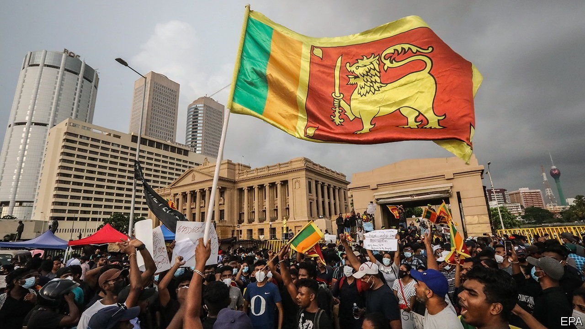

###### Default settings

# Sri Lanka’s default could be the first of many 

##### Soaring commodity prices and higher interest rates imperil the finances of many poor countries 

 

> Apr 16th 2022 

THE ECONOMIC fallout from Russia’s invasion of Ukraine now includes a sovereign default. On April 12th Sri Lanka said that it would suspend payments on the $35bn its government owes foreign creditors. Surging food and energy prices, the result of wartime disruption to commodity markets, have dealt a heavy blow to an economy that was already mismanaged, and brought even erstwhile government supporters onto the streets in protest. Sri Lanka may not be the only country to run aground in the hazardous conditions prevailing in the global economy.

Rising inflation and higher interest rates are painful everywhere, but the stakes are particularly high in poor and middle-income countries. Food prices, which are up by nearly 20% this year, make up a greater share of consumer spending. Inflation is more likely to spiral out of control. And policymakers must also worry about capital flight and falling exchange-rates when the Federal Reserve raises interest rates—as it will over the next year.


As investors have priced in such tightening, the yields on ten-year Treasuries have risen by 1.2 percentage points in the past six months. That is roughly the same increase as during the “taper tantrum” of 2013, when emerging markets suffered capital flight because of a hawkish Fed. There is no sign of a repeat retrenchment on that scale, in part because many middle-income countries now have stronger balance-sheets, and also because many emerging-market central banks have been raising interest rates to get ahead of the inflation problem. (Brazil’s central bank has increased rates by nearly ten percentage points in little more than a year.) But investors have pulled some money out of emerging markets, and the Fed may yet have to raise rates further still.

Often higher rates in the rich world are associated with a stronger world economy, which boosts exports for emerging markets. This time, however, America is overheating, and may face a recession as it slams the monetary brakes. Europe is being squeezed by expensive energy. Though countries that pump oil or grow soyabeans will benefit from higher commodity prices, they must still fight inflation and cope with tighter financial conditions. Commodity importers like Sri Lanka face the sort of pressure that can unseat governments as well as disrupt the economy. Food and energy prices are fuelling unrest in Tunisia and Pakistan.

Several middle-income countries face idiosyncratic crises: China is locking down to battle a coronavirus outbreak, and Argentina continues to stagger under the weight of unsustainable debts. But the greatest vulnerability is found among the poorest economies, nearly 60% of which are in debt distress or at high risk of it, according to the World Bank. One worry is that almost a third of their total debt now carries a floating rate of interest, up from 15% in 2005, making them more exposed to monetary tightening.

It does not help that it is harder than ever to provide emergency support to struggling poor countries. In aggregate they owe more to China than to the “Paris Club” of rich governments who have typically co-operated to restructure debts. So far attempts to include China and other new lenders like Saudi Arabia and India in debt-restructuring efforts have flopped. The IMF only lends to countries with sustainable debts, and the West does not want to see its aid being siphoned off by other creditors. Geopolitical conflict is making the poor world’s economic problems worse, and harder to resolve. ■

For more expert analysis of the biggest stories in economics, business and markets, , our weekly newsletter.

