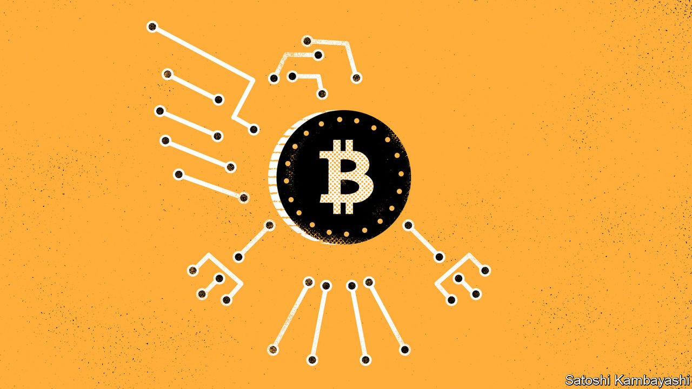

###### Buttonwood

# The complicated politics of crypto and web3 

##### Libertarian dream, or socialist Utopia? 

 

> Apr 16th 2022 

“IT’S VERY attractive to the libertarian viewpoint if we can explain it properly,” wrote Satoshi Nakamoto, the pseudonymous creator of bitcoin, in an email in 2008 to Hal Finney, a developer, describing the appeal of the “e-cash” he planned to launch. The attraction stemmed from bitcoin’s potential role as a currency free from verification by centralised third parties and from oversight by governments. Bitcoin would instead be verified cryptographically and governed by its users.

Bitcoin doubtless appeals to those on the right. At a conference in Miami on April 7th Peter Thiel, the co-founder of PayPal, a firm he once imagined as a young libertarian could supplant the world’s monetary system, waxed poetic about bitcoin’s potential. He views the technology as inherently political, saying in 2020 that “if AI [artificial intelligence] is communist, crypto is libertarian.” AI represents the advance of centralised machines making top-down decisions; crypto requires many individuals and computers making decisions from the bottom up.


Mr Thiel is not alone in thinking there is something inherently right-wing about crypto. Marc Andreessen, co-founder of Andreessen Horowitz, a venture-capital firm, agrees with the characterisation. In 2021 he wrote that crypto could represent a “right-wing tech” that is both more decentralised and more comfortable with entrepreneurialism than the tech industry.

Mr Andreessen is most animated by the opportunities stemming from “distributed consensus”. Until now, he argues, collaborative online effort either adopted corporate norms from the real world, or worked as open-source projects, with no money involved. By comparison, crypto allows for new kinds of incentive systems, where participants can be paid without a real-world company needing to exist. Take Helium, a decentralised wireless network, for instance. It encourages individuals to install “hot spots” in their homes for use by nearby internet-connected devices, by compensating them in HNT, a crypto token. The more the hot spot is used, the more tokens are paid out.

Such architecture is commonly called “web3”, a nod to its potential to be the next phase of the internet. Chris Dixon of Andreessen describes the infrastructure as making it possible for organisations to be owned by token-holders, who then vote on governance matters. Modern tech firms are incentivised to build mammoth platforms that show users as many ads as they will bear. By contrast, developers and users of a web3 application could earn rewards for building and interacting with the platform. In this world users would be able to vote on how Facebook’s or Twitter’s algorithms work. Crucially, they would also gather up their share of the profits.

At first glance, the idea that these applications or projects can be built or contributed to by anyone is the stuff of freedom-loving libertarian dreams. But the way projects themselves are being run has quite a lot in common with left-wing ideas. Antonio García Martínez, a former manager at Facebook and the author of “Chaos Monkeys”, a book about Silicon Valley culture, says that “you will never hear a venture capitalist sound more like a communist than when they are talking about web3.” Blockchain-based enterprise might not be quite what Marx had in mind. But the model behind it seems closer to the idea that the community should own the means of production, distribution and exchange than modern capitalism does.

There is a comedy to venture capitalists talking like communitarian socialists, notes Tomicah Tillemann of Haun Ventures, a crypto fund. As a former adviser to Joe Biden, he is no libertarian. Still, a real shift is under way. Virtually everyone agrees that the big-tech model is flawed, he says. Mr Thiel and his ilk loathe its de-platforming of right-wing voices; the left takes aim at its concentration of power and wealth. Messrs Thiel, Andreessen and Tillemann all see crypto as a serious threat to the status quo.

The truth may be that web3 is simply nascent enough that people across the political spectrum see in it whatever they want. If crypto really does make it possible for developers or users to build any kind of economic system, then the applications that flourish will be the ones that work best. Perhaps those will be libertarian Utopias where the Satoshis of the world retain their privacy. But they could just as well be social-democratic metaverses with automatic wealth taxes and virtual, paternalistic officials.

Read more from Buttonwood, our columnist on financial markets:

 (Apr 9th) (Apr 2nd)

 (Mar 26th)

For more expert analysis of the biggest stories in economics, business and markets, , our weekly newsletter.

