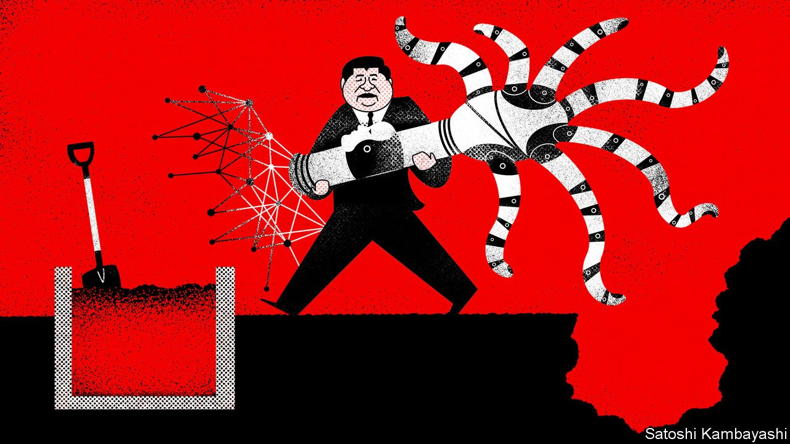
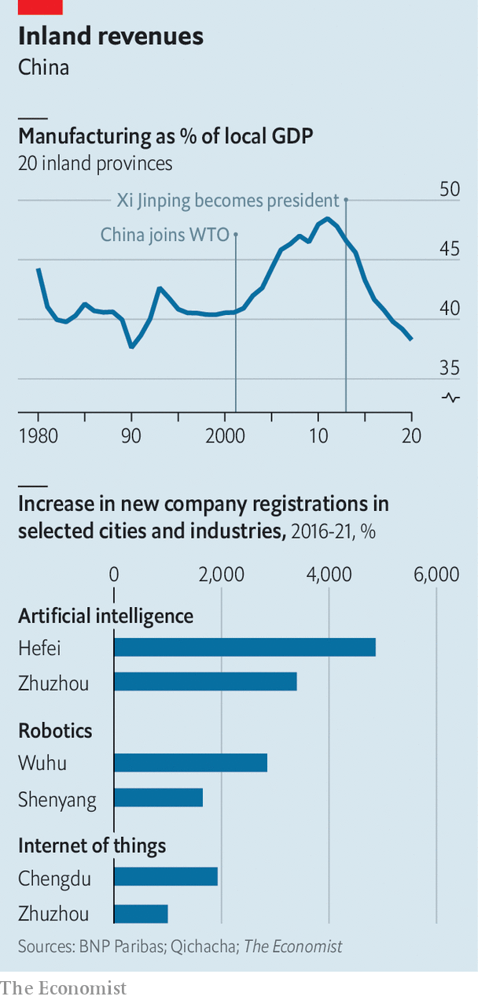

###### The incubator state

# Xi Jinping’s bold plan for China’s next phase of innovation 

##### If it works, the strategy will redraw the country’s economic map 

 

> Apr 16th 2022 

THINGS ARE looking bright for Zhuzhou. The city of 4m people in landlocked Hunan province has often caught the runoff of industrial business from the more populous provincial capital, Changsha, to its north. In the 1990s it became a regional hub for chemicals and metals production. But that caused horrible environmental destruction; more than 1,000 polluters were eventually shut down, with dire economic consequences. Zhuzhou’s inland economy has remained behind that of coastal cities. Over the past decade its moderate growth has been typical of the mid-tier cities that dot China’s interior.

Now, however, its officials talk as if it were a tech hub. Hundreds of artificial-intelligence (AI), robotics and data companies have sprung up in the past year. Local planning documents reflect the exuberance of a boomtown in the making, something Zhuzhou could only watch from afar in the 1990s as eastern ports became rich.


The documents refer to “great changes not seen in 100 years”, a phrase that has been used by Xi Jinping, China’s president, to signify the start of a new era. He believes China is on the verge of a revolution in which dozens of cities will begin producing breakthroughs in robotics, cloud computing and automation. Zhuzhou’s officials also believe they are poised to reap the rewards of Mr Xi’s “common prosperity” campaign—a plan to redistribute wealth from richer regions to poorer ones, and from the dominant internet platforms to consumers and workers.

Mr Xi’s strategy is best understood as a weighty bet that China is on track to become the world’s centre of innovation over the next decade. A shift towards homegrown tech is altering the geographical layout of China’s manufacturing machine. New investment and migration are being rerouted from rich coastal hubs to inland cities such as Zhuzhou. A second feature is an unprecedented rise in the number of new tech companies. The government is nurturing thousands of groups, big and small, in the fields of data science, network security and robotics. Mr Xi and his advisers are also taking firmer control over markets. Their ability to direct capital flows is already evident in how private-equity groups invest in China.

This shift comes at a definitive moment. The narrative that America and the West are in decline, and that China is rising, appears frequently in state media. And yet China has not been more inward-looking since it was condemned internationally after the Tiananmen Square massacre in 1989. The business hub of Shanghai, a city of 25m people, has been locked down as Mr Xi seeks to eradicate covid-19. His support for Russia during the war in Ukraine has raised the potential for more sanctions on Chinese firms. These conditions seem only to strengthen his desire for self-reliance.

Mr Xi is building an incubator state: an economy that relies heavily on government nourishment to create productivity gains with domestic research and technology. In doing so he is also signalling a premature break with the technological convergence that has served China well since the 1980s, when foreign companies began setting up factories using advanced technologies. This tech was eventually transferred to local firms or reverse-engineered at little cost.

The payoff, argues Raymond Yeung of ANZ, a bank, was the realisation of productive efficiencies. One crucial feature of the convergence model was that it presented few risks. China needed only to continue liberalising, and foreign companies only to continue to bring in capital and high-tech gear, to reap the reward.

But the era of convergence is drawing to a close. China’s total-factor productivity growth languished at just above 1% per year between 2010 and 2019. Tech transfers are now far more restricted by America. Mr Xi can surely imagine the sanctions devastating Russia being aimed at China. The response has been to end reliance on foreign tech and to refocus the growth model on what can be created at home.

High-stakes gamble

Rather like a venture-capital investor taking high-risk, high-reward bets, Mr Xi will shoulder more risk in this era. His plan requires the creation of big, globally competitive groups akin to Huawei, a telecommunications giant. “But they will have to develop lots of Huaweis,” says Mr Yeung. If the investments do not produce returns, the plan will have saddled the economy with yet more debt, and too little growth.

Past Chinese leaders have focused their reforms in coastal cities, where manufactured goods could easily reach ports. Shenzhen, 700km south of Zhuzhou, became emblematic of China’s rise as the factory of the world in the 1990s. Some of that business crept westwards to cities such as Chengdu and Chongqing. Mr Xi’s time in power at first focused on boosting consumption, which also favoured the largest coastal cities. On his watch, Alibaba and Tencent, based in the eastern and southern entrepôts of Hangzhou and Shenzhen, respectively, rose to prominence as engines for consumption and were often hailed as such by Party officials.

This has changed rapidly over the past two years. Mr Xi is reorienting the economy back towards manufacturing. The move away from consumer-internet tech, or soft tech, was made clear in the 14th five-year plan published in 2021. It emphasised instead rapid development in hard tech, or areas such as AI, semiconductors, industrial software and big-data processing. The new industrial policy does not require easy access to ports.

The efforts could redraw China’s economic map. An emphasis on manufacturing had pushed migrant workers not just to coastal towns but also to inland cities where new factories could be built cheaply, says Chi Lo of BNP Paribas, a bank. The last great pulse of inland migration began in 2001, when China joined the WTO, and lasted until 2013, when Mr Xi came to power and consumption became the focus for growth. The past eight years witnessed a shift, with migration out of inland centres to cities in the east. Mr Lo believes China is near the start of another wave of inland migration that will power Mr Xi’s new industrial revolution.

 


Migration is essential if the new tech firms are to be staffed. A review of company-registration data by The Economist shows that firms dealing in big data, AI, the internet of things, robotics, cloud computing and clean energy are setting up at an unprecedented pace in China’s interior. Many of the new hubs are capitals of poor provinces. But many smaller cities, too, such as Zhuzhou, are also experiencing explosive growth in tech firms (see chart).

Hefei in Anhui province, one of China’s poorer regions, is a city of about 9m. It has reinvented itself in recent years as a tech hub, with thousands of firms opening in a short period. In 2021 alone more than 2,500 companies claiming to develop basic AI software set up in the city, up from just 370 in 2020. Thousands more say they offer related services. The far northern rustbelt city of Shenyang welcomed more than 860 companies that say they are doing robotics research over the past two years, up from a combined 170 in the four years before that. Some 4,400 groups claiming to be involved in the internet of things set up shop in the south-western city of Chengdu in 2021, four times the number in 2020.

The rapid growth in these cities is closely connected to local-government planning and the offer of generous tax and land incentives. Indeed the figures should also come as a warning to planners that the tech boom they have induced is leading to potentially wasteful investments. Take data-centre and cloud-computing businesses. The pandemic created great demand for consumer-internet firms and, in turn, data services. Local policies encouraged companies of all types to set them up, or at least try. Property developers needed only to convince local officials to sell them land and power cheaply in order to tap into the lucrative data-centre industry, says Edison Lee of Jefferies, an investment bank.

Guiyang, a large city in the poor southwestern province of Guizhou, witnessed an explosion in data-centre-company registrations in 2020, many with no experience in the area. Some have even tried to move into cloud computing, which requires more technological input than data centres. The wave of innovation in AI, robotics and climate tech is carrying with it many wannabes that will drain government funds, not add to GDP.

Several investors have questioned where the talent needed to power this boom will come from. The government has announced academic programmes to train people up. But a shortfall seems clear. The rerouting of migrants does not take into account that their skills have not kept up with Mr Xi’s industrial shift. Almost 70% of the labour force has not had one day of high-school instruction, notes Scott Rozelle of Stanford University.

The government needs more than a startup scene to make its plan work. And so it is nurturing a new cohort of champions. These are not the consumer-internet groups that dominated China’s digital economy. Instead they are companies engaged in enterprise software, industrial digitisation, data security and state-owned cloud computing. Few investors in Silicon Valley will have heard of Baosight, Maxscend, Sangfor, Supcon or YoueData. Many are listed in Shanghai or Shenzhen, not New York and Hong Kong. They are a mix of state and private firms, but almost all are close to the government. And they are working to upgrade China’s industrial infrastructure in order to usher in Mr Xi’s new revolution.

Baosight is a state-owned industrial-software firm. It builds the enterprise-resource-planning software and manufacturing-execution systems that are integrating and digitising industrial plants across China. These systems aim to drive efficiency within the steel, pharmaceuticals and chemicals industries. Baosight recently completed work for a state steel group in what was considered the largest, most complex integration project of its kind. Its market capitalisation has risen three times over since 2018, to 62bn yuan ($9.7bn).

Sangfor Technologies, a private network-security and data group based in Shenzhen, is helping the government build advanced big-data platforms. Supcon, also privately controlled, builds network ecosystems for state-owned firms.

A small but growing number of international investors has cottoned on to these companies. Their thinking could not be more different from the past generation of tech-watchers. Companies such as Alibaba attracted funding as investors bet that only the private sector could provide the dizzying array of online shopping and financial services that would in turn support hefty valuations for a few big platforms.

Soft tech, hard line

That thesis has been dealt a heavy blow. The government believes the consumer-internet craze widened inequality. Companies’ market dominance allowed them to manipulate pricing while hoovering up unregulated personal data. Their clout also dwarfed the influence the Party had over the digital economy. These imbalances have been “rectified”, as officials say, by sweeping regulatory crackdowns.

The state not only succeeded in knocking tech-market valuations by more than $2trn in the span of about a year. It has pushed the giants into submission and decline. Many executives, such as Richard Liu of JD.com, have stepped down. Companies are laying off workers; few are pursuing capital-intensive acquisitions.

For the new champions to achieve scale, they will need to be globally competitive and gain market share in developed economies. Huawei was on this road before it was knocked back by America. Mr Xi wants China to produce its own hard-tech companies in order to become more self-sufficient from the hostile West. But even if this new phalanx of state-backed tech companies is less reliant on foreign inputs than Huawei, it can still be barred from foreign markets, denying it the business needed to grow to sufficient size.

How China’s new boom is funded has become a vexing question for venture capitalists eager to find the next Alibaba but wary of running afoul of government policy. Mr Xi is now six years into a reordering of capital and financial markets. China’s 58trn-yuan shadow-banking market was first targeted in earnest in 2017. A three-year, $450bn wave of speculative outbound investment, driven by flamboyant tycoons, was subdued the same year. Meanwhile property developers were cut off from the supply of credit that financed a 20-year frenzy.

In 2021 senior officials began referring to the enemy by name: a “disorderly expansion of capital” that has recklessly pursued high returns at the expense of the common good. Hundreds of officials and businessmen have been taken down in recent years on corruption charges but only recently have some been accused of being “influenced by capital”. Zhou Jiangyong, a former Party secretary of Hangzhou, the prosperous eastern city that is home to Alibaba, is being investigated for such crimes. He has also been linked by local media to companies affiliated with Alibaba.

Mr Xi is already offering up a plan for an “orderly development of capital”. He personally oversaw the launch of a new stock exchange in Beijing in 2021 that is focused on channelling investments to small tech groups. State funds are raising ever more cash and investing in private tech firms. The “little giants’‘ programme, launched by the Ministry of Industry and Internet Technology, is hand-picking thousands of firms that will be granted tax incentives and public funding. According to Bloomberg, China plans to spend some $2.3trn this year on new projects, many of which will be focused on high-tech manufacturing and technology development.

Han Wenxiu, a leading economic adviser, recently said the crackdown on disorderly capital is not about turning it away. Instead it is about capital following the Party’s lead. This is already starting to happen. Private-equity (PE) investments in consumer tech collapsed last year, for instance, while investments in microchips and software soared to new highs.

Today the tech investors eyeing companies such as Sangfor and Supcon rely on policy and the amount of state-linked business to assess whether they have promise. Analysts at investment banks often cite a company’s inclusion in a large government project as a strong “buy” signal, and avoid anything that runs counter to the state’s message. “Every time we look at a sector, investors are asking us if this area is going to be seen as promoting inequality,” says Kiki Yang of Bain, a consultancy.

Many venture-capital (VC) firms in China are finding fewer constraints on their investments as long as they focus on the areas in the party’s good graces—the hard-tech and clean-energy companies that are cropping up at rapid pace. VC investments in clean energy surged in 2021 to about $8.7bn, up from $5.6bn in 2020, according to PitchBook, a research firm. A growing number of private investors hopes to invest alongside state funds, or to find startups that have already taken state money, says one investor. A green light from the state is now a powerful market signal.

Many of the imbalances in the Chinese economy—the targets of Mr Xi’s attacks—arose or worsened on his watch. The tech tycoons largely made their billions over the past decade. Mr Xi oversaw one of the largest accumulations of property-sector debt in the world. His administration relaxed controls that allowed for a wave of speculative overseas buying. Mr Xi’s regulatory crackdown was in many ways an attempt to correct market distortions caused by his own policy failures.

Some experienced global investors worry the cycle of errors and corrections will repeat. Few have been able to swallow the talk of a “disorderly expansion of capital”. Only through the introduction of market forces and foreign capital did China build an advanced, modern state. Its world-class tech scene has been nurtured by global VC and PE funds. For Mr Xi and his team of technocrats to turn their back on this, says one big investor, shows they have not learned from the past 40 years. That they believe they are ready to do the job of the market sends all the wrong signals. ■

For more expert analysis of the biggest stories in economics, business and markets, , our weekly newsletter.

