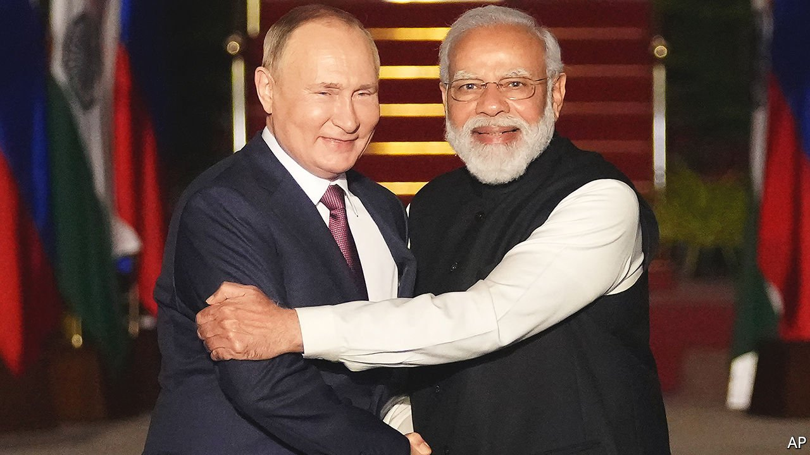
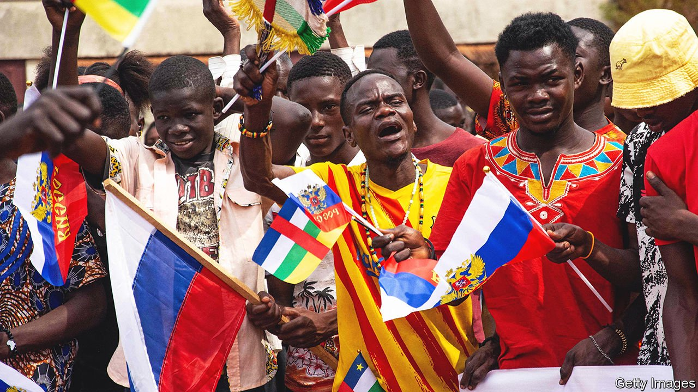
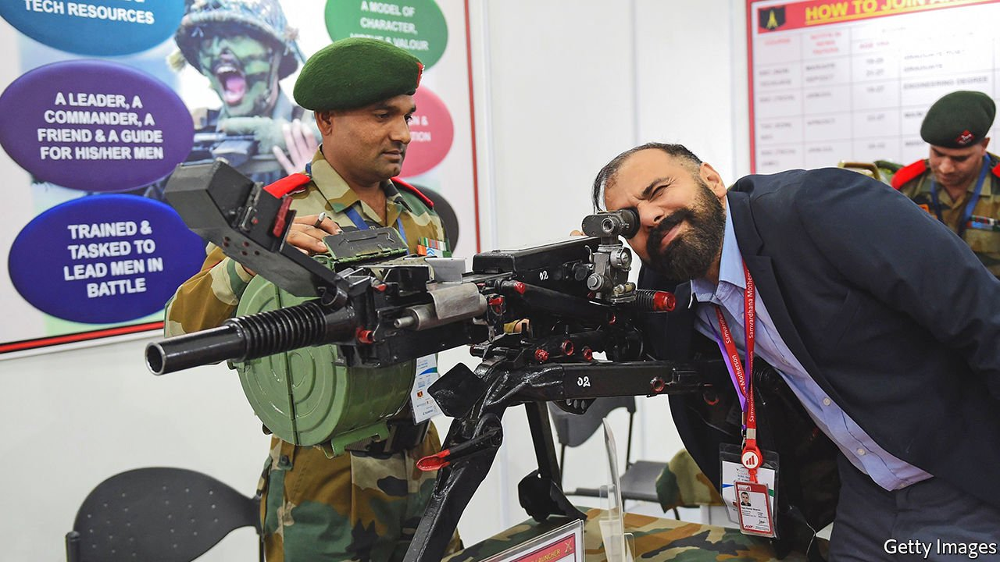

###### Friends like these

# Why so much of the world won’t stand up to Russia 

##### Rising food prices and a history of Western hypocrisy and selfishness aren’t helping 

 

> Apr 16th 2022 

WHEN THE leaders of the world’s two biggest democracies held a virtual meeting on April 11th, Narendra Modi, India’s prime minister (no. 1) approvingly quoted President Joe Biden (no. 2) back to himself: “Democracies can deliver,” Mr Modi declared. But when it came to the war in Ukraine, just what it was that democracies should be delivering went unspecified. Both men worried about the plight of Ukrainian civilians. Although Mr Biden left no doubt whom he blamed for their suffering, Mr Modi sounded less certain. Rather than point a finger at Russia, he called for “an independent inquiry” into the horrors reported from the Ukrainian town of Bucha.

India is perhaps the most inconvenient of the serial abstainers from the West’s campaign to punish Vladimir Putin, Russia’s president, for invading Ukraine. But it is far from alone. In Asia, the Middle East, Africa and Latin America, even longtime allies and clients of America are rebuffing its entreaties to impose sanctions on Russia or merely to criticise it.


Few countries have been as brazen as Pakistan, which, under its since-ousted prime minister, Imran Khan, signed a trade deal with Russia shortly after the United Nations voted on March 2nd to deplore the invasion and demand that Russia withdraw. But many are refraining from either openly criticising or penalising Russia, owing to commercial incentives, ideological commitments, strategic ambitions or simple fear. Turkey, for example, has economic reasons to cling to the sidelines—it buys 45% of its gas from Russia—but it also has citizens endangered by the war. On March 13th Turkey’s foreign minister announced he was negotiating with Russia to extract dozens of Turkish residents from the Ukrainian city of Mariupol, which was being crushed to rubble by Russian bombs. A month later, many remain trapped.

For its part, India has a number of reasons to avoid antagonising Russia: its tradition of neutrality in global conflict, its strategic priority of confronting China, its dependence on Russian military equipment. As an added incentive, democracy itself may argue for staying on the fence: “pulling the lion’s tail” by refusing America or Britain plays well with the domestic audience. For all these reasons, when asked why India will not ally with America in this democratic cause, the mandarins who run its deep state and shape its foreign policy respond with looks of cynical scorn.

It is tricky to gauge the degree to which countries resisting Russia’s isolation might undermine the sanctions regime organised by the West. But considered as a bloc, the 40 countries that opposed or abstained from the UN resolution condemning the invasion will probably matter more in terms of geopolitics than economics. Together they account for a quarter of the world’s GDP and 20% of its exports. Yet they are not very important to the Russian economy. Their median GDP per person is about a third of the global average, suggesting they may not muster demand for much more than the quarter of Russian exports they already consume. And they lack the capacity to provide the more sophisticated goods and services Russia once bought from the West.

On the surface, Russia has had several lonely weeks at the UN. The invasion struck so egregiously at the organisation’s foundation—”the principle of the sovereign equality of all its Members,” as the charter reads—that nations rallied to support not just the first resolution but a second criticising Russia for menacing civilians. The first passed with the support of 141 of the 193 member states, the second with that of 140. Last week the UN’s members went beyond mere exhortation by kicking Russia off the Human Rights Council. It was only the second time any country had been ejected (after Libya in 2011) and the first time for a member of the Security Council. Russia, which had warned before the vote that even abstaining would be seen as an unfriendly act, announced afterwards that it was leaving the council. “You do not submit your resignation after you are fired,” retorted the Ukrainian ambassador, Sergiy Kyslytsya.

But the margin on the vote was far narrower: 93 to 24, with 58 abstentions. Support for Ukraine in much of the world is thin, diplomats caution, as is the patience of abstainers, which could curdle into opposition. The pattern of abstentions speaks in part to concerns that sanctions on Russia are driving up food and energy prices. A European diplomat summarising their view says, “Two elephants are fighting, and the little guys get hurt.” He continues, “There’s a big attack from many sides on sanctions being the problem, not the aggressor in this war. That’s something we have to push back on constantly, and it’s coming from everywhere, including the Indias and Pakistans of the world.”

A related objection is that the West is obsessing over a European conflict that is not a true global concern, while downplaying or ignoring conflicts and human-rights abuses elsewhere. To these critics, a self-righteous inconsistency on questions of international law is a hobgoblin of great powers. “There’s a good deal of what you might call geopolitical whataboutism,” says Richard Gowan of the International Crisis Group (ICG), a think-tank.

In recent years, the reluctance of rich countries to invest in mitigating climate change and the slow and uneven distribution of covid-19 vaccines had already reinvigorated the Non-Aligned Movement, the organisation of states that professed neutrality during the cold war. “There’s been an underlying trend that I’ve observed around the UN in the last couple of years, which is that a lot of the countries from the global south have been increasingly co-ordinated in articulating criticisms of the West,” Mr Gowan says. These countries, he continues, “have been feeling more a sense of unity and common purpose than was the case in much of the post-cold war era.”

Particularly across the Middle East, and in Turkey, the West’s concern for Ukraine’s sovereignty is seen as self-serving and hypocritical, partly in light of America’s war in Iraq and the NATO-led bombing of Libya in 2011, which toppled its dictator, Muammar Qaddafi. The warm European welcome granted to Ukrainian refugees, compared to that accorded Syrian refugees, prompts eye-rolling. These sorts of concerns are of long standing among Arab states. What has been surprising is the degree to which even American clients have felt free to act on them.

Some diplomats were stunned when Iraq’s ambassador to the UN abstained from the resolution condemning the invasion, citing his country’s “historical background”, in an apparent jab at the American invasion to which he may owe his job. Even Saudi Arabia and the United Arab Emirates (UAE), despite having only weak ties to Russia, have assessed more cost than benefit in standing with the West. They do not want to antagonise a crucial partner that has co-operated with OPEC to prop up oil prices. Moreover, they see a chance to send a signal. They want more help from America dealing with problems in their backyard, such as the missiles and drones fired from Yemen and the Iranian-backed militias spreading mayhem from Beirut to Baghdad. “If you’re not there for us, we won’t be there for you,” an Arab official says. In the Middle East, only Israel and Libya voted to boot Russia off the Human Rights Council; the abstentions by the Gulf states were a particular disappointment to Western diplomats.

Russian propaganda in the region feeds grievances against the West. Russia’s state-run media, such as the Arabic service of the network RT or the Turkish edition of Sputnik, are popular, and its foreign ministry has a cadre of diplomats who, unlike their Western counterparts, speak Arabic fluently. “Every time I turn on the television, there’s a Russian making the case for the war,” says a Western ambassador in Jordan. While the big Arabic channels, which have reporters on the ground in Ukraine, have not shied away from recounting the war’s horrors, their coverage is often interspersed with pro-Russian or anti-Western takes. Last month Sky News Arabia, based in the UAE, ran a segment about how “duplicitous” Western countries were trying to “demonise” Mr Putin.

The enemy of my frenemy

With the exception of Russian fellow travellers such as Cuba, Nicaragua and Venezuela, Latin American countries supported the first two UN resolutions condemning Russia for the war. But several, including Brazil and Mexico, balked at kicking Russia off the Human Rights Council, and there is little appetite in the region for joining the sanctions regime. Signalling independence from the West is an old game in Latin America, where some states seek to balance American power in the Western hemisphere “by laying out the red carpet for US adversaries”, as Benjamin Gedan of the Wilson Centre, a think-tank, puts it. In early February Argentina’s president, Alberto Fernández, endorsed this strategy when he sat down for lunch in Moscow with Mr Putin as Russian forces massed to invade Ukraine. Referring to the International Monetary Fund, Mr Fernandez told him, “I am determined that Argentina has to stop being so dependent on the Fund and the United States, it has to open the way to other countries, and Russia has a very important place there.”

 


Since the invasion, Russia has been at pains to encourage that attitude. In late March Sergei Lavrov, the foreign minister, remarked that certain countries “would never accept the global village under the command of the American sheriff”. Citing Argentina, Brazil and Mexico among others, he added, “These countries do not want to be in a position where Uncle Sam orders them to do something and they say, ‘Yes, sir.’” On April 5th Russia added Argentina to its list of 52 “friendly countries” with whom it will restart direct flights. Still, Argentina, the current president of the Human Rights Council, voted to remove Russia.

Brazil’s strongman president, Jair Bolsonaro, has made no secret of admiring Mr Putin and his “masculine qualities”. Mr Bolsonaro also happened to pay a visit to Moscow in February, and hailed the two countries’ relationship as a “more-than-perfect marriage”. It is a marriage fertilised, apparently, by fertiliser. Though Brazil joined in condemning the invasion, Mr Bolsonaro has since said he cannot cut ties with Russia because of the “sacred” importance to Brazil of imported fertiliser, more than a fifth of which comes from Russia. Mr Bolsonaro now says Brazil will remain neutral in the conflict, a position in harmony with his political opponents and, polling suggests, the public. Similarly, Mexico, despite having condemned the invasion, has a long-held policy of non-intervention and a habit of shrugging off events far beyond its borders. It doesn’t help that President Andrés Manuel López Obrador shows little concern for democracy. He is also playing to his leftist party, elements of which set up a friendship group with Russia following the invasion.

It is in Africa that Russia has found the most outright sympathy. Almost half of African countries—25 of 54—abstained or stayed away from the first UN vote. The history of colonialism makes some reluctant to throw support behind what is seen as a Western cause. But others are acting out of growing affinity with Russia. That is true of South Africa, the other big democracy to shrug off the West’s call for unity. It has abstained in all the UN votes.

In southern Africa many countries see Russia as the successor of the Soviet Union, which armed and trained the guerrilla armies that fought colonial powers and segregationist regimes. Such nostalgia partly explains South Africa’s swerve towards Russia during the presidency of Jacob Zuma, from 2009 to 2018. But South Africa’s relationship with the West was also strained by the bombing of Libya. In 2015 leading figures in the African National Congress published a foreign-policy paper lamenting the collapse of the Soviet Union because it had “altered completely the balance of forces in favour of imperialism”, meaning America and the West.

Arms across the sea

Mr Zuma’s departure from office—he is now on trial for corruption—has not cooled the ANC’s ardour for Russia. President Cyril Ramaphosa mouths Kremlin talking points, arguing that NATO is responsible for the conflict because of its eastward expansion. He has also criticised Western sanctions on Russia. One reason may be pecuniary. Although overall trade between the countries is puny, Russia is South Africa’s second-largest market for apples and pears and its fourth largest for citrus fruit. Even as Russian-flagged ships were being turned away from European and American ports, the Vasiliy Golovnin, a freighter, docked in Cape Town on April 4th. South Africa is also reportedly pursuing a $2bn-a-year deal to buy gas from Gazprom, a Russian state-owned energy firm.

In other parts of Africa, support for Russia reflects its success in spreading influence by selling weapons or supplying mercenaries. Russian guns-for-hire have been seen in five of the 17 African countries that abstained on the first UN vote: the Central African Republic, Madagascar, Mali, Mozambique and Sudan. Many more of the abstentions or no-shows are buyers of Russian arms. These include Algeria, Angola, Sudan and Uganda, according to data collected by the Stockholm International Peace Research Institute, a think-tank. Eritrea, a gulag state, was among the five countries in the world that voted with Russia on March 2nd.

 


As the conflict grinds on, the West will increasingly confront the question of how aggressively to use its own leverage to prod fence-sitters onto their feet. Some countries might be encouraged to see an opportunity to repair relations with the West. That could be the case with Pakistan, particularly now that Mr Khan has been ousted in a no-confidence vote. Trade with Russia is meaningless to Pakistan, and its armed forces, which tend to call the shots, are showing signs of discomfort with its deep and growing dependence on China.

General Qamar Bajwa, the commander-in-chief, has lately sounded surprisingly conciliatory to the West. In a speech on April 2nd he nudged China to fix its border troubles with India, and then said that Russia’s “aggression” against Ukraine could not be condoned and “must be stopped immediately”. He also noted the war showed how a smaller country could defend itself by having stronger morale and making clever use of simple technology—an allusion to Pakistan’s struggle with India, its larger neighbour.

The West has even greater leverage with India. All told, Russia, with a GDP just over half of India’s, accounts for barely 1 % of India’s trade. Trade with the West is of vastly greater importance, as are India’s ties to America via people-to-people exchanges. Under a law authorising sanctions against countries making “significant transactions” with Russia, America placed sanctions on China in 2018 and Turkey in 2020 for buying the S-400 missile defence system. India has bought the same system, but the Biden administration has so far danced away from the question of whether it will apply the same standard. “We have not yet made a determination,” Antony Blinken, the secretary of state, said when asked about such sanctions at a press conference after the meeting between American and Indian officials on April 11th. Meanwhile, India is not merely refraining from criticising Russia but increasing its purchases of Russian oil.

Mr Biden’s strategy is clearly to woo India rather than pressure it, an approach that has appeared so far to bear little fruit. Pressed in the same exchange with journalists as to why India was not moving to reduce any dependence on Russia, Subrahmanyam Jaishankar, the minister of external affairs, sarcastically thanked reporters for their “advice and suggestions” and then shot back, “Believe me, we have a decent sense of what is in our interest and know how to protect it and advance it.” ■

 A previous version of this article misstated the results of the vote on Russia's membership to the Human Rights Council. It was 93 to 24, with 58 abstentions, not 93 to 58, with 24 abstentions. Sorry

Read more of our recent coverage of the 

