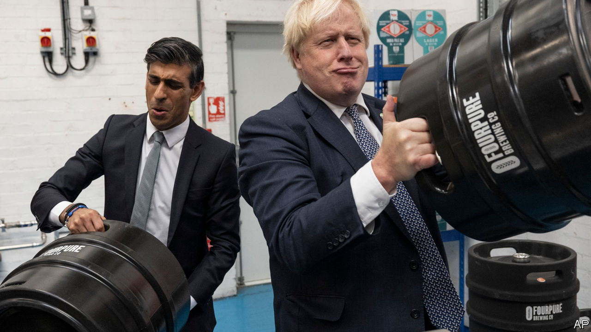

###### Partygate, the final episode

# Boris Johnson broke his own lockdown rules 

##### But he won’t be forced from office 

 

> Apr 16th 2022 

WHEN SOMEBODY has a lucky escape do they learn from their mistake, or are they emboldened to make the next one? That was the question facing Britain on April 12th after the prime minister, along with his wife and chancellor, received a “fixed penalty notice”—a small fine—for a get-together during the covid-19 lockdowns. The answer, alas, is that Boris Johnson has form. However repentant he now is in public, in private he will be revelling in his knack for wriggling out of the tightest spots like a greased piglet. For Britain, that is not a good outcome.

For several weeks, starting towards the end of last year, “Partygate” looked as if it might end Mr Johnson’s political career. Revelations emerged that the prime minister and his staff had been boozing at one knees-up after another, in breach of the government’s own covid rules. Mr Johnson first told Parliament there had been no parties. When that proved false, he said he had not known about them. When he was shown to have been at several, he denied that they were really parties. When it was said he had been warned, he seemed to suggest that he had misunderstood his own government’s rules.


Some Conservatives  that this week’s fine is no more serious than a speeding ticket. In fact, it proves that the police have in effect concluded that Mr Johnson either lied to Parliament or was wildly ignorant of his government’s policy on the biggest and most urgent issue of the day. He has, in other words, been a knave or a fool—and few would call the biographer of Churchill and Shakespeare a fool.

Breaking the law and lying to Parliament were sacking offences before Partygate and they still should be. But Mr Johnson’s fate is in the hands of Tory MPs and, at the moment, they believe that they need him if they are to keep their seats at the next election. It helps that Partygate no longer seems quite so heinous now that Russia is committing war crimes in Ukraine. Given that Mr Johnson has helped lead the international coalition against Vladimir Putin, Tory MPs now say he is too important to lose—though since Britain has changed prime ministers during its own wars, in 1916 and 1940, it is hard to see why it should shrink from doing so during someone else’s.

Even though Mr Johnson may receive more fines over Partygate, it will therefore not spell his end. But it will leave its Merlot-tinged mark on British politics. Mr Johnson has lost the trust of voters. Snap polls taken this week suggest that about 60% think he should resign and over 70% think he lied to Parliament. Britain , a huge backlog in the health service and a surge in the cost of living. It is a time for the hard choices that would stretch the nerves of even the most esteemed prime minister. Mr Johnson, who courts popularity, is more likely than ever to duck them.

This scandal also casts a pall over the Conservatives. The party of law and order has, with open eyes, chosen to associate itself with Mr Johnson’s law-breaking and lies. It has been tainted by them. However much it pretends that there were extenuating circumstances, MPs will learn the lessons—that rules are for suckers, that the crime is getting caught and that, even if you are nabbed, braggadocio will see you through. And Mr Johnson and his party have eroded standards in public life. Because elections are blunt instruments, these are in effect self-policed. The prime minister is the chief enforcer of the ministerial code. Because he is assumed to be beyond reproach, there is no provision for when he himself is the problem.

Partygate is winding down. Sadly for Britain, the man with more gates to his name than Heathrow airport has got away with it again. You can count on the next one coming along soon. ■

