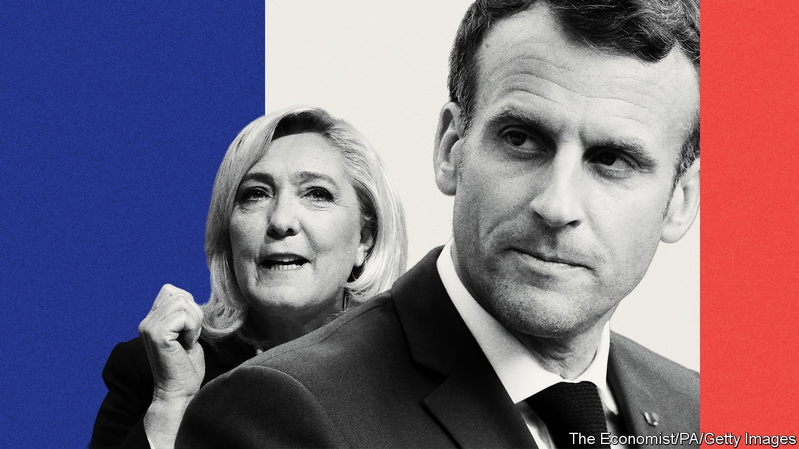

###### Don’t panic

# Emmanuel Macron did better than it seems in the first round of France’s election 

##### He still has the advantage over Marine Le Pen in the run-off 

 

> Apr 16th 2022 

FOR THE third time in the past 20 years a candidate of the hard right has made it through to the run-off round of France’s presidential election, causing much anxiety in liberal circles across Europe and beyond. The panic is overdone. The French do not much like their presidents, often relishing elections as an opportunity to give an incumbent a good kick in the teeth. Only two have been re-elected since 1965. Bearing that in mind, Emmanuel Macron’s  on April 10th was close to a triumph. At 27.9%, it was the highest first-round score attained by any incumbent since 1988, and almost four points more than he got in 2017. That is testament to the competence with which he has governed, boosting employment and productivity and improving training and education while avoiding major mishaps, despite the disruption of covid-19.

Just as in 2017, Mr Macron will face Marine Le Pen in the run-off. Ms Le Pen has done a good job of rebranding herself and her party. She focused her campaign on bread-and-butter issues like energy prices rather than only on toxic ones like immigration. After her previous defeat she changed the name of her party from the National Front, which she had inherited from her overtly racist father, to the more mainstream-sounding National Rally. Even so, her share of the vote in the first round rose by less than two points, to 23.2%.


From here it is much easier to see a path to a second term for Mr Macron than an upset by Ms Le Pen. The president should pick up most of the votes of the eliminated mainstream candidates; Ms Le Pen will grab those of the far-right Eric Zemmour. So the election will be determined by a scrabble for the votes of the perennial firebrand, Jean-Luc Mélenchon, who got an astonishing 22%, thanks partly to tactical voting on the left. Mr Mélenchon has told his supporters that “not a single one” of his votes should go to Ms Le Pen. Many will defy him out of their hatred of the former banker in the Elysée and their anger at the deprivation of France’s left-behind rural backwaters, post-industrial towns and urban slums. But Ms Le Pen needs to secure the great bulk of Mr Mélenchon’s votes to win, and that will be hard.

The Economist’s poll-of-polls has the race at a tight 53-47%. Nevertheless our electoral model, which is based on that, gives Ms Le Pen a one-in-five chance of victory, about the same as Donald Trump faced on some estimates at the 2016 election in America. Mr Macron needs to campaign his socks off to minimise the likelihood of something as shocking happening in France on April 24th.

French voters should be in no doubt: a Le Pen presidency would be a disaster for France and for Europe. Ms Le Pen has in the past expressed open admiration for Mr Trump and Vladimir Putin and still supports Hungary’s autocratic Viktor Orban. She wants to pull France out of NATO’s integrated command structure, and to ban the Muslim headscarf (though not other scarves). She has dropped her call for France to leave the euro, but would pick fights with the EU in her quest to give priority to French citizens in government handouts and jobs, to give French law primacy and to slash French payments to the EU’s budget. A Le Pen victory would also give heart to the hard right elsewhere in Europe, notably Italy, which is due an election next year. The EU would face a grave crisis. Huge, perhaps violent, protests could well roil France’s streets.

Whatever transpires in the second round, the fact that on April 10th a record 58% voted for the extremes of right and left is a sign that France is divided and unhappy. In presidential politics the two mainstream parties of left and right that supplied almost all its governments since 1958 have been vaporised—their candidates got less than 7% between them. If the four-in-five chance does indeed give Mr Macron his second term, he must use it to tackle the root causes of this division and discontent. Russian roulette is not a game to be played repeatedly. ■

For more coverage of the French election, visit our dedicated 

