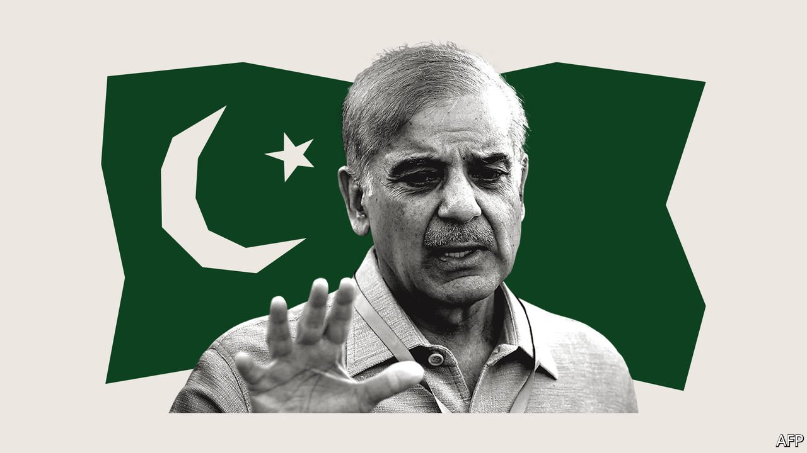

###### Mismanaged democracy

# Pakistan’s generals should let politicians run the country for once 

##### The army thinks it keeps the country stable. But it makes Pakistan ungovernable 

 

> Apr 13th 2022 

WHEN PAKISTAN’S top brass helped install Imran Khan as prime minister in 2018, the former cricket champion seemed like the perfect front man. He was a sporting hero, dashing and cosmopolitan. Even so, he had cultivated a folksy, pious air, along with a streak of indignant nationalism that could fire up a rally. His party looked different from the tiresome old lot, which are run as fiefs by political dynasties. His attack on the entire political class as irretrievably corrupt dovetailed helpfully with the work of the aptly named NAB, or National Accountability Bureau, which was trying to put an end to one of those dynasties by prosecuting Nawaz Sharif, the outgoing prime minister.

Most important, Mr Khan cheerfully did what the armed forces wanted, be it cosying up to China and rich Arab states or playing the West as the army quietly helped the Taliban return to power in Afghanistan. The “miltablishment”, as Pakistani wags call it, seemed to have landed on exactly what it was looking for: a plausible yet pliable manager, who would give the army the final say on anything it cared about, but could still take the blame for whatever went wrong.


Yet Mr Khan, predictably, turned out not to be infinitely malleable; he soon developed illusions about his own importance. Last autumn he tried to block Qamar Javed Bajwa, the country’s most senior general, from putting a new man in charge of the intelligence service. Mr Khan’s electoral success had depended on the scheming of the previous chap, and soaring inflation and a faltering economy were doubtless making him twitchy with new elections due next year.

Magically, the same political barons whose defection to Mr Khan’s camp had brought him to office suddenly recanted, and switched allegiance back to the Sharif family. Mr Khan was thrown out in a no-confidence motion in the early hours of April 10th. Shehbaz Sharif (pictured), the younger brother of Nawaz, was  on April 11th.

The generals will be glad to be rid of Mr Khan. They seem to have changed their minds on several fronts. They appear keen to shift Pakistan away from Mr Khan’s anti-Western posture and undo the perception that the country is China’s poodle. They also seem wary of Pakistan’s tilt towards extremism, not helped by Mr Khan’s strident Islamist rhetoric.

But what the generals may consider a success is really a defeat, in that it shows that the system they have created is inherently unstable. For one thing, it is hard to be prime minister, and to be called “boss” by the army chief, and not begin to think that you should have some say in how the country is run. The older Mr Sharif, too, started out in politics as a protégé of the generals before getting ideas above his station.

What is more, it is not clear how much leeway the new prime minister has, or whom the generals will turn to next if he, too, rubs them up the wrong way. The popular support the army ginned up for Mr Khan has not disappeared. Plenty of angry voters attended a rally he held to protest his loss of power. The economy remains a mess and elections must still take place in 2023. Further upheaval is inevitable.

Pakistan is not easy to run, as the army well knows. Its many stints in direct control have all ended badly—hence its recent practice of stepping back and trying to manage politics from behind the scenes. But this set-up, too, is also doomed to fail. The army’s overbearing influence means that politics is reduced to a game. Governments do not have the authority to enact their own policies. Political speech is understood as empty talk. The generals may believe they are simply applying a guiding hand to the messy business of politics. In fact, they are saboteurs. ■

