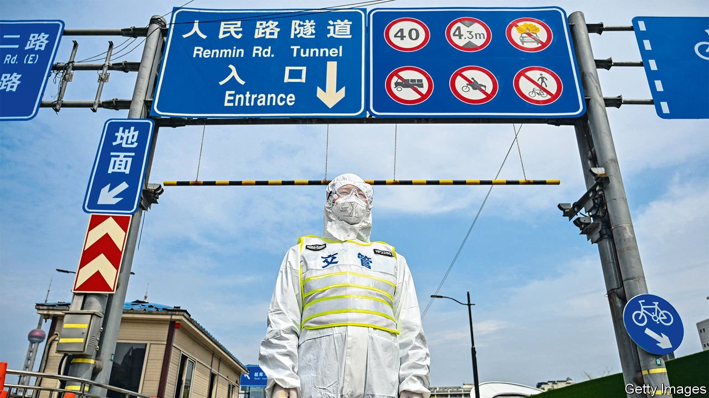

###### China’s risky year

# What China gets wrong 

##### The pandemic, the economy and the war in Ukraine 

 

> Apr 16th 2022 

IT IS OFTEN said that China’s government plans decades ahead, carefully playing the long game as democracies flip-flop and dither. But in Shanghai right now there is not much sign of strategic genius. Even as the rest of the world has reopened, 25m people are in a citywide lockdown, trapped in their apartments and facing food and medical shortages that not even China’s censors can cover up. The zero-covid policy has become a dead end from which the Communist Party has no quick exit.

It is one of a trio of problems faced by China this year, alongside a misfiring economy and the war in Ukraine. You may think they are unconnected, but China’s response to each has a common root: swagger and hubris in public, an obsession with control in private, and dubious results. Rather than being the product of statecraft with the Yellow Emperor’s time horizon, China’s actions reflect an authoritarian system under Xi Jinping that struggles to calibrate policy or admit when it is wrong.


This is the year for China’s president when everything has to follow the script. In the autumn he is expected to use a five-yearly party congress to launch a third term as its chief, in defiance of norms that he step aside after two and opening a pathway to lifelong rule. For this coronation to go smoothly, China must be stable and successful.

In some ways Mr Xi has triumphed. The propagandists can boast of a covid-19 mortality rate that is the lowest of any big country, and an economy that has grown by more than any other in the G20 since 2018. As Europe descends into war, China stands apart and secure, with a growing nuclear arsenal and the muscle and money to project power from the Pacific to the Caribbean.

Yet look closer and Mr Xi’s final year as a political mortal betrays China’s weaknesses under his rule as well as its strengths. Start with the pandemic. Since the virus was detected in Wuhan, China has pursued a zero-covid strategy. Its borders have been closed for two years and outbreaks are met with quarantines, coercive mass testing and harsh lockdowns. Early on, China’s rulers decided on a giant utilitarian experiment, leading to a largely covid-free life for the majority, at the cost of forfeited individual liberties, pain for those in lockdown and national isolation.

But the outbreaks are becoming . In addition to Shanghai, five provinces have partial lockdowns and Guangzhou has closed its schools. At least 150m people are affected. Having granted autonomy to Shanghai to manage its lockdown, Mr Xi has seized back control. And there is no exit strategy. The party has not prepared the public for living with covid and has failed to jab enough vulnerable old folk or use more effective Western vaccines. The choice now is between a redoubled vaccination campaign alongside an exit wave that could, according to some models, kill 2m people, or indefinite isolation and repeated curfews.

Those lockdowns are hurting growth, amplifying a botched attempt to recast the economy. Mr Xi has called on Chinese capitalists to become less predatory and more self-reliant. But in an attempt to implement vague slogans such as “common prosperity”, zealous officials have reasserted state control and intimidated the most successful entrepreneurs. A once-glittering tech industry is in intensive care, with the largest ten firms having lost $1.7trn of market value after a barrage of regulations. The bosses of Alibaba and Tencent are reduced to displays of cringing obedience and barred from expanding in some new areas. In recent weeks the party has tried to reverse course. But global investors are wary. Those ten largest tech firms are valued at a 50% discount to their American peers.

In their place China  a loyal new generation of startups that follow the party’s austere goals. Registration documents point to tens of thousands of these firms being created in inland cities, which purport to be at the cutting edge of the cloud, robotics and artificial intelligence. For now, patriotic investors are cheering them on but many are duds or frauds tolerated by officials keen to meet local development targets. A tech industry where the incentives are subsidies and fear, and which is separated from an  of venture capital, is likely to fall behind the frontier of innovation.

The last problem involves Ukraine and foreign policy. Mr Xi has sided with Russia, in keeping with his belief that the West is in decline. Yet this stance has costs. It will further hurt relations with America and Europe, upon whose markets China relies. China hopes Europe can be prised apart from America, but the war has revived NATO and transatlantic co-operation in energy. It is true that  do not want to pick sides between the West and China and Russia. But China’s “wolf warrior” diplomacy is backfiring, as foreigners balk at the insults and threats issuing from Beijing. Across rich countries, public perceptions of China are at their worst for two decades. The same is true in some developing ones, such as India, that fear Chinese aggression.

Underestimating China is foolish. Its centralised governance allows vast resources to be concentrated on strategic tasks, from building a navy to dominating the battery business. Public opinion can be mobilised. The sheer size of the domestic market lets firms achieve economies of scale without leaving home—and the potential pool of profits will always tempt global firms to be present, and mercantilist governments to support them.

The three regrets

These strengths remain. Yet China’s system of government is developing new flaws as power grows more concentrated. Authoritarian states can get things right but hate to admit when they are wrong. The more Mr Xi’s status is officially exalted ahead of the party congress, the more sycophancy there will be. When bureaucrats compete to demonstrate zeal, the administration becomes less effective; if officials fear to speak up, the feedback mechanism fails. A test of China’s long-term prospects is whether it can change course. For now, if you think China’s ascent is inevitable, look at the deserted streets of its biggest city, and ask yourself if Mr Xi has a monopoly on wisdom. ■

For subscribers only: to see how we design each week’s cover, sign up to our weekly 

