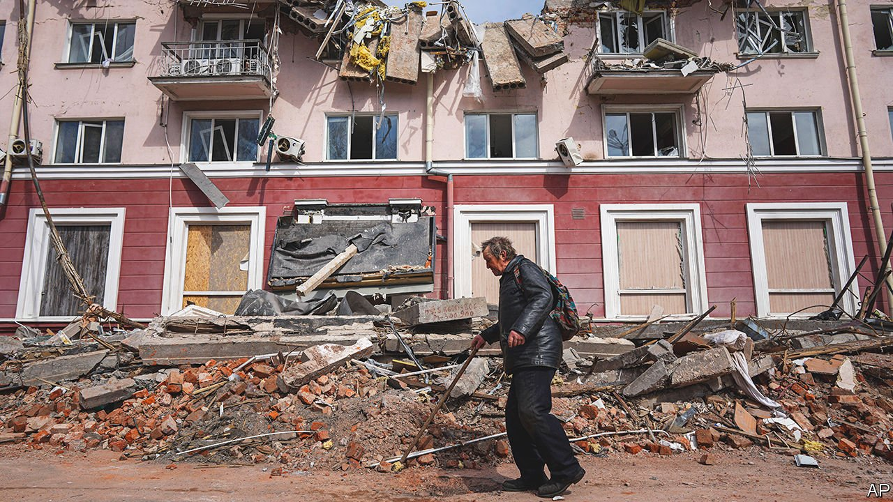

###### Get off the fence

# What is at stake in Ukraine 

##### Russia wants to impose its brutal vision on its neighbour. That is everybody’s business 

 

> Apr 16th 2022 

THE WAR is first of all about the fate of 44m Ukrainians. But in the shattered ruins of Mariupol and Kharkiv a worldview is also at stake. Vladimir Putin invaded Ukraine to force it to renounce the West and to submit to the Kremlin. He believes that big countries should be free to dominate smaller ones. Ukraine counters that it will choose its own allies. With Western backing, it is affirming the universal principle that all countries are sovereign. Whoever prevails on the battlefield will win a fundamental argument about how the world should work.

It matters, therefore, that off the battlefield this is an argument the West is losing. Most of the emerging world either backs Russia over its invasion or is neutral. Some countries depend on Russian arms, others feel a misplaced nostalgia for Soviet largesse, but many see the West as decadent, self-serving and hypocritical. And many more, even if they do not welcome the invasion, see it as somebody else’s problem. As America and the rest of NATO rally support for action against Russia, that is a stunning rebuke. It is also taking the world down a dangerous path.


On March 2nd, 141 countries voted in the UN to deplore Russia’s invasion. Just five voted against and 35 abstained. But the real pattern is more complex. Our sister organisation, the Economist Intelligence Unit, has noted that only a third of the world’s people live in countries that have not only condemned Russia but also imposed sanctions on it. Most of them are Western. Another third are in neutral countries. This group includes giants like India and tricky American allies, such as Saudi Arabia and the United Arab Emirates. The final third are in countries that are echoing Russia’s rationale for the invasion. The biggest, China, has repeated propaganda claiming that Ukraine has hosted American-backed bioweapons laboratories.

In Mr Putin’s world, where might makes right, today’s lack of support is proof of Western decline. After the Soviet collapse in 1991, when America became the sole superpower, countries aligned themselves with it not so much out of ideological conviction but to win its backing. On this reading, America’s sway over smaller countries has diminished as China has risen.

There is something to this, even if declinism is exaggerated. The West has also hastened its own . Until Mr Putin jolted it by invading Ukraine, the West had seemed to have lost faith in the universal principles it espoused. Following the Russian attack on Georgia in 2008, America’s president, Barack Obama, rushed to “reset” relations and focus on nation-building at home. When Bashar al-Assad used chemical weapons in 2013, Mr Obama backed off. After annexing Crimea in 2014, Russia got a slap on the wrist.

China and Russia argue that this lack of self-belief is a sign of Western decadence. If so, it spread under Donald Trump, who held America’s allies  in contempt and was wholly transactional. Democracy in America sank further into outrage and conspiracy. The European Union often seemed hopelessly self-absorbed. Brexit, whether you were for or against it, was a fiasco.

Poorer countries also see America and its allies as self-serving, because they demand solidarity when it suits them and turn their backs when it does not. While Russia and China released covid-19 vaccines abroad, the West hoarded huge stocks. Countries that grew rich by burning oil and coal have urged a global effort to limit climate change, but failed to keep their (limited) promises to help finance poorer countries’ plans to abandon fossil fuels and adapt to a warmer world.

And poorer countries see the West as hypocritical. Europe talks about universal rights, but its laudable welcome for millions of refugees from the war in Ukraine has been undercut by its rejection of refugees from the war in Syria. America and its closest allies invaded Iraq in 2003 without UN backing. In Western eyes, and The Economist’s, Saddam Hussein was a murderous dictator who had used nerve gas on his own people and attacked his neighbours. He could not be more different from Volodymyr Zelensky, Ukraine’s elected president. Yet the rulers of other countries worry that if the West is free to act as judge, jury and executioner, they will get summary justice.

This is a poisonous cocktail of legitimate grievances and exaggeration, all laced with a lingering resentment of colonialism. The pity is that emerging countries are making a grave error. As sovereign powers, they too have a stake in the war. All the West’s faults do not outweigh the fact that, in the system Mr Putin is offering, their people would suffer terribly.

The reason is that the world Mr Putin desires would be far more decadent, self-serving and amoral than the one that exists today. Ukraine shows how. His extravagant lies about Nazis in Kyiv and his denial that Russia is even fighting a war are decadent. His brazen claim that NATO provoked the war, posing an intolerable threat to Russia by expanding into central and eastern Europe is self-serving. Those countries were not swallowed up: they chose to join NATO for their own protection after decades of Soviet tyranny. And witness the drowning of all morality in his armies’ unconscionable use of torture, rape and mass murder as the routine tools of war.

What is more, Mr Putin’s belief in the dominance of great powers will not be limited to the battlefield. For he is right that, ultimately, the successful use of force underpins the structure of geopolitics. If Russia is allowed to prevail in Ukraine, bullying, lying and manipulation will further permeate trade, treaties and international law—the whole panoply of arrangements that are so easily taken for granted, but which keep the world turning.

That vision may suit China, which is impatient to shape the world in its own interests and which feels strong enough to dominate its sphere of influence. It would certainly suit tyrants, who want free rein to abuse their countries and terrorise their neighbours. But it cannot be welcome to leaders who want the best for their people.

Contrast Mr Putin’s brutish vision with . Partly in answer to Russian aggression, the country has emerged as a beacon of democracy. Like the West, it is imperfect. But it stands for freedom and hope. Developing countries should not abandon today’s flawed system. They should defend it from Mr Putin and use their growing influence to help it flourish. ■

Read more of our recent coverage of the 

