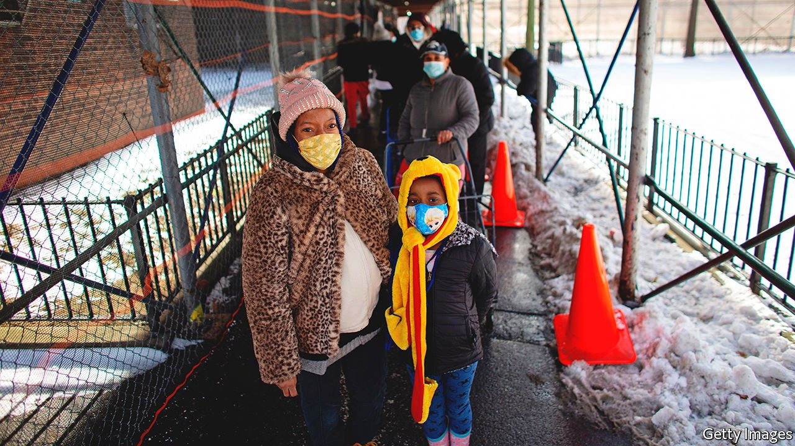
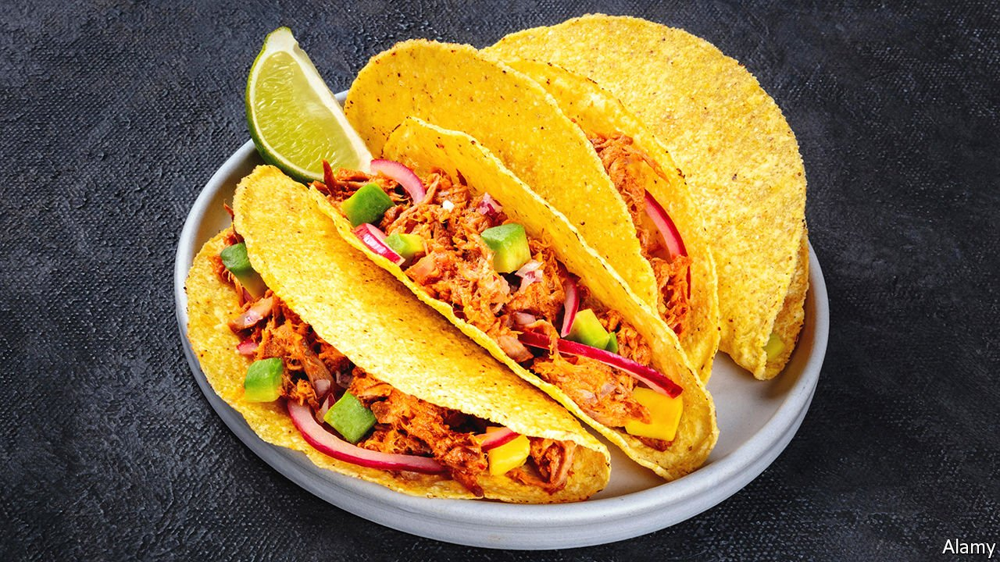

###### On Ukraine, logistics in Africa, food banks, tacos, initials, energy

# Letters to the editor 

##### A selection of correspondence 

 

> Apr 16th 2022 


A lesson from history

One historical case that has been overlooked as a parallel for the situation in Ukraine is the Spanish civil war (“”, April 2nd). From 1936 until 1939 European democracies gave moral support to the republicans in that conflict, but failed to provide them with sufficient military support to defeat Franco, the dictator. They hesitated because of internal domestic divisions and for fear that they would be stepping across a line that would make them belligerents in the war. As a result, a few months after the fall of Barcelona and Madrid, these same European democracies found themselves in a much nastier war. They had Franco on their consciences until he died, in bed, in 1975.


We are at risk of repeating that error today in Ukraine. As you argue, no solution short of a decisive military victory by the Ukrainians will preserve Western credibility and the rule of law. Consequently, three measures need to be taken immediately: the establishment of clearly defined "red lines" concerning the use of chemical and nuclear weapons; blocking SWIFT transfers to all Russian banks and the termination of Russian oil and gas purchases that this would imply; and providing the Ukrainians with immediate access to the entire Western arsenal of defensive weapons. But, like the Spanish civil war, I fear Western democracies lack the courage to implement these measures.

MATTHEW LEITNER

Former director of the executive masters in international negotiation and policymaking

Graduate Institute of International and Development Studies (IHEID)

Geneva

 


If victory in Ukraine is so important to the West, then why the hypocrisy of sending weapons and other support and letting the Ukrainians do all the dying? If victory is so important, why are we not putting NATO boots on the ground and giving Ukraine back to the Ukrainians? To quote Primo Levi regarding another period of horrific atrocities, "If not now, when?"

MICHAEL SLATER

San Luis Obispo, California

I applaud most of your position on helping Ukraine win, but I take exception to your recommendation to “bring Ukraine’s governance in line with the EU”. In “The Light That Failed”, a book that seeks to understand the crisis in liberalism, Ivan Krastev and Stephen Holmes put forward a theory that holding up one system of government as ideal has led to a nationalist reaction and support for autocracy in some eastern European countries. Hectoring others to fall in line does not work everywhere.

NORMA ELLIOTT

Seal Rock, Oregon

 


Missiles and drones have rendered armour-plated tanks as obsolete as cavalry for military purposes (“”, March 26th). Perhaps future versions of stealthy nocturnal drones could be developed to carry food and medical supplies, making it pointless to besiege a city.

GILES CAMPLIN

London

 


Delivering reform for Africa

You are right to point out that non-tariff barriers are a key obstacle preventing the growth of African trade (“”, March 26th). Logistics are a big part of that. Our members (DHL, FedEx and UPS) are increasingly subjected to draconian postal-licensing regimes in Africa. These licences are designed to stifle competition and extract revenue. They extend national postal monopolies to logistics and impose prohibitive fees that increase the cost of doing business. They fly in the face of regulation standards that a large group of WTO members have recently adopted.

An open and competitive market for delivery services would be an essential building block for the African Continental Free Trade Agreement to yield its full potential. It would allow African traders of all sizes to reach foreign markets efficiently, both within Africa and worldwide. This can be achieved while maintaining a universal postal service, which is distinct from express delivery. Sadly, many African governments are choosing to go in the opposite direction.

CARLOS GRAU TANNER

Director general

Global Express Association

Geneva

 


A sign of our times

There has, for good and ill, been a recent cross-pollination of anti-poverty policy between the United States and Britain (“”, April 2nd). A year ago the queues outside British food banks were shortening and hundreds of thousands of children were being lifted out of poverty. This was largely because of the government’s decision to raise benefit payments.

However, as in America, the increase in benefit payments proved to be temporary and has now been withdrawn. With those payments now lagging far behind inflation, some food banks within our network are reporting their busiest weeks ever and families are arriving, in the words of one volunteer, with desperation written over their faces.

ANDREW FORSEY

National director

Feeding Britain

London

 


What is a taco?

As a Mexican living in America who has accidentally ordered (and then proceeded to eat) hard-shell tacos, I think your article in praise of their mass marketing did not convey the main objection to them (“”, April 2nd). It is not about the food content, but about the name. A taco is anything that is wrapped in a tortilla that has been warmed up. That’s it. There are no canons on Mexican food, but we do need to get the names on the menu right.

Something similar to hard-shell tacos already exists in our Mexican menu: the tostada, a deep-fried tortilla that has an assortment of stuff on top of it, such as ceviche or pig's trotter in vinegar. One of the classic versions has meat, lettuce, tomato, cheese and cream. Kudos to the American engineering innovation that fried these things in a wedge shape.

As far as taste goes, if you like hard-shell so called tacos, go for it. Leave the good stuff for the rest of us.

JAVIER MADRID

Chicago

I enjoyed your article and description of foodie culture. But I contest your claim that hard-shell tacos bear “little relation to the real thing”. That would have been a surprise to my immigrant grandmother (born in Irapuato, Mexico) as she served us only hard-shell tacos her entire life. I can assure you she never went to a Taco Bell nor succumbed to “hard-shell” propaganda.

TONY ACOSTA

Redondo Beach, California

Also known as

There may be something to the “name-letter effect”, the subconscious bias that people have for the letters in their own name, and for their own initials in particular (, March 19th). During my career I was known as a major S.O.B.

MAJOR STEPHEN BORKOWSKI

United States Air Force, (Ret)

Pittsburg, Texas

 


Energarchy in the UK

I read your leader on the new age of energy insecurity (“”, March 26th). Is it too soon (or late) to coin the term “Energarchy”?

M.J. (THINUS) BOOYSEN

Stellenbosch, South Africa

