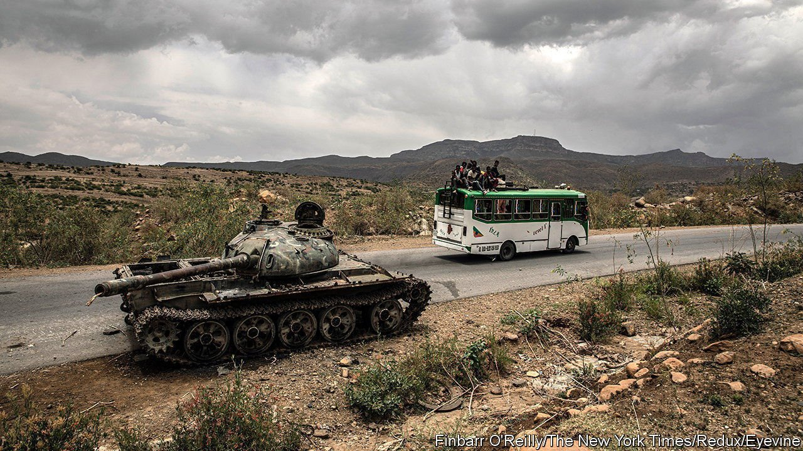
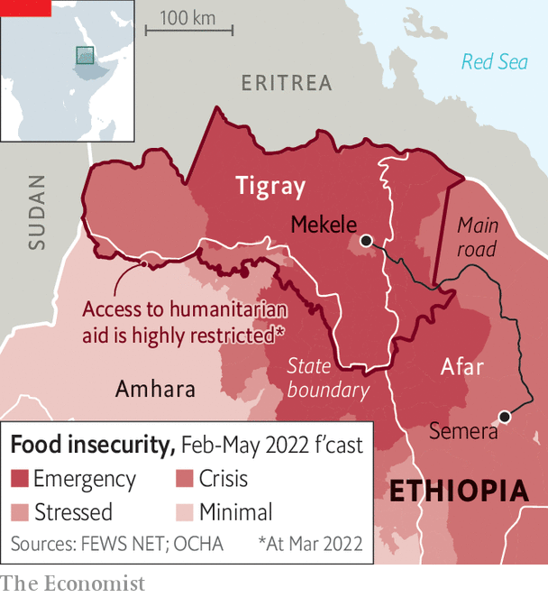

###### Horror heaped on horror

# Ethnic cleansing of Tigrayans may prolong Ethiopia’s civil war 

##### Evidence emerges of war crimes by forces allied to Abiy Ahmed’s government 

 

> Apr 13th 2022 

THE LUCKY ones were frogmarched onto buses and driven across the river. The less fortunate were slung into detention camps and left there to rot. Others were murdered in the streets or hacked to death as they cowered in their homes. “We don’t need a single one of them any more,” a militiaman told a foreign researcher last year. “They cannot be trusted.”

Since the start of Ethiopia’s bloody civil war 18 months ago, there have been frequent allegations of ethnic cleansing targeting people from the northern region of Tigray. Antony Blinken, America’s secretary of state, first levelled this charge more than a year ago, infuriating the government of Abiy Ahmed, Ethiopia’s prime minister, which strongly denied it. Because the government has imposed a tight blockade of the region, it has been hard to assess the claims of atrocities. But some horrifying hints have emerged, such as the corpses with their hands bound that have washed up on river banks in Sudan.

 


Now a thorough investigation by Human Rights Watch and Amnesty International, two pressure groups, leaves little doubt of the enormities committed by government forces and their allies. The joint report, published on April 6th, concludes that authorities from the Amhara region have systematically killed or evicted hundreds of thousands of ethnic Tigrayans from territory seized from Tigray since the start of the war. The campaign, carried out with the connivance of federal authorities, was as methodical as it was brutal. Notices ordering Tigrayans to leave were pinned around towns. Freshly appointed Amhara officials handed out title deeds for plots of stolen land. Identification cards were given to new Amhara arrivals, but denied to Tigrayans, who were prevented from receiving aid and government services. The new authorities even granted permits for shipments of looted sesame, a lucrative cash crop at the heart of the territorial dispute between the two regions.

This matters not only because of the frightful human toll. The contested area, known officially as Western Tigray before the war, is now arguably the biggest obstacle to ending the conflict. “It’s definitely the thorniest issue,” says a senior official of the ruling party. Both sides have long claimed this land. Both are hardening their stances. Just days before the report was published Amhara investigators announced the discovery of mass graves, which they allege contain the remains of Amharas murdered decades ago by the Tigrayan People’s Liberation Front (TPLF), the party-cum-militia that runs Tigray.

Meanwhile, hundreds of thousands of Tigrayans are starving. A “humanitarian truce” that started on March 24th is already teetering. The government has allowed just one aid convoy to enter Tigray (the first since mid-December) and has been withholding permission for more until the TPLF withdraws to Tigray. The TPLF wants aid to flow freely before it pulls back entirely, ideally in tandem with the withdrawal of Amhara forces from Western Tigray. Without a breakthrough to ease the blockade, the horror of ethnic cleansing will be matched by an equally grotesque abuse: deliberate, mass starvation. ■

