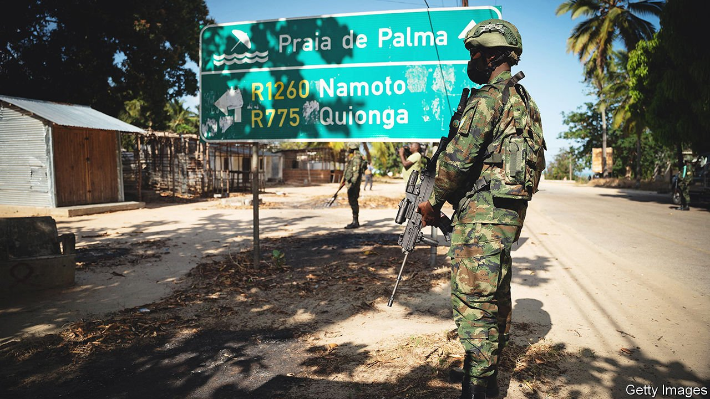
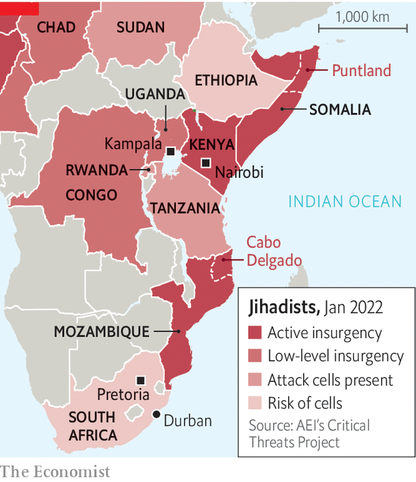

###### Follow the money

# Islamic State is using South African money to build its network 

##### Extortionists and kidnappers in South Africa are alleged to be funding terrorist groups in Congo and Mozambique 

 

> Apr 16th 2022 

DEFEATING INSURGENCIES is hard and dangerous work. Most of all, according to a book on the subject by John Nagl, a retired American soldier, it requires patience. He likens it to eating soup with a knife. That makes the rapid successes achieved by a hotchpotch of African forces against jihadists affiliated to Islamic State (IS) in northern Mozambique in the past year all the more remarkable.

The violent jihadist insurgency that has engulfed the northern Mozambican province of Cabo Delgado since 2017 had claimed perhaps 3,200 lives by the middle of 2021. Yet it attracted little outside attention until a year ago, when the militants swept into the coastal town of Palma, where they killed dozens of people, including several foreigners, and halted progress on a huge gas project. Soon after, Rwanda sent the first of about 2,000 troops. These were followed by about 1,000 more soldiers from eight other African countries, led by South Africa. In short order these forces have driven the insurgents out of most of the province’s populated areas.


Yet even as South Africa earns praise for battling jihadists in Mozambique, it is also gaining a reputation as a hub and money-laundering centre for jihadists from across the continent. In March America’s Treasury imposed sanctions on four people in South Africa accused of raising money and recruiting for IS activities and branches across Africa. The American action cast new light on the connections between IS’s core in Iraq and Syria, which has suffered crushing defeats in recent years, and its growing networks in Africa.

 


In 2019 IS received pledges of allegiance from two rebel groups almost 2,000km apart that seemed to have little connection: the insurgents in Cabo Delgado and the Allied Democratic Forces (ADF), a Ugandan outfit notorious for massacres in eastern Congo (see map). These affiliates have since mounted attacks not just at home but also in Tanzania and Uganda.

Their entrepot is South Africa. Police sources there say that suspected members of the ADF and other jihadists from as far afield as west Africa and Somalia freely hobnob in the country with like-minded locals. Dozens of South Africans went to Syria and Iraq to join IS in the heyday of its so-called caliphate. Among those who tried to go are twin brothers, Brandon-Lee and Tony-Lee Thulsie, who were arrested in South Africa in 2016 and jailed this year for terrorist offences. South Africans have been spotted among the jihadists in Mozambique, according to South African officials. Some have built networks at home.

Take Farhad Hoomer, a businessman from the coastal city of Durban. America’s Treasury slapped sanctions on him, alleging that he had established and led an IS cell in Durban and that he was in contact with the ADF in Congo. It claimed that he funded his cell by raising more than 1m rand ($69,000) through extortion and kidnapping. He denies the allegations. Also placed under sanctions was Abdella Hussein Abadigga, an Ethiopian with alleged links to IS in Somalia, whom the Treasury accused of extorting money from members of two mosques in South Africa that he sent to IS groups elsewhere.

It is not clear how much money flows from South Africa to terror groups but officials reckon it may add up to hundreds of thousands of dollars a year. Investigators believe that a good chunk of this money comes from crime of one sort or another, possibly including drug smuggling (though there is little public evidence for this). From South Africa it then takes many paths. Police in Kenya, for example, recently arrested a middleman who had received money from South Africa and sent it on to suspected militants in Mozambique and ADF operatives in Uganda.

Counter-terrorism officials in the region suspect that IS is using its money to buy the loyalty of radicals associated with al-Shabab, the Somali affiliate of al-Qaeda, IS’s rival. Defections of al-Shabab loyalists have “a lot to do with money”, says a Somali intelligence officer. IS currently backs an al-Shabab splinter group in Puntland, northern Somalia. UN investigators monitoring the group have found evidence that one of its commanders has visited Mozambique to train insurgents there.

Cutting these financial cords will not be easy. South Africa’s security institutions are poorly run, under-resourced, riddled with corruption and infiltrated by criminals. The Financial Action Task Force, a money-laundering watchdog, says South Africa has “failed to demonstrate that it is effectively identifying, investigating or prosecuting terrorist financiers”. One frustrated South African cop following the IS money trail says his bosses have ignored most of the cases he has sent them. “It makes it harder for us to really dig into where all the money is being generated from in the first place,” he sighs. ■

