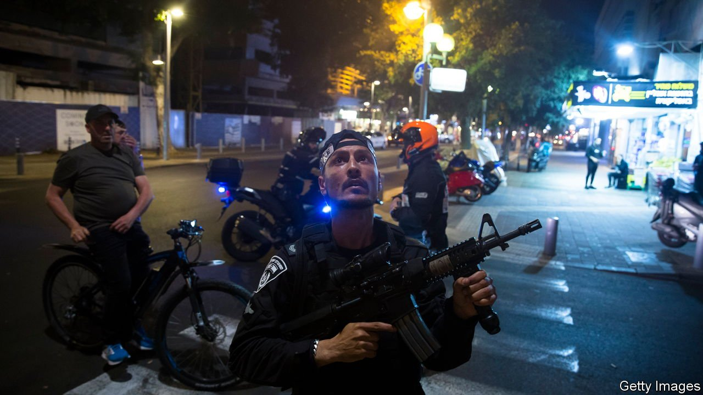

###### Keep cool amid the terror

# Israel’s government is being tested by a spate of terror attacks 

##### But it won’t take much to set off an eruption 

 

> Apr 16th 2022 

ISRAEL PRIDES itself on having some of the world’s finest counter-terrorism units. But when a lone Palestinian gunman roamed the streets of Tel Aviv on April 7th, it seemed to have too many of them. After a shoot-up outside a popular night spot, which left three Israelis dead or dying, hundreds of special forces, airborne commandos and police rushed to the scene, then milled around chaotically without co-ordination. Some ran with guns cocked into restaurants and residential buildings, hoping to flush out the killer, who had fled to Jaffa, a few miles south. He was tracked down and shot dead eight hours later.

The attack was the fourth in an Israeli city in 16 days. Fourteen victims and five perpetrators have been killed, ending ten months of relative calm in the conflict between Israel and the Palestinians. The attacks were not jointly planned nor attributed to a single group. The attackers came from different communities and backgrounds. Three were Arab citizens of Israel (one was a Bedou from the Negev desert) who had tried to join Islamic State; two were Palestinians from the West Bank.


Israelis and Palestinians were bracing themselves for another round of violence in the Muslim holy month of Ramadan, which this year coincides with the Jewish festival of Passover. A year ago there was a month of constant clashes on the eastern, Arab side of Jerusalem. Hamas, the Islamist group that runs the Gaza strip, then joined in, firing rockets at Israel for 12 days, provoking a devastating wave of Israeli air raids on Gaza and widespread riots in mixed Jewish-Arab towns in Israel proper.

So far none of last year’s flashpoints has erupted again. Bar a few scuffles, east Jerusalem has been tense but calm. Prayers have taken place undisturbed at the al-Aqsa mosque. Crowds of young Palestinians have been quietly enjoying themselves after breaking their Ramadan fast near the city’s Damascus Gate, the scene of several of last year’s violent confrontations.

“There’s a general feeling in Jerusalem that this Ramadan has got to be different,” says a Palestinian stall-owner. “The Israeli police are behaving better, not firing skunk all over the place.” Last year Israeli anti-riot police sprayed the area with a putrid liquid that lingered in the air for days. Now the strongest smell is from shisha pipes.

Gaza, still under a state of semi-siege imposed by Israel and Egypt, has been calm this year, too. Hamas has not fired any of its arsenal of rockets since a ceasefire, in May 2021. While congratulating the recent attackers, it has prevented smaller Palestinian factions such as Islamic Jihad from launching rockets.

All the same, the outbreak of violence has come at a bad time for Israel’s government. Not yet ten months into its term, the unwieldy coalition of eight disparate parties lost its majority in the 120-member Knesset when a member of the party of Naftali Bennett, the prime minister, defected. The government can persevere without a majority, at least for a while, but if it were to lose another right-wing waverer, an election could be called.

This political pressure could prod Mr Bennett to act tougher on security. So far Palestinian workers are still allowed to travel from the West Bank to jobs in Israel. A limited number may enter for prayers at the al-Aqsa mosque. But the government has closed the West Bank town of Jenin to Arab visitors from Israel, since two of the attackers were from there. Israel has also doubled the number of troops in the West Bank. On April 10th a Palestinian woman, who turned out to be unarmed, was shot dead at an Israeli roadblock because she was “moving suspiciously”. “If the politicians try to show they’re tough and more people get killed, things can kick off very fast,” warns an Israeli security official. ■

