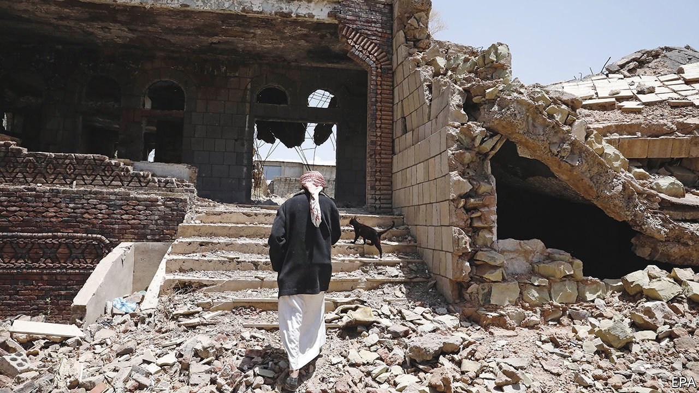
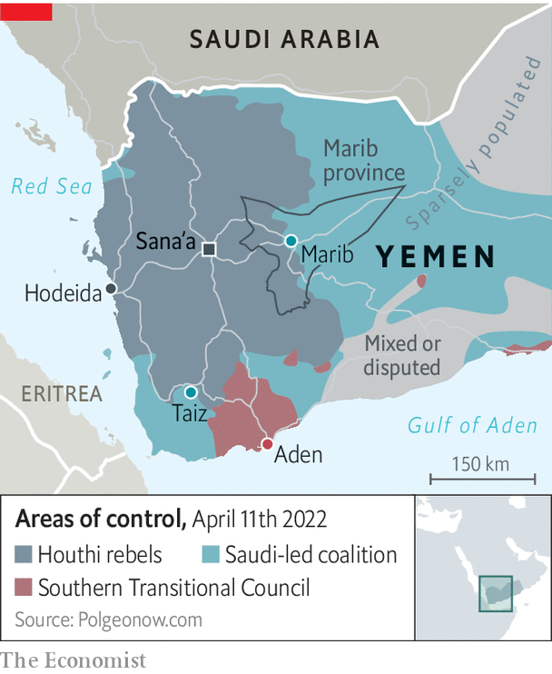
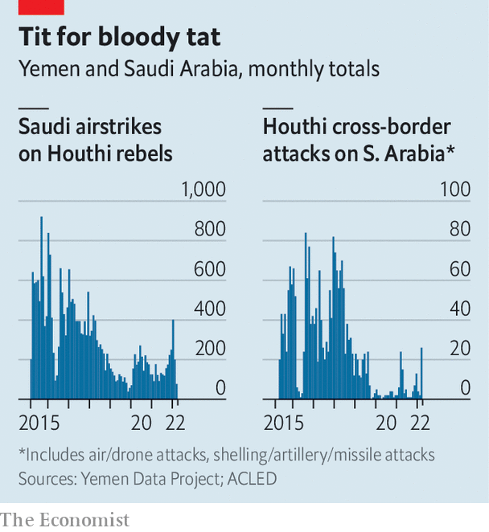

###### Peace or pause?

# War-ravaged Yemen gets a truce and dumps a tired president 

##### But the lull may not last and the new government holds little sway 

 

> Apr 16th 2022 

SOON AFTER iftar, the fast-breaking meal during Ramadan, a group of influential Yemenis was summoned to the Saudi royal court. They were in Riyadh on April 6th for peace talks to help end Yemen’s long war. But there was little to discuss: the Houthis, a rugged Shia group from northern Yemen who have conquered much of the country (see map), refused to attend, saying they would talk only in a neutral country. Instead the peace conference became a venue for palace intrigue. The balance of power continues to shift against the Saudis and their Yemeni allies. But a lasting peace remains elusive.

 


As several Yemenis tell the tale, the grandees in Riyadh were relieved of their mobile phones and put in separate rooms. The Saudis ordered Yemen’s feckless president, Abd Rabbo Mansour Hadi, to cede power to an eight-man council. His resignation was duly announced to the media. Only then were the council members, who had been cooling their heels for hours, told of their unexpected promotions.

 


The shake-up came after a two-month ceasefire began on April 2nd, the first nationwide truce since 2016. Both the Houthis and the Saudi-led coalition fighting them have accused each other of violations. Still, violence has dropped from its highest level in almost four years (see chart), giving Yemenis a bit of relief during the Ramadan holiday. Some diplomats are hopeful that the truce could be extended and lead to a more durable peace.

That still seems unlikely. The presidential council is meant to forge a united front, either to fight the Houthis more effectively or to broker a peace deal. But its members do not like each other and cannot agree on much. That the Saudis presented the council as a fait accompli suggests they are eager for a quick way out of a ruinous war. But a deal that creates a viable Yemeni state looks further away than ever.

The coalition invaded in 2015 after the Houthis seized large parts of the country, including the capital, Sana’a. It expected to dislodge them within weeks. Instead it got stuck in a quagmire. No one is winning, but the Saudis are certainly losing vast amounts of money and prestige.

Yemen’s 30m people are the chief victims. An estimated 377,000 have died from fighting, hunger and disease. The UN says 17m go hungry. Three-quarters rely on aid to survive. Only half the country’s hospitals and clinics are working.

The Saudi-led coalition has largely refused to allow fuel shipments through the port of Hodeida, which the Houthis control. The blockade has caused a severe fuel shortage in the Houthi-controlled areas, where black-market petrol can fetch more than $3 a litre. Under the terms of the truce, the Saudis will let oil tankers unload at Hodeida. The first two of a promised 18 docked earlier this month.

Two commercial flights a week will also be allowed to and from Sana’a; its airport has been closed to ordinary traffic since 2016. But it is unclear when they will start or who will be let aboard. There is talk of reopening roads to Taiz, which the Houthis have been encircling for years. These are all modest gestures, given the scale of Yemen’s suffering. Though they are welcome, many Yemenis doubt they will last.

For more than a year the heaviest fighting has been around Marib, a city under the government’s control. The area is home to 1m people displaced from other parts of the country and most of Yemen’s oil. The Houthis want to capture it. They have lost tens of thousands of fighters trying to breach its defences. Witnesses say they have continued attacks on Marib during the truce, albeit at a lesser scale, and are using the lull to reinforce their positions.

“This is both a precious and precarious moment,” says Hans Grundberg, the UN’s envoy to Yemen. “Ceasefires rarely hold if not supported by progress on the political track.” The UN has spent years cajoling the Houthis and Mr Hadi’s government to share power. The effort was doomed from the start. Mr Hadi was both too weak and too obstinate to be an effective negotiator. The Houthis thus saw little reason to talk, thinking they could win a better bargain on the battlefield than by diplomacy.

Few Yemenis will miss their ousted president, who was meant to serve a two-year transitional term but stayed for ten. An insular leader, he was surrounded by a small circle of relatives and cronies and ran a government-in-exile that was good at stealing money and not much else.

Unlike Mr Hadi, many of the new council’s members wield influence on the ground. They have little else in common: the body embraces Islah, an Islamist party, and the Southern Transitional Council (STC), a secessionist group that wants to restore an independent South Yemen. Islah and the STC despise one another and have clashed repeatedly. Even if they set aside personal and ideological animosity, the STC (which  is focused on the south, where the Houthis have no presence) will be loth to send its men to fight in the north.

Saudi Arabia is keen to end the war. Apart from its financial and reputational costs, it has exposed the kingdom to increasingly accurate cross-border Houthi attacks. But a face-saving exit for the Saudis will not end the civil war that long predates the involvement of foreigners. That would require consensus among a vast constellation of armed groups, including the Iranian-backed Houthis.

More likely is that Yemen will continue its steady disintegration. The south, backed by the United Arab Emirates, will pursue greater autonomy. The north will try to negotiate an awkward power-sharing deal. Parts of the country will remain ungoverned. For all the optimism about the truce, it may prove just an intermission before another round of fighting. ■

