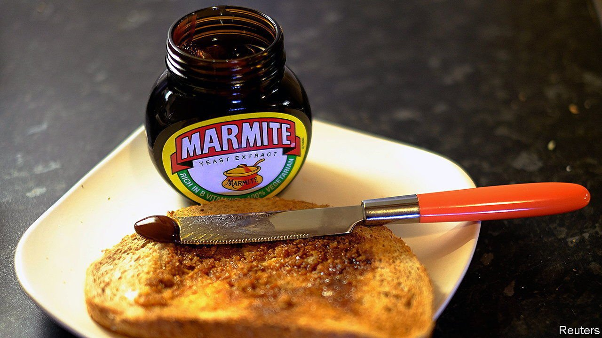

###### Marmageddon

# Why South Africa is running out of Marmite 

##### A ban on booze has led to parched throats and dry toast 

 

> Apr 16th 2022 

“I AM DISTRAUGHT because I am about to finish my last jar,” says Irine Mboweni, a resident of Johannesburg and mother of two. “There is no Marmite on the shelves and I do not know what to do.” Amid the many tragedies befalling the world, a shortage of glossy dark goo to spread on bread is surely small beer. But not to the millions of South Africans who, quite inexplicably, like the salty sludge and are struggling to cope with the worst Marmite shortage since the end of apartheid.

The love-it-or-loathe-it spread, invented in Britain at the start of the 20th century, is an extract of yeast. It is most commonly eaten spread thinly on buttered toast, but it can also be used to add a rich, vegan-friendly umami flavour to soups, stews and sauces.


In South Africa Marmite is indeed thinly spread. Shoppers first noted shortages at the beginning of the covid-19 pandemic, when South Africa banned alcohol sales in an attempt to free up beds in hospitals that would otherwise be filled with tipsy drivers or drunken brawlers. The ban had an unexpected consequence. With beer sales on ice, South Africa’s main breweries sharply reduced their production. With much less lager fermenting in their vats, they were also producing far less brewer’s yeast, the beery by-product that is the main ingredient of Marmite.

Through the course of the pandemic, South Africa imposed four separate alcohol bans, each one of which dealt a blow to Marmite production. Nine months since the lifting of the last prohibition, production ought to have recovered, allowing shops to refill their shelves. Yet it has not. When your correspondent recently walked the aisles of 15 grocery stores in Johannesburg, 12 had no Marmite at all. In the three remaining shops a total of just seven jars could be found, of which three appear to have escaped purchase by hiding behind jars of Bovril, a beef-based cousin of Marmite. The branch manager of a large store in eastern Johannesburg says that deliveries still dribble in but fly off the shelves in an instant.

That the shortage continues is because of another hiccup in the supply chain. Pioneer Foods, the local manufacturer of Marmite, reportedly said that its production has been slowed by a shortage of sodium carbonate, which is used in the manufacturing process. Muckraking by the Daily Maverick, a local paper better known for exposing political scandals than for scrutinising sandwiches, found that intermittent cuts in the water supply were also affecting the country’s only Marmite factory.

Perhaps, though, some good may yet emerge from South Africa’s forced diet of dry bread. In a country that is often divided along lines of race or wealth, all boundaries are transcended by love (or hatred) of Marmite. “Whether black or white, rich or poor, most South Africans have a jar of Marmite in their cupboard,” says Mrs Mboweni. Your correspondent will neither confirm nor deny snagging Johannesburg’s last seven jars. Suffice it to say that Mrs Mboweni is no longer short of sludge.

