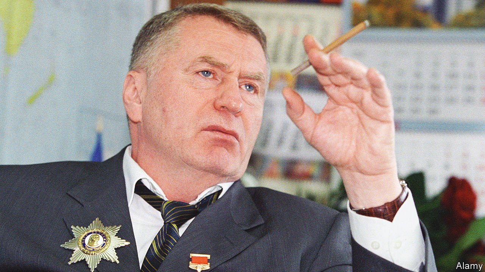

###### Putin’s court jester

# Vladimir Zhirinovsky’s highly methodical madness 

##### The court jester of Russian politics was 75. His death was announced on April 6th 

 

> Apr 16th 2022 

HE LIKED TO dress in bright colours. Acidic yellow, fluorescent red and purple were his favourites for a jacket. His top shirt button was always undone, his tie loose, his suit crumpled and covered in his last dinner. On occasions he wore a bow tie; sometimes a Soviet military uniform, replete with medals. The leader of the right-wing and misnamed Liberal Democratic Party, Vladimir Zhirinovsky was first and foremost a showman. He was after fame, money and sex—not political office. But he played an important role in Russian politics, stripping it of meaning, faking opposition, turning it into buffoonery and providing an outlet for nationalism and xenophobia.

Zhirinovsky was a prized guest at Moscow’s political beau-monde parties. Actors loved to do imitations of him in variety shows. His eccentricity, his direct slightly twitchy manner was easy to mimic; his every utterance a caricature of the scandalised, embittered, vodka-swilling dolt of Moscow’s back streets—disgruntled in equal measure by personal misery, sexual frustration and the humiliation of his once-mighty nation.


His fans called him “Zhirik”, a nickname better suited to a circus clown. Stage characters don’t talk about the biography of the actors who play them. He was born in 1946 in Almaty, then the capital of Soviet Kazakhstan, to an ethnic Russian mother and a Ukrainian Jewish father, Volf Edelstein, who had been deported from western Ukraine and who later emigrated to Israel. “My mother was Russian, my father was a lawyer,” he said of his background.

He burst onto the stage in late 1993. Russia had just stepped back from the edge of a civil war. Street battles between a Stalinist-fascist coalition and President Boris Yeltsin ended in the president’s favour after he shelled the parliament building where the hardliners were holed up. It seemed, at last, that Russia could forge ahead with creating a market-oriented democratic system and living in peace with the world. At a televised party held on the night of the parliamentary elections in 1993, liberals were sipping champagne and congratulating each other on their victory.

Zhirinovsky gate-crashed their celebrations when his ultra-nationalist party topped the poll with 23% of the national vote, compared with the 15.5% attained by pro-Western liberals. “Russia, come to your senses, you have gone bonkers,” said Yury Karyakin, a liberal deputy and literary academic. A scholar of Dostoyevsky, Karyakin took Zhirinovsky for a real threat. He did not recognise in him one of the novelist’s favourite types—those who revel in scandals, make mockery of any value, and break taboos.

In Zhirinovsky’s 1995 electoral campaign a nearly naked dancer in an erotic floor-show gyrated to the song: “I’m looking for a man who will spank me, spank me…” In the same campaign he threw a glass of orange juice at Boris Nemtsov, the liberal opposition leader who was murdered in 2015. “We must always exploit the worst in the people. Such is the fate of the opposition,” he once said.

He was not, of course, opposition in any real sense. His party was brought into being by the Soviet KGB, which in the spring of 1990 reluctantly concluded that the communist monopoly on power was over and some version of multi-party democracy had to be accepted. But Russia’s security services—going right back to tsarist times—had vast experience of manipulating and fostering tame “opposition” groups. After the authorities had announced that non-communist political parties could be legally registered, a mysterious group called the Liberal Democratic Party of Russia sprang into existence.

His party was meant to split the democratic electorate. But as a showman in search of an audience, Zhirinovsky sensed that popular demand was in the field of imperial nostalgia and ressentiment—a mixture of frustration, jealousy and resentment. His electorate was the disenchanted and the lumpenised. He had a knack for articulating their basic instincts, forbidden desires and dark thoughts. He told them he dreamt of a day “when Russian soldiers can wash their boots in the warm waters of the Indian Ocean”.

While he was entertaining the public with his antics, those with real political power looted their own country. As Kirill Rogov, a chronicler of post-Soviet politics, noted, Zhirinovsky’s confident dominance on that stage kept real right-wing nationalists with their permanent hangover and stern gloominess at bay, thus shielding the Russian centrist kleptocratic bureaucracy from a nationalist revanche.

Perhaps it was partly his success that made the Kremlin realise just how fertile that nationalism and xenophobia were. As it came to adopt his slogans of imperial resurgence, Zhirinovsky spotted another fertile ground—the resentment of Moscow by the regions. His Liberal Democratic Party became a refuge for populists across the country who rivalled and rattled Kremlin nominees. The Kremlin responded with its usual thuggery and repressions.

He, in turn, warned them of the growing rage. “Do you want a Maidan, like in Ukraine? Then you will get one! Just one match will be lit somewhere, a fire will erupt everywhere, the people will not stand for it…Don’t try to bring people to the boil; don’t provoke conflict out of the blue. You have no shame and no conscience.” The Kremlin took his warning of rising anger in Russia seriously and doubled-down on nationalism, xenophobia and aggression.

Zhirinovsky understood the Kremlin’s intentions because he taught them the language in which they spoke. Last December he made an eerie prediction. “At 4am on February 22nd, you will feel [our new policy]. I would like 2022 to be a peaceful year. But I love the truth. For 70 years I have been telling the truth. It will not be peaceful. It will be a year when Russia becomes great again.” He was out by two days: Vladimir Putin launched his invasion in the small hours of February 24th. By then he was already in hospital and did not join in the fascistic frenzy. It is not known exactly when he died, but his act was over and he took his exit just in time. He was a cynical jester, not a war criminal. As Russia descended into darkness, there was no room for his bright colours. ■

Read more of our recent coverage of the 

