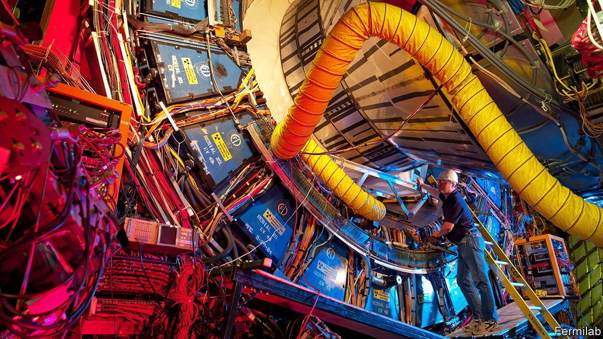

###### Particle physics

# Experiments contradicting the Standard Model are piling up 

##### Some bosons, quarks and muons appear not to be behaving as predicted 

 

> Apr 16th 2022 

THE STANDARD MODEL of particle physics—completed in 1973—is the jewel in the crown of modern physics. It predicts the properties of elementary particles and forces with mind-boggling accuracy. Take the magnetic moment of the electron, for example, a measure of how strongly a particle wobbles in a magnetic field. The Standard Model gives the correct answer to 14 decimal places, the most accurate prediction in science.

But the Standard Model is not perfect. It cannot explain gravity, dark matter (mysterious stuff detectable only by its gravitational pull), or where all the antimatter in the early universe went. Physicists have spent much time, effort and money performing ever-more elaborate experiments in an effort to see where the Standard Model fails, in the hopes of finding a clue to the theory that will replace it. But the Standard Model has fought back, stubbornly predicting the results of every experiment physicists have thrown its way.


But that may perhaps be changing. In a paper published last week in Science, a team of researchers from the Fermi National Accelerator Laboratory (Fermilab) in America announced that the mass of an elementary particle called the W boson appears to be greater than the Standard Model predicts. The difference is small—only a hundredth of a percent—but the measurement’s precision exceeds that of all previous experiments combined. It places the odds that the result is spurious at only one in a trillion (“seven sigma”, in the statistical lingo), well above the one in 3.5m (five sigma) that physicists require to consider a finding robust.

The scientists at Fermilab analysed historical data from the Tevatron, a circular particle collider which was the most powerful in the world until the Large Hadron Collider (LHC) came online in 2009. Between 2002 and 2011 (when it ran for the last time), the Tevatron produced approximately 4m W bosons in collisions between particles called quarks and their antimatter counterparts, antiquarks. Using detailed recordings of the scattering trajectories of the menagerie of particles present in such collisions, the scientists could calculate the mass of the W boson with unprecedented accuracy.

The finding has big implications. The W boson is a force-carrying particle. Together with its sibling the Z boson, it mediates the weak nuclear force that governs radioactive decay. Unlike other force-carrying particles, however, the W and Z bosons have mass—and a lot of it. The W boson is 90 times heavier than a hydrogen atom. The Z boson is even more massive. What really distinguishes the W boson, however, is its ability to change the type—or “flavour”—of other elementary particles it comes across. For example, it can transform the electron (and two of its cousins, the muon and tau) into neutrinos. It can also flip quarks from one type to another—up to down, top to bottom, and the whimsically named “strange” quark to a “charm” one.

These protean powers mean that the mass of the W boson is linked to the mass of several other elementary particles. That allows scientists to use the W boson to calculate the mass of those other particles. That is how they predicted the mass of the top quark (discovered in 1995) and the mass of the Higgs boson (discovered in 2012), before either particle had been detected. If the W boson is more massive than the Standard Model predicts, it implies that something else is tugging on it too—an as-yet-undiscovered particle or force. For particle physicists, that is an exciting prospect.

It is not the only one. In March 2021 scientists from CERN—Europe’s particle-physics laboratory—reported evidence that the bottom quark decays into electrons and muons in uneven numbers, contradicting the Standard Model. Only three weeks later, Fermilab announced that the magnetic moment of the muon appears to be greater than predicted by the Standard Model too. Like the mass of the W boson, the magnetic moment of the muon is partly determined by the properties of other particles. If it is greater than the Standard Model predicts, that hints at an as-yet-undiscovered particle or force too.

Assuming, that is, the results are real. Exciting as they were, neither result from 2021 crossed the 5-sigma threshold (they hit 3.1 and 4.2 sigma, respectively). That means further confirmation is necessary. The more recent Tevatron result, though, contradicts the previous best measurement of the W boson mass, made in 2017 at the LHC. That was in close agreement with the Standard Model, presenting a puzzle.

On the other hand, the latest Tevatron result aligns well with previous estimates from the Large Electron-Positron Collider, the LHC’s predecessor. It is consequently the strongest evidence yet of the physics that must lie beyond the Standard Model. Anyone who prefers interesting errors over yet more dull confirmation will be hoping it holds up. ■

To enjoy more of our mind-expanding science coverage, , our weekly newsletter.

