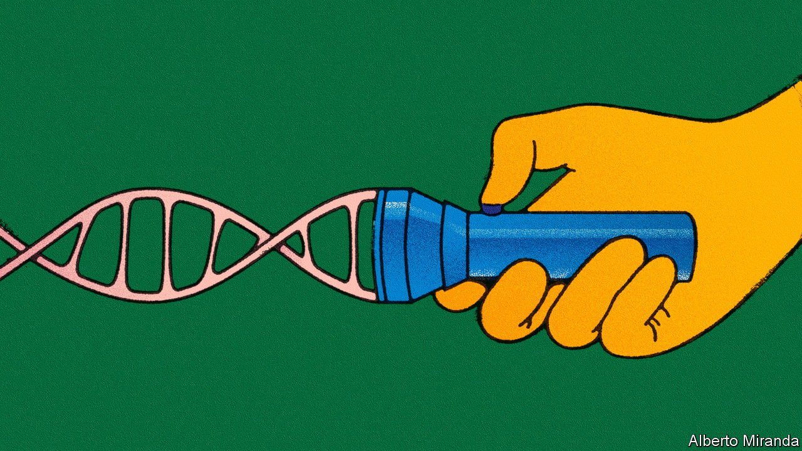

###### Personalised medicine

# Genetic screening can improve drug prescribing 

##### Most people carry at least one mutation that can stop a drug working properly 

 

> Apr 16th 2022 

PETER LEY, a retired civil servant who lives in London, was diagnosed with colon cancer in 2017. An operation to remove the tumour was successful. But the chemotherapy that followed caused a severe reaction that required a two-week hospital stay and a pause in his cancer treatment.

All that could have been avoided had a simple test been done. The test examines a gene that encodes a liver enzyme called dihydropyrimidine dehydrogenase (or DPD for short). The enzyme breaks down several common cancer drugs. Without it, toxic levels of the drugs build up in the body, sometimes with fatal results. A complete inability to make DPD is rare, but there are four mutations in the DPD-regulating gene that are known to reduce its production. As it turned out, Mr Ley had one of them.


Screening for such “pharmacogenes” is an idea that is catching on among doctors. Several big hospitals in America are testing their patients for a dozen or more of them. Separate pilot projects are under way in at least seven of the European Union’s member states. Britain’s National Health Service (NHS) is doing screening tests for some patients being prescribed cancer and HIV drugs. A report on March 29th by the British Pharmacological Society (BPS) and the Royal College of Physicians (RCP) proposed widening that testing to cover the 40 drugs among the 100 most-prescribed that are known to be affected by pharmacogenes. The report’s authors reckon testing could feasibly be rolled out across the NHS as soon as 2023.

Genetic screening promises big benefits. Mutations can affect drugs in all sorts of ways, determining a pill’s efficacy, toxicity, how well it is absorbed, and how well it is broken down. Some genetic variants affect several drugs at once, because they alter common enzymes in widely used metabolic pathways. Britain’s 100,000 Genomes project has shown that almost 99% of people carry at least one pharmacogene; 25% have four. About 9% of Caucasian people have, like Mr Ley, DPD deficiency; one in 200 lack the enzyme completely. Roughly 8% of Britain’s population get little pain relief from codeine, because they lack an enzyme responsible for metabolising the drug into morphine (they instead metabolise it into other substances that have little influence on pain).

All told, scientists have identified about 120 such drug-gene pairs so far. Roughly half of them are “actionable”, says Henk-Jan Guchelaar, a pharmacologist at the University of Leiden in the Netherlands—meaning that changing the dose or replacing the drug can lead to a better clinical outcome. And most people will be prescribed at least one of those drugs at some point in their lives. In Britain people over the age of 70 have around 70% chance of taking at least one drug whose safety or efficacy is compromised by their genes, says Munir Pirmohamed, a pharmacologist and geneticist at the University of Liverpool.

Currently, clashes between a patient’s genome and his drug regimen are dealt with by trial-and-error prescribing. But that is time-consuming, and may be harmful. If a drug is being prescribed for high blood pressure or artery-clogging levels of cholesterol, time spent trying different drugs means time in which a stroke, heart attack or organ damage may occur. And cleverer prescribing would have benefits for the health-care system overall, as well as for individual patients. Adverse drug reactions account for 6.5% of hospital admissions in Britain.

The chief issue, as ever, is cost. In the Netherlands a test for 50 pharmacogenes costs about €200 ($217). In Britain a panel test for 40 such genes costs £100-150 ($130-195). Carrying out testing on an entire population would, therefore, be extremely expensive. Some light on whether it is worth the cost will be shone later this year when PREPARE, a study that began in 2017, publishes its results. The project, which is led by Dr Guchelaar, recruited 7,000 people across seven European countries for a study of mutations affecting 42 different drugs. Half the participants were screened, and given cards listing the drugs flagged up. That information, in turn, was made available to doctors, pharmacists and the like. Dr Guchelaar and his colleagues are analysing how much this reduces adverse drug reactions compared with the unscreened participants—and, crucially, the health-care costs averted as a result.

Such cost-benefit analyses will be vital in making the argument that governments or insurance firms should pay for widespread genetic testing. In the meantime, though, doctors are already pondering ways to get the most bang for their buck. The BPS and RCP study suggests several ways to expand pharmacogene screening. One is to test for the genes the first time a drug known to be susceptible is prescribed. Another option is to offer that test to everyone over a certain age, perhaps 50—though the NHS is also pondering the idea of comprehensive genetic screening for all newborn babies. That could pay off handsomely later in their lives. ■

To enjoy more of our mind-expanding science coverage, , our weekly newsletter.

