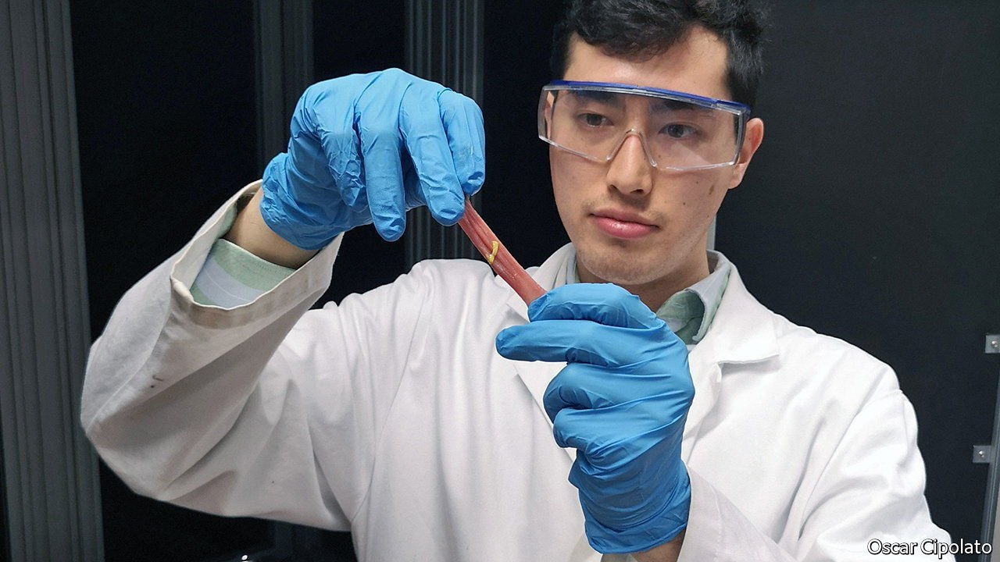

###### Fixing wounds

# Never mind stitches—it is possible to solder wounds closed 

##### It works exactly the same way that soldering electronics does 

 

> Apr 16th 2022 

IF YOU CUT yourself, your options are to reach for a plaster or, if the cut is nasty, to go to a doctor to have it stitched or glued. That seems a rather limited choice. Medical researchers have been trying to develop another way to join the edges of a wound, inspired by something routinely done to gas pipes and electronics: soldering. And an innovation developed at the Swiss Federal Institute of Technology (ETH) in Zurich, in co-operation with the Swiss materials-science institute Empa, suggests this might soon become a practical reality.

In soldering, an intermediate material is heated until it melts and bonds with the two surfaces that are to be joined. The material of these edges has a higher melting point and remains solid (otherwise it would count as welding).


For tissue, the intermediate material is not a metal alloy, but a paste of biocompatible material, such as albumin, a protein that is an important constituent of blood. When heated, the paste develops chemical bonds with living tissue on both sides. As healing progresses, the two sides reconnect and the paste is removed by the body's natural cleaning procedures.

Closing wounds by soldering has several important advantages, says Oscar Cipolato, a PhD candidate at ETH, who presented preliminary results on April 5th at the Photonics Europe conference in Strasburg, France. The bond it produces is strong and watertight, something that cannot be guaranteed with stitches. If a wound is internal—after surgery, for instance—a leak could cause an infection.

But soldering tissue has turned out to be difficult in practice, which means it is not commonly done. Heating the soldering paste is done by shining a laser onto it, from which the paste absorbs energy. But controlling the heating precisely is tricky. The paste needs to reach about 80°C to work. If the temperature is too low, the soldering material will not fully melt and the bond will be weak. But if it is too high, it risks burning the surrounding tissue. Existing attempts at wound-soldering rely on thermal imaging to measure temperature. But that only measures the temperature at the surface of the solder, rather than throughout the material.

Mr Cipolato and Inge Herrmann, a chemical engineer at ETH, hope their improved paste can get around such problems. It is made up of two kinds of nanoparticles, specks of material of only about 20-billionths of a metre across. Between them, these help direct the energy of the laser to the places it should be, and help doctors gauge the conditions in the paste.

The first set of particles are made of titanium nitrate. They eagerly absorb photons of red or near infrared light, precisely the colours that most easily penetrate living tissue, and release the energy as heat to their surroundings. That efficient absorption means the paste can be heated by a relatively weak laser beam, which helps protect the surrounding tissues.

Using such tiny particles is in itself not new. But until recently most researchers used tiny rods of gold, which are expensive. Nanoparticles of titanium nitrate, on the other hand, are easily and cheaply produced by spraying the right mix of precursor chemicals into a flame.

The second set of particles are a new development in the soldering world. They are specks of a material which fluoresces. In other words, it absorbs the laser light, but immediately re-emits the energy as light again, at a few very specific wavelengths.

Two of these wavelengths are also in the infrared and red colour range. That allows some of the re-emitted light to emerge from the paste to where it can be analysed by an external instrument called a spectrometer. By precisely measuring the difference between the two wavelengths, the temperature of particles that are emitting it—and thus of the paste as a whole—can be worked out.

Thus far, the researchers have tested the technique only on pieces of pig intestine that they obtained from a slaughterhouse. Soldering a cut is done in a matter of minutes. Similar “ex vivo” tests of the strength and permeability of the bond will also be needed for human tissue, followed by clinical tests on actual pigs and, eventually, humans. But the researchers are optimistic. At the conference, they were cagey about exactly what the fluorescing particles are made of. They are applying for a patent, which could be quite valuable if the tools at the ready in a doctor’s office one day include a laser soldering gun. ■

To enjoy more of our mind-expanding science coverage, , our weekly newsletter.

